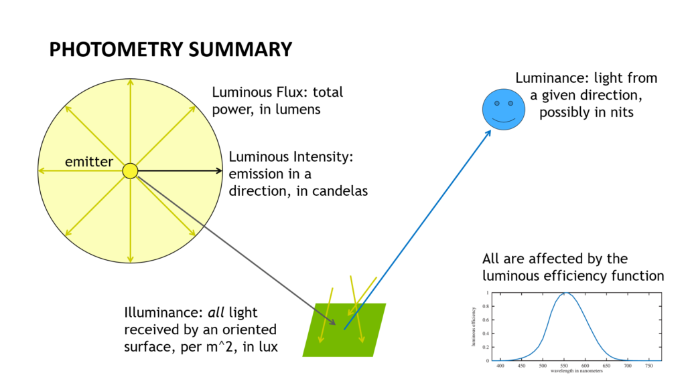
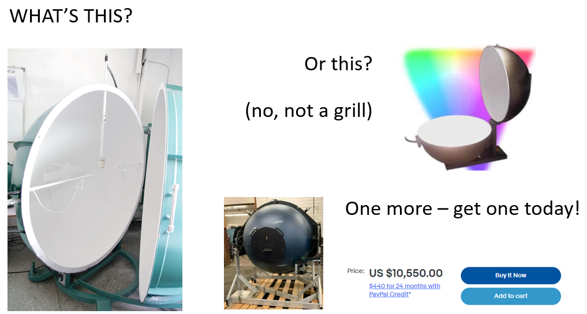

# Physical Units for Lights
[Original](http://www.realtimerendering.com/blog/physical-units-for-lights) from Eric Haines; cached here locally for offline reference

I expect most of us have a passing knowledge of physical units for lights. We have some sense of what lumens and candelas are about, we’ve maybe heard of nits with regard to our monitors, and _maybe_ have a vague sense of what lux is about. This was, at least, my level of understanding for the past lessee 38 years I’ve been in the field of computer graphics. My usual attitude with lights was (and still is, most of the time), “make them brighter” if the scene is too dim. That’s all most of us normally need, to be honest.

These past months I’ve been learning a fair bit about this area, as proper specification of lights is critical if you want to, for example, move a fully modeled scene from one application to another, or are merging real-world data with synthetic. APIs and programs with “0.7” or “90% brightness” or other relative units don’t hack it, as they are not anchored to any physical meaning. So, here’s my summary of the four main light units, with others mentioned along the way. My focus is on the practical, real-world use of these units. Some of this knowledge was hard won, for me. Lux, in particular, is a term where I have been misled by many pages on the internet that attempt to define it. My thanks to Luca Fascione and Anders Langlands in particular for correcting me along the way. I may still have a bug or two in this post (though am trying hard not to), so tell me if I do and I’ll fix it: erich@acm.org.

The PBR book [gives the textbook basics](https://www.pbr-book.org/3ed-2018/Color_and_Radiometry/Radiometry), starting with radiometric units and going on to photometric. Here’s [their useful table](https://www.pbr-book.org/3ed-2018/Color_and_Radiometry/Radiometry#LuminanceandPhotometry):

Table 5.2: Radiometric Measurements and Their Photometric Analogs

| **Radiometric** | **Unit**                                             | **Photometric**    | **Unit**                                                                                             |
| --------------- | ---------------------------------------------------- | ------------------ | ---------------------------------------------------------------------------------------------------- |
| Radiant energy  | joule $(\mathrm{Q})$                                 | Luminous energy    | talbot $(\mathrm{T})$                                                                                |
| Radiant flux    | watt $(\mathrm{W})$                                  | Luminous flux      | lumen $(\mathrm{lm})$                                                                                |
| Intensity       | $\mathrm{W} / \mathrm{sr} $                          | Luminous intensity | $\operatorname{lm} / \mathrm{sr}=\mathrm{candela}(\mathrm{cd})$                                      |
| Irradiance      | $\mathrm{W} / \mathrm{m}^2$                          | Illuminance        | $\operatorname{lm} / \mathrm{m}^2=\mathrm{lux}(\mathrm{lx})$                                         |
| Radiance        | $\mathrm{W} / \left(\mathrm{m}^2 \mathrm{sr}\right)$ | Luminance          | $\operatorname{lm} / \left(\mathrm{m}^2 \mathrm{sr}\right)=\mathrm{cd} / \mathrm{m}^2=\mathrm{nit} $ |

You’ll see similar tables in many other places, including page 272 of [our own book](https://smile.amazon.com/Real-Time-Rendering-Fourth-Tomas-Akenine-M%C3%B6ller/dp/1138627003?tag=realtimerenderin). I like theirs better: more columns. [Radiometry](https://en.wikipedia.org/wiki/Radiometry) is concerned with any electromagnetic radiation – radio, microwaves, x-rays, etc.; [photometry](https://en.wikipedia.org/wiki/Photometry_(optics)) factors in how our eyes respond to light, described by the [luminous efficiency function](https://en.wikipedia.org/wiki/Luminous_efficiency_function) (well, functions: there’s the photopic function, for brightly lit conditions, and the scotopic, for dim). I’m focusing on photometric units.  

If you know all this, you’re done here. Well, some of the links below may inform and entertain.

Radiant energy: like it says, energy, some total amount of radiation, basically. Luminous energy: same, modified by the eye’s response. I say “forget them” as far as graphics goes – I’ve never seen energy (vs. power) get used for light in the field of computer graphics. All the units that follow are in terms of “per second,” and those are the ones you’ll see used in describing lights in the real world and computer graphics. Begone, Talbots!

**Luminous flux:** measured in _lumens_, this is what you’ll see on the box for most light bulbs you buy nowadays. It’s the power of the light. Think of it as the number of photons emitted per second, again modulated by the luminous efficiency function. Incandescent bulbs are (were) sold as “60 Watts” or similar. This rating refers to the incoming amount of power, not what the bulb itself produces. With LED bulbs being 6x or more efficient converting power to light than incandescents, you’ll see “[60W equivalent](https://smile.amazon.com/Amazon-Basics-Equivalent-Non-Dimmable-Lifetime/dp/B08FJVZKZG) – 800 lumens” on packaging, since such LEDs actually draw around 9 Watts. This ratio of lumens to Watts is the [luminous efficacy](https://en.wikipedia.org/wiki/Luminous_efficacy), not to be confused with luminous efficiency, noted earlier. Welcome to the first of many instances where the English language mostly runs out of words for describing light, resulting in a lot of similar-sounding terms (and I won’t even begin to discuss “exitant radiance” vs. “radiant exitance” – [see PBR](https://www.pbr-book.org/3ed-2018/Color_and_Radiometry/Radiometry)). That’s about all you need to know about basic light bulbs.

If you’re curious about how manufacturers measure lumens in bulbs they produce, go down the [integrating sphere](https://en.wikipedia.org/wiki/Integrating_sphere) rabbit hole. Invented around 1900, you put a bulb in one part and a detector at another. To eliminate any directionality from the light source, its photons usually do 10-25 scatters inside the sphere before being detected. This geometric series of scatters converges to a simple formula and gives a resulting lumens value. These devices can also be used to measure reflectivity of materials. [Buy one now](https://www.newport.com/p/819C-SF-4) or [build your own](https://hackaday.com/2022/02/07/is-your-flashlight-a-lumen-liar-build-a-diy-integrating-sphere/) (no, don’t do either of those).

**Luminous intensity:** measured in _candelas_ (abbreviated as _cd_). You might know a bulb gives 800 lumens, but that’s the total power. Even a bulb has a base where it screws into the socket, so no light is going that direction. What you’d more likely want to know is how many photons per second (again, modulated by the luminous efficiency function for our eyes) are going in a particular direction. It’s a more precise measure of how much light a surface is receiving from a given direction.

From our table, you can see candelas are lumens divided by [steradians](https://en.wikipedia.org/wiki/Steradian), _sr_, a measure of solid angle. For a perfect point light, emitting equally in all directions, we get the luminous intensity by dividing the luminous flux by the solid angle of a sphere, which is 4\*pi steradians, so 800 lumens/12.57 sr = 63.6 candelas. However, a real bulb has a base that blocks emission. For example, [this bulb](https://smile.amazon.com/Wiyifada-Replace-Colored-Lighting-Decoration/dp/B08P7LP8B4/?th=1) says it emits over 150 degrees (out of 180). Using [this calculator](https://www.rapidtables.com/calc/light/lumen-to-candela-calculator.html), putting in 300 degrees (150 \* 2), the effective intensity of the bulb is 68.2 cd, a bit higher than our 63.6 “isotropic emitter” estimate.

Spotlights, flashlights, laser pointers, and other directed light sources are most sensibly described using candelas, sometimes as “[maximum beam candlepower](https://www.shineretrofits.com/lighting-center/faq/what-is-the-difference-between-lumens-and-candelas)” (MBCP). Imagine we have a flashlight that is described as providing 100 lumens over a 20 degree wide beam. By [the calculator](https://www.rapidtables.com/calc/light/lumen-to-candela-calculator.html), this would give 1047 cd – pretty bright. Oddly, most consumer flashlights and similar are marketed by lumens, not candelas. I expect this is because we’re just getting used to lumens on our lightbulb packaging and have no idea what candelas are. But, the beam angle matters: if a 100 lumen flashlight instead has a 10 degree uniform beam, the intensity goes up to 4182 cd. Here’s, in fact, [a flashlight along these lines](https://www.thefirestore.com/Streamlight-4AA-ProPolymer-LUX-Div-2), one that lists as 100 lumens and 4200 cd, so I’m guessing its beam angle is indeed 10 degrees. Note you’ll also see absolute lies out there, such as this [million lumen flashlight](https://smile.amazon.com/RFIUCH-Flashlight-Rechargeable-Flashlights-Brightest/dp/B09SF26LQQ). For comparison, the highest DIY flashlight I know is [this amusing 1.4 million lumen monster](https://www.diyphotography.net/this-is-the-worlds-brightest-diy-led-flashlight-at-over-1-4-million-lumens).

A more elaborate and accurate way to describe a light’s emission is to provide an [IES profile](https://docs.unity3d.com/Packages/com.unity.render-pipelines.high-definition@10.0/manual/IES-Profile.html) (another IES collection [here](https://ieslibrary.com/en/browse)). A profile is a simple text file describing candelas emitted in a latitude-longitude type or mapping. Find more format information [here](https://www.lifewire.com/ies-file-2621816), [here](https://web.archive.org/web/20210507040321/https://seblagarde.wordpress.com/2014/11/05/ies-light-format-specification-and-reader/), and [here](http://docs.autodesk.com/ACD/2011/ENU/filesAUG/WS73099cc142f48755f058a10f71c104f3-3b1a.htm), for starters. Or just skip to [here](https://github.com/fknfilewalker/tinyies) _([thanks to BellaRender](https://twitter.com/BellaRender/status/1540437067305476096) for the tipoff)_.

RenderMan’s free, public domain [“artistic” IES profiles](https://renderman.pixar.com/ies-profiles)

A [candela](https://en.wikipedia.org/wiki/Candela), by the way, is indeed related to a candle. It has a fancy physics definition nowadays, but [used to be things like](https://en.wikipedia.org/wiki/Candela) “one candlepower is the light produced by a pure spermaceti candle weighing one sixth of a pound and burning at a rate of 120 grains per hour.”

Luckily for all involved, we no longer need whales to figure out what a candela is. _[Wikimedia](https://commons.wikimedia.org/wiki/File:Spermaceti_candle_and_oil.jpg)_

**Illuminance:** measured in _lux_. Here’s where the internet is a morass of poorly written, confused, or just plain misleading information. This unit is the main reason I’m writing this piece. Illuminance depends purely on three things: the detector’s _position_ and _orientation_, and its _shape_ (but not size). I’ve seen [way](https://www.allaboutcircuits.com/technical-articles/understanding-illuminance-whats-in-a-lux/) [too](https://www.any-lamp.com/blog/lumen-and-lux) [many](https://sciencing.com/calculate-lux-levels-6953934.html) [pages](https://www.saving-light-bulbs.co.uk/blog/how-to-calculate-the-lux-level-in-a-room/) saying things like illuminance being “about how much light an area receives” – no, the area is irrelevant. There are [other](https://www.merriam-webster.com/dictionary/lux) [mentions](https://www.imbema.com/en/transport-and-logistics/what-is-the-difference-between-lux-lumen-and-candela/) relating the unit to lux and candelas, with a light (somehow) shining on (only) a square meter a meter away – technically correct, but useless for understanding.

I’m not sure if this will help or hurt: Imagine you have a flat little piece of whatever that detects light, sitting on some surface. It merrily records some number of various-wavelength photons per second, which you weight by the luminous efficiency function, as usual. Divide this weighted value by the number of square meters your detector covers and you have the illuminance (in some form – you’d actually need some constant to convert to lux). You’re dividing by the detector’s size, so all that’s left is its location and which direction it’s pointing.

Wikipedia has a particularly [good, detailed page on light meters](https://en.wikipedia.org/wiki/Light_meter), which are used to detect lux in a scene. Highlights: a [hemispherical receptor shape](https://en.wikipedia.org/wiki/Light_meter#Calibration_constants) is more useful in photography than a flat detector – your subjects are likely curved surfaces pointing in a bunch of directions, not flat and pointing in a single direction. This hemisphere shape leads to a cardioid falloff with angle (instead of a cosine, for a flat detector). There’s a “constant K” that varies for meters, a matter of taste in exposure value. Me, for yuks I bought [a cheap illuminance meter](https://smile.amazon.com/URCERI-Illuminance-Handheld-Temperature-Measurer/dp/B075DC6X25) that gives lux values, though it has a dubious receptor shape (hemisphere recessed inside a black bowl – what?). Still, point it at the sun and it gives a reasonable value. _Update:_ there are apps for measuring lux with your phone – no idea how good these are.

While lumens and candelas are directly associated with the light and nothing else, lux is associated with the scene being lit. The incoming photons are from wherever. Various environments have different typical lux ranges; [here’s](https://en.wikipedia.org/wiki/Lux#Illuminance) a pretty reasonable typical table on Wikipedia. Note the range of illuminance is incredible: 0.3 lux for the full moon to 100,000 lux for direct sunlight. Beware, however, of the internet, as [this similar table](https://en.wikipedia.org/wiki/Illuminance#Common_illuminance_levels), also on Wikipedia, says full daylight is only 10,000 lux – a factor of 10 difference! (_Update_: I fixed this table on Wikipedia, adding “Sunlight” to it, and directly referenced [this original source](https://www.engineeringtoolbox.com/light-level-rooms-d_708.html).) In this case I think this second table is just plain wrong. But, also recall that the _direction_ the meter is pointed matters. Straight up will give a different reading than pointing it directly at the sun, for example (unless the sun’s [directly overhead](https://www.reddit.com/r/pics/comments/64tdgx/when_the_sun_is_directly_overhead_in_hawaii_it), of course). For designing an interior space, you’ll see terms like “horizontal illuminance”, e.g., for a desk or other work surface and “vertical illuminance,” for what illumination a wall or similar receives.

Part of the variance I see in these tables I believe depend on _what_ you’re measuring. For example, [this table](https://en.wikipedia.org/wiki/Orders_of_magnitude_(illuminance)), yet another on Wikipedia, lists a full moon on a clear night as 0.25 lux (well, 25 decilux) and moonlight as 1 lux. I assume the latter includes reflections off the surroundings, including clouds, i.e., direct vs. global illumination. Like the moon, lights are sometimes rated by lux. A filmmaker, photographer, or set designer may not care so much about a light in terms of lumens or candelas, but rather cares how much light is reaching the subject. [Light panels](https://www.digitalcameraworld.com/buying-guides/the-best-led-light-panels), for example, are described in terms such as “the Lume Cube 2.0 puts out 750 lux at 1m.” Lux is also handy for the sun and moon, where no other unit makes a heck of a lot of sense (or has a lot more zeros), and where the distance from the source is essentially constant and so can be ignored. [Conversion for local lights](https://www.rapidtables.com/calc/light/candela-to-lux-calculator.html) is easy: divide candelas by the square of the distance and you get lux for the light (assuming the receptor is facing the light). For area lights, [the five-times rule](https://www.intl-lighttech.com/basic-light-measurement-principles-chapter-6-light-measurement-tutorial) is useful.

To confuse things a bit, you can also describe an area light’s output in terms of lumens per square meter. Note that this same unit description describes lux, but isn’t called lux when used for emission. In this case, the area is emitting a certain amount of visible light, again divided by area. When emitted, this is called [luminous exitance or luminous emittance](https://en.wikipedia.org/wiki/Photometry_(optics)#Photometric_quantities). That said, this sort of area emission is often better described by our last physical unit…

**Luminance:** measured in nits (well, candelas per square meter – “nits” are not an official part of [the SI system](https://en.wikipedia.org/wiki/International_System_of_Units), but this unit is commonly used; there are [many obscure units](https://en.wikipedia.org/wiki/Candela_per_square_metre#Comparison_with_other_units_of_luminance) for luminance that I’ve rarely seen employed). Luminance is a measure of light along a given direction. When you take a picture, you’re capturing luminance (well, after converting to grayscale). Your camera, of course, has its exposure adjusted so that we can see something reasonable, but it’s taking in luminance at each pixel and remapping this value in some way. When you let your camera use its through-the-lens light meter to figure out how much to [expose](https://photographylife.com/what-is-exposure-triangle) a shot, you’re depending on some average, weighted, or spot luminance reading it detects. As an aside, measuring luminance is not always a great way to shoot photos. [This article](https://www.digitalcameraworld.com/tutorials/how-to-use-a-light-meter-and-why-not-to-trust-the-camera-meter) explains – and gives practical examples – why using a light meter to capture the illuminance instead can be better.

“Nits” is from the Latin _[nitere](https://www.schorsch.com/en/kbase/glossary/luminance.html)_, to shine. This unit name is often used to characterize the brightness of flat screens (though I won’t stop you if you use it for any surface, e.g., a reflector). For example, monitors, laptops, and mobile devices are [typically 200-300 nits](https://en.wikipedia.org/wiki/Candela_per_square_metre), though a 13-inch MacBook can [max out at 548 nits](https://www.digitaltrends.com/computing/everything-you-need-to-know-about-laptop-displays). Televisions can be as bright as 1000 nits or more. The sun is about [1.6 billion nits](https://www.theverge.com/2014/1/6/5276934/dolby-vision-the-future-of-tv-is-really-really-bright). The filament (tiny area) of a clear incandescent bulb is 7 million nits (video where I saw this number forgotten – _update_: the book [_Vision_ says on p. 54](https://www.google.com/books/edition/Vision/NSZvt8Ld2-8C?hl=en&gbpv=1&bsq=table%202.1) that it’s a million mL, which is about 3 million nits). This unit makes sense as a measure for area light sources. That said, be careful that you don’t assume angle doesn’t matter. As [this page shows](https://www.rtings.com/monitor/tests/picture-quality/horizontal-viewing-angle), at a 70-degree angle from perpendicular, “lightness” on real displays are between 50% to 75% of the maximum nit value.

Luminance from a surface is constant along a direction, no matter the distance. Think about looking at a [blue screen of death](https://en.wikipedia.org/wiki/Blue_screen_of_death) (BSOD, to fans) in a darkened room – really, assume the screen is all blue. You walk closer to the monitor. While you yourself are more illuminated by it, since you’re nearer the light source, any location on the screen itself is not brighter. The blue stays constant; there’s just more of it in your field of view as you approach it.

Search [“blue screen” on Wikimedia Commons](https://commons.wikimedia.org/w/index.php?search=blue+screen&title=Special:MediaSearch&go=Go&type=image) and you get this, and a lot of weird hits on old-timey photos

The radiometric equivalent of “luminance” is “radiance,” a term you should likely know, as this is what a physically based renderer typical uses for computation under the hood (or [spectral radiance](https://www.pbr-book.org/3ed-2018/Color_and_Radiometry/Radiometry#LuminanceandPhotometry), but I’m trying to keep away from spectra and color in this already overlong post). It’s a key quantity for us, since it is independent of distance. When we shoot a ray from the eye, our goal is to compute the luminance for that ray, for display. If we’re rendering a BSOD monitor, being closer just means its emission covers more pixels of the image we form, not that any pixel is brighter. This of course works for any object viewed (ignoring atmospheric effects): you look at the walls of [the Green Monster](https://en.wikipedia.org/wiki/Green_Monster) (hey, I live next to Boston), it doesn’t matter whether you’re behind home plate or in the cheap seats, it’s the same amount of green along any given direction.

Last unit – done! And, my plea: please try to avoid using the word “intensity” in your UI and documentation if you don’t mean luminous intensity. I’m likely fighting the tide here ([I tried](https://github.com/KhronosGroup/glTF/issues/2135), once; it was too late), but “intensity” has a real-world physical unit meaning, “luminous intensity” and candelas. I’d use “brightness” or perhaps “multiplier” if you are using a non-physical light and just want to adjust its effect. [Think of the children!](https://en.wikipedia.org/wiki/Think_of_the_children)

Your homework assignment: if you were building a physically based rendering system, what units would you use for light sources? Point, spotlight, directional (at infinity) light, environment (dome or image-based lighting, aka IBL), and area lights of various sorts (subdivide into flat and other, if you prefer). Some are pretty obvious, at least to me, some are tricky, some might allow multiple representations, holding some value constant. For example, think what happens if you change the shape or size of an area light. Did it do what you expected? Anyway, a thing for a future blog post.

And we describe [this light source](https://commons.wikimedia.org/wiki/File:Light_Painting_1_-_Booyeembara_Park.jpg) how?

More info: A reasonable free book, _Light Measurement Handbook_, on the subject of light and physical units from 1998 is found [here](http://apps.usd.edu/coglab/schieber/pdf/handbook.pdf) and [here](https://thornseshold.cup.uni-muenchen.de/site/assets/files/1068/light_measurement_handbook.pdf). Note it is in the camp of “correct but misleading” with what “lux” means – page 32 implies lux depends on sensor area – it doesn’t.

Sebastien Lagarde’s [discussion of lights in Frostbite](https://media.contentapi.ea.com/content/dam/eacom/frostbite/files/course-notes-moving-frostbite-to-pbr-v2.pdf) is worthwhile. It delves deeply into representations of various light source types for their game engine, including various formulae for evaluating area lights.

For a serious book on the subject, see _[Introduction to Radiometry and Photometry](https://www.google.com/books/edition/Introduction_to_Radiometry_and_Photometr/w-jmBgAAQBAJ?gbpv=1)._ The first 52 pages of this book are online at Google Books (click the link). It even has a chapter on ray tracing, which you can get a glimpse of [here](https://www.google.com/books/edition/Introduction_to_Radiometry_and_Photometr/w-jmBgAAQBAJ?gbpv=1&bsq=ray%20tracing).

_Update:_ check [the tweet replies](https://twitter.com/pointinpolygon/status/1540424829156806658) for even more physical-light-unit goodness.
