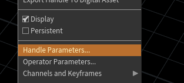

# Houdini Crash Course

## Overview

### Terminology

| Term        | Description                                                                                                                                                                                                                                                                                                                                    |
| ----------- | ---------------------------------------------------------------------------------------------------------------------------------------------------------------------------------------------------------------------------------------------------------------------------------------------------------------------------------------------- |
| **Object**  | Object type nodes in an Object type folder. These Object nodes allow you build transform constraint hierarchies. Geometry type Object nodes contain SOP nodes that construct and modify geometry that inherit any transforms at the object level.                                                                                              |
| **SOPs**    | Surface OPerators or geometry nodes that are inside an object folder. These are used to construct and modify geometry. Any kind of geometry from polygons to volumes.                                                                                                                                                                          |
| **DOPs**    | Dynamic OPerators or simulation/solver nodes that are used to construct simulations. Simulations read in geometry from SOPs and passes this data in to the DOP solvers.                                                                                                                                                                        |
| **SHOP**    | SHading Operators are materials that represent a shader to apply to geometry. Some are hard coded with vex and others are folders that you can dive in to and modify the VOPs inside.                                                                                                                                                          |
| **VOPs**    | Vector OPerators inside VOP network nodes are used for everything from building shaders to modifying geometry, volumes, pixels, and more.                                                                                                                                                                                                      |
| **VEX**     | Vector Expression Language. The code language used to write shaders. VOPs are wrappers around VEX code snippets.                                                                                                                                                                                                                               |
| **CVEX**    | Context agnostic Vector Expression Language. This has replaced all the VEX specific contexts throughout Houdini. It is a generalized language that uses the same environment and functions anywhere inside Houdini.                                                                                                                            |
| **COPs**    | Composite OPerators in composite type folders. Used in image compositing operations.                                                                                                                                                                                                                                                           |
| **ROPs**    | Render OPerators in side ROP Output directories which are used to create render output dependency graphs for automating output of any type of data and for triggering external processes like rendering. Commonly used to generate sequences of geometry, simulation data and trigger Render tasks that generates sequences of images to disk. |
| **CHOPs**   | CHannel OPerators used to create and modify any type of raw channel data from motion to audio and everything in between. Most users safely ignore the CHOP context, and so can you, for now. Put it on the “get to it later” list when learning Houdini. But definitely keep it on the list.                                                   |
| **Bundles** | Way to group things. Smart Bundles allow for patterns<br>                                                                                                                                                                                                                                                           |

### Tutorials

- General Tutorials
  - [Maya To Houdini](https://www.youtube.com/watch?v=w9V8mvi-__A)
  - [Houdini Training](https://www.youtube.com/playlist?list=PLjOCJrhSBGUG9uqJ2rMe6ByLJcTD9Jau)
  - [Softimage to Houdin](https://www.sidefx.com/tutorials/softimage-to-houdini-transition-guide/)

- Cvex_bsdf
  - [http://www.sidefx.com/docs/houdini/vex/functions/cvex_bsdf](http://www.sidefx.com/docs/houdini/vex/functions/cvex_bsdf)
  - [https://gist.github.com/WhileRomeBurns/38edb7ac5476f52ae3fd](https://gist.github.com/WhileRomeBurns/38edb7ac5476f52ae3fd)
  - [https://github.com/groundflyer/physhader-for-mantra](https://github.com/groundflyer/physhader-for-mantra)
  - ggx_eval, approxsss_sample

- Irradiance Caching
  - [https://groundflyer.github.io/point-based-gi.html#point-based-gi](https://groundflyer.github.io/point-based-gi.html#point-based-gi)

- Illuminance
  - [http://www.sidefx.com/docs/houdini/vex/functions/illuminance](http://www.sidefx.com/docs/houdini/vex/functions/illuminance)

- OpenGL Shaders
  - [http://www.sidefx.com/docs/houdini/shade/opengl](http://www.sidefx.com/docs/houdini/shade/opengl)
  - [https://www.sidefx.com/docs/hdk/_h_d_k__viewport_g_l3.html](https://www.sidefx.com/docs/hdk/_h_d_k__viewport_g_l3.html)
  - [http://www.sidefx.com/docs/houdini/shade/glsl.html](http://www.sidefx.com/docs/houdini/shade/glsl.html)

- Scripting
  - [http://www.sidefx.com/docs/houdini/render/soho](http://www.sidefx.com/docs/houdini/render/soho)


### Internals

- For every cook (frame change, parm change, etc)
  - the network starts at the Display/Render node and then walks up the chain looking for nodes with changes and evaluates dependencies for each node also querying those nodes for changes until it hits the top nodes
  - The nodes marked dirty causing the network to evaluate the dirty nodes top down evaluating the dependencies that were found
- You can set a few options in the Performance Monitor to work in the older H11 way and see this evaluation tree order if you wish.
  - It is "mandatory" that you do this if you want a deeper understanding of Houdini.
  - You definitely need to use the Performance Monitor if you want to see how the networks have evaluated as it is based on creation order along with the set-up dependencies.
  - Yes deleting and undeleting an object can and will change this evaluation order and can sometimes get you out of a spot with crashing.
- Houdini is a file system, in memory, and on disk in the .hip "cpio" archive file.
  - If you want, you can use a shell, and given any .hip file, run the hexpand shell command on the file
  - This will expand the Houdini file in to a directory structure that you can read and edit if you so wish
  - Then wrap it back up with hcollapse
- Each node is captured as three distinct files:
  - the file that that adds the node and wires it up to other nodes
  - the parameter file that sets the nodes parameters
  - another file that captures additional info on the node
  - If you locked a SOP, then that binary information will be captured as a fourth file for that node
- Different types of node networks and nodes of a specific type can only be worked on in specific directory node types
- You can dig deeper with Houdini textport pane to navigate the houdini scene via the textport as you would in a unix shell
  - opcf (aliased to cd)
  - opls (aliased to ls)
  - oppwf (aliased to oppwd and pwd)
  - Ex
    ```bash
    cd '/obj'
    ls -al
    ```
- [(Reference)](http://forums.odforce.net/topic/17105-short-and-sweet-op-centric-lessons/#comment-104263) - an _excellent_ Houdini Internals Explanation

### References

- [Excellent Houdini Internals Explanation](http://forums.odforce.net/topic/17105-short-and-sweet-op-centric-lessons/#comment-104263)
- [Attributes](http://www.sidefx.com/docs/houdini/model/attributes)
- [Global expression variables](http://www.sidefx.com/docs/houdini14.0/expressions/_globals)
- [Standard variables](http://www.sidefx.com/docs/houdini/nodes/sop/standardvariables)
- [Local SOP variables](http://www.sidefx.com/docs/houdini/nodes/sop/point#locals)
- [Houdini basics](https://github.com/kiryha/Houdini/wiki/houdini-basics)
- [Terminology](https://www.sidefx.com/forum/topic/43515/?page=1#post-195103)
- [More Terminology](http://mikelyndon.online/2017/02/07/learning-houdini-like-a-language/)


### Coordinate System

**Coordinate System:** Right handed, Y-Up

**Matrix**
- Matrices are post multiplied (`x * M * V * P`)
- Row addressable `M[RowIndex][ColumnIndex]`
- Matrix stored as row major `m[0]-m[3]` = first row, `m[4]-m[7]` = second row

Note that Houdini’s matrices are stored in row-major format, and vectors that are multiplied with matrices are treated as row vectors. [(Reference)](http://www.sidefx.com/docs/houdini/hom/hou/Matrix4)
- So, if p is a hou.Vector4 representing a point and M is a Matrix4, you write `p*M`, **_not_** `M*p`
- Similarly, `p*M1*M2` will first transform p by M1, and then transform it by M2

**IMPORTANT** however, in the houdini network editor, some nodes like channel **multiply** can be premutliplied/postmultiplied.
For left to right inputs A, B, C =>
  - Post-multiply (eg **Multiply node**) means `v * C * B * A`
  - Pre-multiply (eg **Transform node**) means `v * A * B * C`

are connected in a left to right order bc they are "post-multiply  implying a premultiply order (eg: WorldSpace * ObjectSpace * v).  Others like **transform** give you the option to premultiply or post multiply

## Configuration
- [Environment Variables](http://www.sidefx.com/docs/houdini/ref/env)
- [Houdini Python Setup](https://amesyta.wordpress.com/2017/04/14/houdini-python-environment-setup/)
- **hconfig:** for listing houdini config and environment variables
  - `-a`: dump all the environment vars
  - `-ap`: dump all the seach paths
- **hgpuinfo:** dump GPU info
  - `-c/-l`: dump OpenCL info for active/all devices
  - `-g`: dump OpenGL info
  - `-o`: dump OptiX info
- Special characters:
  - `@` => expands to directories in `HOUDINI_PATH` 
    Ex: if `HOUDINI_PATH=$HIP;$HFS/houdini;$HOME/houdini`, then `@/vex` would expand to `$HIP/vex;$HFS/houdini/vex;$HOME/houdini/vex`
  - `=` => equiv to `$HIP`
  - `&` => default path for given envar
  - `^` => expands to the shader type for VEX-related variables
    Ex: if `HOUDINI_VEX_PATH="$HOME/vex/^"`, when loading Surface shaders it will expand to `"$HOME/vex/Surface"`

## Shortcuts

To set a shortcut, click on a menu option while holding ctrl+shift+alt to bring up the hotkey manager for that menu command


### General

| Volatile keys     | Hold them to temporarily activate and revert on release. Tap to activate                                                              |
| ----------------- | ------------------------------------------------------------------------------------------------------------------------------------- |
| Ctrl+B            | Maximize current pane                                                                                                                 |
| Alt               |                                                                                                                                       |
| W                 |                                                                                                                                       |
| E                 |                                                                                                                                       |
| R                 |                                                                                                                                       |
| T                 |                                                                                                                                       |
| Y                 |                                                                                                                                       |
| X                 |                                                                                                                                       |
| Escape+enter      | Go to viewport & turn on manipulator                                                                                                  |
| M                 | Cycle through alignment of gizmo (world, object, screen, etc)                                                                         |
| K                 | Keyframe                                                                                                                              |
| '                 | Detach manipulator                                                                                                                    |
| ;                 | Align manipulator mode                                                                                                                |
| /                 | Align construction plane mode                                                                                                         |
| Ins               | Go to move pivot mode                                                                                                                 |
| Ctrl+"drag manip" | Will snap changes by units specified in handle params:<br><br> |
| Alt+W             | Rename nodes:<br>                                                                                     |
| Ctrl+1/3/4        | Change view layout to single view/3-split/4-way split                                                                                 |
| Alt+\\            | Maximize panel vertically                                                                                                             |

### Viewport

| Shortcut   | Description                                           |
| ---------- | ----------------------------------------------------- |
| Spacebar+B | Toggle maximize viewport (from splitview to one view) |
| X,C,V      | Radial menu for Snapping, Current, View               |
| Spacebar+Z | Move viewport pivot                                   |
| S          | Volatile toggle to selection                          |
| Spacebar   | Volatile: toggle to camera mode                       |
| Shift+Z    | Reset rotate pivot to a viewport center               |

### Viewport Modelling

| Shortcut            | Description                             |
| ------------------- | --------------------------------------- |
| /                   | Toggle construciton plane               |
| Alt                 | to detach curve from construction plane |
| Ctrl                | Constrain placement within 45 degrees   |
| Space, Ctrl+6,7,8,9 | To save a particular view               |
| Space, 6,7,8,9      | Return to specific view                 |
| /, Ctrl+6,7,8,9     | To save a particular c-plane            |
| /, 6,7,8,9          | Return to specific c-plane              |

### Network pane

| Shortcut                   | Description                                             |
| -------------------------- | ------------------------------------------------------- |
| C                          | color                                                   |
| P                          | parameter                                               |
| Shift+A+Mouse Drag Up/Down | Layout selected nodes either vertically or horizontally |

### Network view

| Action                                             | Shortcut                             |
| -------------------------------------------------- | ------------------------------------ |
| **Align** nodes                                    | press A, press LMB, move left(or up) |
| **Move** node with **upstream** connections        | Shift + LMB + move                   |
| **Move** node with **downstream** connections      | Ctrl + LMB + move                    |
| **Duplicate** node                                 | Alt + LMB + move .                   |
| **Duplicate** node with **upstream** connections   | Alt + Shift + LMB + move             |
| **Duplicate** node with **downstream** connections | Alt + Ctrl + LMB + move              |
| Set **display and render** flag                    | R + LMB click                        |
| Set **render** flag                                | T + LMB click                        |
| Set **bypass** flag                                | Q + LMB click                        |
| Set **template** flag                              | W + LMB click                        |
| **Reoder** inputs                                  | Shift + R                            |
| **Add** **dot                                      | ** Alt + LMB click .                 |
| **Pin** the wire                                   | Alt + LMB click                      |
| **Cut** the wire                                   | Y + LMB drag                         |
| **Set** quickmark 1                                | Ctr + 1                              |
| **Go to** quickmark 1                              | 1                                    |
| **Togle** quickmarks                               | tilda                                |
| Drop visualizer node                               | X+LMB                                |
