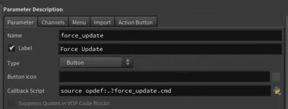

# Houdini Python

## Overview
Using houdini python libs in normal python
  - Hython.exe is a python shell wrapper that automatically sets env variables (http://www.sidefx.com/docs/houdini/hom/commandline)
  - Call the houdini script setup to set necessary env variables (look at command line tools shortcut)


## Common Recipes
- Execute Python Script internal to HDA
  - CallbackScript: source opdef:.?force_update.cmd
    
    


- Using houdini python libs in normal python
	- Hython.exe is a python shell wrapper that automatically sets env variables (http://www.sidefx.com/docs/houdini/hom/commandline)
	- Call the houdini script setup to set necessary env variables (look at command line tools shortcut)

- Get Python Code for Houdini Node or Operator
  ```python
  print hou.node('/obj/testgeo/ltcompute').asCode()
  ```

- Execute Python Script internal to HDA
  CallbackScript: `source opdef:.?force_update.cmd`

- Execute Python Script internal to Subnet: (no need for reference to self or ../)
  ```hscript
  CallbackScript: exec(hou.node("PromoteXfmParmsForPoseLib").parm('python').eval());promoteParameters("./")
  CallbackScript: exec(kwargs['node'].parm('python').eval())
  ```

- Callback on parameter update/change:
  ```python
  def callbackUpdateXfmRot(event_type, **kwargs):
    node = kwargs['node']
    parmTuple = kwargs.get('parm_tuple', None)
    if not parmTuple:
      return
    if parmTuple and parmTuple.name() == 'computedFinalXfmRot' and node.evalParm('bUseLookAt'):
      node.parmTuple('xfmRot').set(node.evalParmTuple('computedFinalXfmRot'), follow_parm_references=True);

  node = kwargs['node']
  try:
    node.removeEventCallback([hou.nodeEventType.ParmTupleChanged], callbackUpdateXfmRot)
  except hou.OperationFailed:
    pass
  node.addEventCallback([hou.nodeEventType.ParmTupleChanged], callbackUpdateXfmRot)
  ```

- Manipulate Node
  ```python
  Import hou
  Import toolutils

  Hou.node("/obj/mynode")
  N = Node.parent().createNode("bright")
  n.setFirstInput(node)
  ```

- Get a list of all parameters on a node
  ```python
  all_parms = my_cam.parms()
  my_cam.parm("lookat").get()
  Node.parm("bright").set(amount)
  hou.parmTuple("pos").eval()
  hou.evalParmTuple("pos")
  ```

- Get Point Attributes
  ```python
  [ x.name() for x in hou.node('/obj/mygeo/mysop').geometry().pointAttribs() ]
  ```

- [Cook a node through python](https://www.sidefx.com/forum/topic/47479/)
  ```python
  hou.node('/obj/my_python_node').cook(force=True)
  ```

- [Trigger a button](http://nicholaspfeiffer.com/blog/2016/2/20/houdini-tip-of-the-day-python-pressbutton-and-set-commands)
  ```python
  hou.parm('/obj/sphere_object1/rop_alembic1/execute').pressButton()
  ```

- Get Children of a node
  ```python
  skelRigNode = hou.node(node.parm('skelRig').eval())
  for child in skelRigNode.children():
    print child
  ```


- Basic Code to get selected prim string
  ```python
  import toolutils 
  viewer = toolutils.sceneViewer() 
  geo = viewer.selectGeometry() 
  prims = geo.mergedSelectionString()
  ```

- If you want get list of Prims
  ```python
  listPrim = hou.selectedNodes()[0].geometry().globPrims(prims)
  ```

- Just list of Prim numbers
  ```python
  listPrimNum = []
  for i in listPrim:
    listPrimNum.append(i.number())
  ```

- [Get the index of a vector parameter or current parmTuple channel](https://sites.google.com/site/fujitarium/Houdini/python-houdini/python-template/select-point-prim)
  ```python
  pwd().parm(expandString('$CH')).componentIndex()
  ```


- Get primitive from geo
  ```python
  iterPrims()[23]
  ```

- Cur Node Path
  ```python
  scene_view = toolutils.sceneViewer()
  scene_view.pwd()
  hou.node('/obj/CloudThuggerVol/render_cam').path() => '/obj/CloudThuggerVol/render_cam'
  hou.node('/obj/CloudThuggerVol/render_cam').name() => 'render_cam'
  ```


- Setting Dynamic Parameter range
  ```python
  numSlices = kwargs['node'].parm('numSlices').eval(); newval = min(int(kwargs['script_value']), int(numSlices));kwargs['parm'].set(newval)
  ```

## Math

- Build Rotation
  ```python
  angle = v1.angleTo(v2)
  axis = v1.cross(v2)
  rot_xform = hou.hmath.buildRotateAboutAxis(axis, angle)
  ```

## MultiParm parameters


- Accessing
  - Houdini appends the array index of the param block to all the attribute names.
  - To reference, use '#'
  - attribute name: "geo_node#" => houdini will substitute to "geo_node0", "geo_node1", etc
  - It will automatically do this once it recognizes an attribute is inside a multiparm
  - Default values: can be set doing the same thing using #. Ex: floor((# - 1)/9)*1.1
  - Ex: http://www.andynicholas.com/?p=639&page=4

## Dealing With Nodes

### Node/Graph Manipulation

- Traversing node hierarchy: `hou.node()`
  - Return the node at the given path, or None if no such node exists
  - If you pass in a relative path (i.e. the path does not start with /), searches are performed relative to this node
  - Note that the return value may be an instance of a subclass of Node.
  - For example, if the node being found is an object node, the return value will be a `hou.ObjNode` instance
  - If the path is an absolute path (i.e. it starts with /), this method is a shortcut for `hou.node(node_path)`
  - Otherwise, it is a shortcut for `hou.node(self.path() + "/" + node_path)`
    - See also hou.node_
- Access internal node named 'bindpose_after' in `constraintoffset` operator
  ```python
  choptoolutils.updatePose(kwargs['node'].node('bindpose_after'))
  ```
- To get the parent node n:      `n.node("..")`
- To get child named `geo5`:     `n.node("geo5")`
- To get sibling named `light3`: `n.node("../light3")`


- Also look at `python3.7libs\houdinihelp\examples.py`
  ```python
  subnet = network.createNode("subnet", subnet_name)

  # Move the subnet next to the original node
  pos = node.position()
  subnet.setPosition(hou.Vector2(pos.x() + 3, pos.y()))
  # Remember which node we're making an example for
  subnet.setUserData("__example_for", typename)
  # Set the comment to tell the user what to do with this subnet
  subnet.setComment("Build example network inside,\n"
                    "then RMB > Save Node Example")
  # Toggle node display or render flag
  subnet.setGenericFlag(hou.nodeFlag.DisplayComment, True)
  ```


### Editor/HDA/Operator manipulation
- Reload Editor Node Shapes
  ```python
  editor = hou.ui.paneTabOfType(hou.paneTabType.NetworkEditor)
  editor.reloadNodeShapes()
  ```

- Set node shape
  ```python
  node.setUserData("nodeshape", "nodeshapeKLShield")
  ```

- Enable Houdini Environment for python command line
```python
def enableHouModule():
  '''Set up the environment so that "import hou" works.'''
  import sys, os
  os.environ['HFS'] = os.environ['EDEV_HOU_ROOT']
  os.environ['PATH'] = os.environ['PATH'] + os.pathsep + os.path.abspath(os.path.join(os.environ['EDEV_HOU_ROOT'], 'bin'))
  sys.path.append( os.path.abspath(os.path.join(os.environ['EDEV_HOU_ROOT'], 'bin')) )

  # Importing hou will load in Houdini's libraries and initialize Houdini.
  # In turn, Houdini will load any HDK extensions written in C++.  These
  # extensions need to link against Houdini's libraries, so we need to
  # make sure that the symbols from Houdini's libraries are visible to
  # other libraries that Houdini loads.  So, we adjust Python's dlopen
  # flags before importing hou.
  if hasattr(sys, "setdlopenflags"):
    old_dlopen_flags = sys.getdlopenflags()
    import DLFCN
    sys.setdlopenflags(old_dlopen_flags | DLFCN.RTLD_GLOBAL)

  try:
    import hou
  except ImportError:
    # Add $HFS/houdini/python3.7libs to sys.path so Python can find the hou module.
    sys.path.append(os.environ['HFS'] + "/houdini/python%d.%dlibs" % sys.version_info[:2])
    import hou
  finally:
    if hasattr(sys, "setdlopenflags"):
      sys.setdlopenflags(old_dlopen_flags)
```

## ROPS
- Full ROP Example
  ```python
  def cleanup(current_node):
    default_material_node = current_node.node("matnetwork/VSR_DEFAULT_MATERIAL")
    if default_material_node:
      default_material_node.destroy()

    default_render_node = current_node.node("rop_render/VSR_DEFAULT_RENDER")
    if default_render_node:
      default_render_node.destroy()

    default_comp_node = current_node.node("copnet/VSR_DEFAULT_COMP")
    if default_comp_node:
      default_comp_node.destroy()


  def doSetup(**kwargs):
    current_node = kwargs['node']
    cleanup(current_node)

    inputs = current_node.inputs()

    # create default constant smoke material
    mat_node =  current_node.node("matnetwork")
    default_material_node = mat_node.node("VSR_DEFAULT_MATERIAL")
    if not default_material_node:
      try:
        mat_gallery = hou.galleries.galleryEntries(name_pattern="constantsmoke")[0]

        new_mat_node = mat_gallery.createChildNode(mat_node)
        new_mat_node.setName("VSR_DEFAULT_MATERIAL")
        new_mat_node.parm("smokedensity").set(current_node.parm("density_multiplier").eval())

      except IndexError as e:
        print "error: " + str(e)

    # create a defualt render node
    out_node = current_node.node("rop_render")
    default_render_node = out_node.node("VSR_DEFAULT_RENDER")
    if not default_render_node:
      try:
        new_render_node = out_node.createNode("ifd")
        new_render_node.setName("VSR_DEFAULT_RENDER")

        camera_node = current_node.node("render_cam")
        if camera_node:
          new_render_node.parm("camera").set("../../render_cam")
          res_x = current_node.parm("resolutionx").eval()
          res_y = current_node.parm("resolutiony").eval()
          camera_node.parm("resx").set(res_x)
          camera_node.parm("resy").set(res_y)

        # 0 = render current farame
        # 1 = render frame range
        new_render_node.parm("trange").set(1)
        new_render_node.parm("vm_picture").set(current_node.parm("output_path"))

        # some render settings
        if current_node.parm("quality").eval() == 1:
          parm = new_render_node.parm("vm_samplesx")
          if parm:
            parm.set(16)
          parm = new_render_node.parm("vm_samplesy").set(16)
          if parm:
            parm.set(16)

          parm = new_render_node.parm("vm_minraysamples")
          if parm:
            parm.set(4)

          parm = new_render_node.parm("vm_maxraysamples")
          if parm:
            parm.set(16)

          parm = new_render_node.parm("vm_volumequality")
          if parm:
            parm.set(1)

          parm = new_render_node.parm("vm_volumeshadowquality")
          if parm:
            parm.set(1)
        else:
          new_render_node.parm("vm_samplesx").set(3)
          new_render_node.parm("vm_samplesy").set(3)

          new_render_node.parm("vm_minraysamples").set(1)
          new_render_node.parm("vm_maxraysamples").set(9)

          new_render_node.parm("vm_volumequality").set(0.25)
          parm = new_render_node.parm("vm_volumeshadowquality")
          if parm:
            parm.set(0.5)

      except IndexError as e:
        print "error: " + str(e)


    # create a defualt comp node
    img_node = current_node.node("copnet")
    default_comp_node = img_node.node("VSR_DEFAULT_COMP")
    if not default_comp_node:
      try:
        new_comp_node = img_node.createNode("cop2net")
        new_comp_node.setName("VSR_DEFAULT_COMP")


        file_node = new_comp_node.createNode("file")
        file_node.setName("DEFAULT_FILE")
        sequence_path = current_node.parm("output_path")
        file_node.parm("filename1").set( sequence_path )

        mosaic_node = new_comp_node.createNode("mosaic")
        num_slice = current_node.parm("num_slice").eval()
        mosaic_node.parm("imagelimit").set(num_slice)
        per_line = int(math.sqrt(num_slice))
        mosaic_node.parm("numperline").set(per_line)


        rop_node = new_comp_node.createNode("rop_comp")
        rop_node.setName("DEFAULT_ROP")
        final_render_path = current_node.parm("output_pic_path").eval()
        final_render_path = final_render_path.replace("\\", "/")
        rop_node.parm("copoutput").set(final_render_path)
        rop_node.parm("alpha").set("C")
        rop_node.parm("trange").set(0)

        rop_node.setInput(0, mosaic_node)
        mosaic_node.setInput(0, file_node)

        file_node.parm("reload").pressButton()

      except IndexError as e:
        print "error: " + str(e)

    # setup frame range by number slices
    start_frame = 1
    end_frame = current_node.parm("num_slice").eval()
    #hou.playbar.setPlaybackRange(start_frame, end_frame)
    setGobalFrangeExpr = 'tset `(%d-1)/$FPS` `%d/$FPS`' % (start_frame,end_frame)

    hou.hscript(setGobalFrangeExpr)
  ```

- Create bundle and lights
  ```python
  def create_rgb_light_rig():
    if not hou.nodeBundle('rgb_lightrig'):
      rig_bundle = hou.addNodeBundle('rgb_lightrig')
    else:
      rig_bundle = hou.nodeBundle('rgb_lightrig')

    if (hou.pwd().parm('render_rgb_lights').eval()==1):
      obj = hou.node("/obj")
      if not hou.node('/obj/RGB_LIGHTRIG'):
        rig_subnet = obj.createNode('subnet', 'RGB_LIGHTRIG')
        null = rig_subnet.createNode('null')
        #y_pointing_down
        light = rig_subnet.createNode('hlight')
        light.setName("Y_Pointing_Down")
        light.parm('ogl_enablelight').set(0)
        light.parm('light_type').set(7)

        light.parm('light_colorr').set(0.0)
        light.parm('light_colorg').set(1.0)
        light.parm('light_colorb').set(0.0)

        light.parm('tx').set(0.0)
        light.parm('ty').set(5.0)
        light.parm('tz').set(0.0)

        light.parm('rx').set(-90.0)
        light.parm('ry').set(0.0)
        light.parm('rz').set(0.0)

        light.setFirstInput(null)

        rig_bundle.addNode(light)

        #y_pointing_up
        light = rig_subnet.createNode('hlight')
        light.setName("Y_Pointing_Up")
        light.parm('ogl_enablelight').set(0)
        light.parm('light_type').set(7)

        light.parm('light_colorr').set(0.0)
        light.parm('light_colorg').set(1.0)
        light.parm('light_colorb').set(0.0)

        light.parm('tx').set(0.0)
        light.parm('ty').set(-5.0)
        light.parm('tz').set(0.0)

        light.parm('rx').set(90.0)
        light.parm('ry').set(0.0)
        light.parm('rz').set(0.0)

        light.setFirstInput(null)

        rig_bundle.addNode(light)

        #x_pointing_left
        light = rig_subnet.createNode('hlight')
        light.setName("X_Pointing_Left")
        light.parm('ogl_enablelight').set(0)
        light.parm('light_type').set(7)

        light.parm('light_colorr').set(1.0)
        light.parm('light_colorg').set(0.0)
        light.parm('light_colorb').set(0.0)

        light.parm('tx').set(5.0)
        light.parm('ty').set(0.0)
        light.parm('tz').set(0.0)

        light.parm('rx').set(0.0)
        light.parm('ry').set(90.0)
        light.parm('rz').set(0.0)

        light.setFirstInput(null)

        rig_bundle.addNode(light)

        #x_pointing_right
        light = rig_subnet.createNode('hlight')
        light.setName("X_Pointing_Right")
        light.parm('ogl_enablelight').set(0)
        light.parm('light_type').set(7)

        light.parm('light_colorr').set(1.0)
        light.parm('light_colorg').set(0.0)
        light.parm('light_colorb').set(0.0)

        light.parm('tx').set(-5.0)
        light.parm('ty').set(0.0)
        light.parm('tz').set(0.0)

        light.parm('rx').set(0.0)
        light.parm('ry').set(-90.0)
        light.parm('rz').set(0.0)

        light.setFirstInput(null)

        rig_bundle.addNode(light)

        #z_pointing_away_from_camera
        light = rig_subnet.createNode('hlight')
        light.setName("Z_Pointing_Away_From_Camera")
        light.parm('ogl_enablelight').set(0)
        light.parm('light_type').set(7)

        light.parm('light_colorr').set(0.0)
        light.parm('light_colorg').set(0.0)
        light.parm('light_colorb').set(1.0)

        light.parm('tx').set(0.0)
        light.parm('ty').set(0.0)
        light.parm('tz').set(5.0)

        light.parm('rx').set(0.0)
        light.parm('ry').set(0.0)
        light.parm('rz').set(0.0)

        light.setFirstInput(null)

        rig_bundle.addNode(light)

        #z_pointing_towards_camera
        light = rig_subnet.createNode('hlight')
        light.setName("Z_Pointing_Towards_Camera")
        light.parm('ogl_enablelight').set(0)
        light.parm('light_type').set(7)

        light.parm('light_colorr').set(0.0)
        light.parm('light_colorg').set(0.0)
        light.parm('light_colorb').set(1.0)

        light.parm('tx').set(0.0)
        light.parm('ty').set(0.0)
        light.parm('tz').set(-5.0)

        light.parm('rx').set(0.0)
        light.parm('ry').set(180.0)
        light.parm('rz').set(0.0)

        light.setFirstInput(null)

        rig_bundle.addNode(light)

        #orient lights to camera
        camera_node = hou.node(hou.pwd().parm("camera").eval())
        camera_rx = camera_node.parm('rx').path()
        null_rx = null.parm('rx')
        null_rx.setExpression("ch(\"%s\")" % camera_rx)

        camera_ry = camera_node.parm('ry').path()
        null_ry = null.parm('ry')
        null_ry.setExpression("ch(\"%s\")" % camera_ry)

        camera_rz = camera_node.parm('rz').path()
        null_rz = null.parm('rz')
        null_rz.setExpression("ch(\"%s\")" % camera_rz)

      mantra_node = hou.node(hou.pwd().parm("mantra_external").eval())
      if mantra_node:
        mantra_node.parm('excludelights').set('@rgb_lightrig')
    else:
      obj = hou.node("/obj")
      rgb_lightrig = hou.node('/obj/RGB_LIGHTRIG')
      if rgb_lightrig:
        rgb_lightrig.destroy()
  ```

## Kiryha's Snippets
[Kiryha's Python Snippets Inlined below](https://github.com/kiryha/Houdini/wiki/python-snippets)

You can explore the node parameters with Python Shel:
- Create any node and tweak its parameters
- Run Python Shell.
- Type `node = `, drag node to Shell (you will get `hou.node('path/to/node')`), press enter.
- Type `print node.asCode()`

### Snippets
##### Install pip in Houdini
```python
# Download and save get-pip.py
import os
os.popen('python get-pip.py').read()
```

##### Install package with pip in Houdini
```python
import pip
pip._internal.main(['install', 'package_name'])
```

##### Get Houdini environment variable
```python
import hou

# print current scene name
print hou.expandString("$HIPNAME")
```

##### Scene file operations
```python
import hou
sceneRoot = hou.node('/obj')

# Save current scene as file
hou.hipFile.save('C:/temp/myScene_001.hipnc')

# Export selected node to a file
sceneRoot.saveChildrenToFile(hou.selectedNodes(), [], 'C:/temp/nodes.hipnc')

# Import file to the scene
sceneRoot.loadChildrenFromFile('C:/temp/nodes.hipnc')
```

##### Get node from the scene
```python
import hou
node = hou.node('/<nodePath>/<nodeName>') # By name
node = hou.selectedNodes()[0] # By selection
# Get node content
node.children()
```

##### Get node upstream connections
```Python
listParents = node.inputAncestors()
```

##### Create node in the scene
To create any node wiyh Python you have to set parent node for that. You need to create Geometry node in OBJ context.
```Python
# Get scene root node
OBJ = hou.node('/obj/')
# Create Geometry node in scene root
geometry = OBJ.createNode('geo')
```

```python
import hou
# Create transform node inside geo1
geometry = hou.node('/obj/geo1')
xform = geometry.createNode('xform')
xform.moveToGoodPosition() # Align new node

# Create new transform node linked to existing transform
xformNew= xform.createOutputNode('xform')
```
##### Delete node
```python
import hou
node = hou.node('/<nodePath>/<nodeName>')
node.destroy() # Delete node
```
##### Delete parameter expression (chennal, animation)
```python
import hou
node = hou.node('/<nodePath>/<nodeName>')
node.parm(<parameterName>).deleteAllKeyframes()
```

##### Copy node to another location
```python
import hou
node = hou.node('/<nodePath>/<nodeName>')
parent = hou.node('/<parentPath>/')
hou.copyNodesTo([node], parent)
```

##### Get and set parameters
```python
import hou
node = hou.selectedNodes()[0]

# get translate X
node.parm('tx').eval()
hou.parm('/obj/geo1/tx').eval()
hou.ch('/obj/geo1/tx')

# Get string parameter without token evaluation
node = hou.node('/obj/geometry/fileCache')
print node.parm('file').eval()
print node.parm('file').rawValue()
# >> C:/temp/myFile.1.bgeo.sc
# >> $HIP/myFile.$F.bgeo.sc

# set translate XYZ
node.parmTuple('t').set([0,1,0])
hou.parm('/obj/geo1/tx').set(2)

# Set parameters for selected Remesh SOP
remesh = hou.selectedNodes()[0]
remesh.setParms({'group': 'myGroup', 'element_sizing1': 1, 'iterations': 2})
```

##### Get Translate X keyframes of selected node
```Python
import hou
node = hou.selectedNodes()[0]

node.parm('tx').keyframes()
```

##### Run hscript command form Python
```Python
# Run Redshift IPR
hou.hscript('Redshift_openIPR')
```

##### Get all node parameters names
```Python
def getAllNodeParameters(node):
    # Return list of all parameters names for input node object
    allParameters = [param.name()for param in node.parms()]
    return allParameters
```

##### Connect nodes
```python
import hou
# Create transform nodes
xform_A = hou.node('/obj/geo1/transform1')
xform_B = hou.node('/obj/geo1/transform2')
 # Connect transform_A to transform_B
xform_B.setInput(0, xform_A)

# Create merge
merge = node.createNode('merge')
# Connect xforms to a merge
merge.setNextInput(xform_A)
merge.setNextInput(xform_B)

# Get node inputs
merge.inputs()
# Get node outputs
merge.outputs()
```
##### Get groups
```Python
import hou

node = hou.selectedNodes()[0]
groups = [g.name() for g in node.geometry().primGroups()]
print groups
```
##### Builder workflow (shop context)
Create "Material Surface Builder" in SHOP context, dive inside.
```python
import hou
shader = hou.node('/shop/vopmaterial1/lambert1')
out = hou.node('/shop/vopmaterial1/surface_output')
out.setNamedInput('Cf', shader, 'clr') # Set connection by name
out.setNamedInput(0, shader, 0) # Set connection by parameter index

# List all inputs for node 'surface_output'
print out.inputNames()
```

##### Filter node.children() output
```python
import hou
selectedNode = hou.selectedNodes()

def extractVop(listOfChildrens):
    for node in listOfChildrens:
        if node.type().name() == 'vopsurface':
            return node

# return vopsurface nodes
vops = extractVop(selectedNode.children())
```

Same task with list comprehensions:
```python
import hou
selectedNode = hou.selectedNodes()

# return vopsurface nodes
vops = [node for node in selectedNode.children() if node.type().name() == 'vopsurface']
```

##### Run compiled PySide2 UI
This is the better option (then running *.ui files, see below)!
Create with QT Designer interface.ui file and save it somewhere where Houdini Python will see it (or add the path to the file to os.environ['PYTHONPATH']). Name main widget object (QWidget) "MyInterface".
Create compile_ui.bat file:
```c
set UIFILE=%1
set UIDIR=%~dp$PATH:1
set FILENAME=%~n1
set SNAME=%UIDIR%%FILENAME%.py


CALL C:\Python27\Scripts\pyside2-uic.exe %UIFILE% -o %SNAME%
```
Drag and drop interface.ui on compile_ui.bat to get interface.py
In Houdini run this code in Python Source Editor window:

```python
import os
import hou

os.environ['PYTHONPATH']  = 'path to compiled interface.py'

from PySide2 import QtCore, QtUiTools, QtWidgets
import interface


class Window(QtWidgets.QDialog, interface.Ui_MyInterface):
    def __init__(self):
        super(Window, self).__init__()
        self.setupUi(self)
        self.setParent(hou.ui.mainQtWindow(), QtCore.Qt.Window)

        self.pushButton.clicked.connect(self.prn)

    def prn(self):
        print 'OLA'


win = Window()
win.show()

```

##### Run PySide UI
Create and save a UI file with QT Designer. It could be just a blank widget (but not Main Window). In Houdini run this code in Python Source Editor window:

```python
# Run *ui file in Houdini

import hou
from PySide2 import QtCore, QtUiTools, QtWidgets

class MyWidget(QtWidgets.QWidget):
    def __init__(self):
        super(MyWidget,self).__init__()
        ui_file = 'C:/path/to/file.ui'
        self.ui = QtUiTools.QUiLoader().load(ui_file, parentWidget=self)
        self.setParent(hou.ui.mainQtWindow(), QtCore.Qt.Window)

win = MyWidget()
win.show()
```
You should have your window opened.

## Tools

### Expand Alembic
```Python
# Expand Alembic
# Recreate alembic hierarchy by object groups and names
# Select Alembic node, set

# Naming convention
# Hirarchy in alembic: OBJECT (group)/PART_01, ..., PART_## (meshes)
# OBJECTS: <objectName>_<objectVariation> : bootle_A
# PARTS: <objectName>_<objectVariation>_<objectPart> : bootle_A_label

import hou

# Get Alembic SOP
ABC = hou.selectedNodes()[0]

def checkConditions():
    '''
    Check if environment conditions allows to run script without errors
    '''
    if not ABC:  # If user select anything
        print '>> Nothing selected! Select Alembic SOP!'
        return 0


def buildObjectsMap(listGroups):
    # Create object map dictionary: each object = key, list of parts = values

    objectsMap = {} # { OBJ: [PARTs] }

    for partNameFull in listGroups:
        items = partNameFull.split('_')
        object = '{0}_{1}'.format(items[0], items[1])
        part = items[2]

        if not object in objectsMap.keys():
            objectsMap[object] = [part]
        else:
            objectsMap[object].append(part)

    return objectsMap

def buildGroupsList(object, listParts):
    # Create string for BLAST SOP with list of groups for each object

    groupsList = ''
    for part in listParts:
        name = '{}_{}'.format(object, part)
        groupsList += ' ' + name

    return groupsList


def expandABC(OBJ, objectsMap):
    # Recreate alembic hierarchy

    for object in sorted(objectsMap.keys()):
        groupsList = buildGroupsList(object, objectsMap[object])
        blast = OBJ.createNode('blast')
        blast.setNextInput(ABC)
        blast.setName(object)
        blast.parm('group').set(groupsList)
        blast.parm('negate').set(1)
        blast.moveToGoodPosition()

def run():
    if checkConditions() != 0:
        # Setup Alembic properties
        ABC.parm('loadmode').set(1)
        ABC.parm('groupnames').set(4)
        # Get Alembic container
        OBJ = ABC.parent()

        # Get all groups (PARTS) from alembic
        listGroups = [g.name() for g in ABC.geometry().primGroups()]

        # Build Objects Map
        objectsMap = buildObjectsMap(listGroups)
        # Expand Alembic
        expandABC(OBJ, objectsMap)

        print '>> EXPANDING DONE!'

run()
```

### Import FBX into Houdini
```Python
import hou
import os

dirFBX = 'P:/PROJECTS/NSI/PROD/3D/lib/ANIMATION/CHARACTERS/ROMA/FBX/'
filesNamesFBX = [fileName for fileName in os.listdir(dirFBX) if os.path.isfile(os.path.join(dirFBX, fileName))]

for fileName in filesNamesFBX:
    fileFBX =  '{0}{1}'.format(dirFBX,fileName)
    if not hou.node('/obj/{}_fbx'.format(fileName.replace('.fbx',''))):
        hou.hipFile.importFBX(fileFBX)
    else:
        print 'FBX {} EXISTS!'.format(fileName)
```

### Convert imported FBX to geometry
```Python
# 256 Pipeline tools
# Convert FBX subnetwork to Geometry node
# Import FBX into Houdini, select FBX subnetwork, run script in Python Source Editor

import hou
# Get selected FBX container and scene root
FBX = hou.selectedNodes()
OBJ = hou.node('/obj/')

def checkConditions():
    '''
    Check if environment conditions allows to run script without errors
    '''
    if not FBX:  # If user select anything
        print '>> Nothing selected! Select FBX subnetwork!'
        return 0

def convert_FBX():
    '''
    Create Geometry node and import all FBX part inside
    '''
    # Create Geometry node to store FBX parts
    geometry = OBJ.createNode('geo', run_init_scripts = False)
    geometry.setName('GEO_{}'.format(FBX.name()))
    geometry.moveToGoodPosition()
    # Get all paerts inside FBX container
    geometry_FBX = [node for node in FBX.children() if node.type().name() == 'geo']

    # Create merge node for parts
    merge = geometry.createNode('merge')
    merge.setName('merge_parts')

    # Replicate FBX structure in Geometry node
    for geo in geometry_FBX:
        # Create Object Merge node
        objectMerge = geometry.createNode('object_merge')
        objectMerge.setName(geo.name())
        # Set path to FBX part object
        objectMerge.parm('objpath1').set(geo.path())
        objectMerge.parm('xformtype').set(1)
        # Create Material node
        material = geometry.createNode('material')
        material.setName('MAT_{}'.format(geo.name()))
        # Link Material to Object Merge
        material.setNextInput(objectMerge)
        # Link part to Merge
        merge.setNextInput(material)

    # Set Merge Node flags to Render
    merge.setDisplayFlag(1)
    merge.setRenderFlag(1)
    # Layout geometry content in Nwtwork View
    geometry.layoutChildren()

# Check if everything is fine and run script
if checkConditions() != 0:
    # Get FBX network
    FBX = FBX[0]
    # run conversion
    convert_FBX()
    print '>> CONVERSION DONE!'
```

### Create Material Stylesheet UI
```Python
# Create Material Stylesheet parameter interface
# Select Geometry node, run script

import hou

# Get selected geometry node to create Stylesheet parameter
OBJ = hou.selectedNodes()[0]

# Define tags
dataTags = {'script_action_icon':'DATATYPES_stylesheet',
            'script_action_help':'Open in Material Style Sheet editor.',
            'spare_category':'Shaders',
            'script_action':"import toolutils\np = toolutils.dataTree('Material Style Sheets')\np.setCurrentPath(kwargs['node'].path() + '/Style Sheet Parameter')",
            'editor':'1'}

# Create parameter interface
group = OBJ.parmTemplateGroup()
folder = hou.FolderParmTemplate('folder', 'Shaders')
folder.addParmTemplate(hou.StringParmTemplate('shop_materialstylesheet', 'Material Style Sheet', 1, tags = dataTags))
group.append(folder)
OBJ.setParmTemplateGroup(group)
```

### Flatten curve
```Python
# Flatten curve: set Y coord = 0
coordList_SRC = '39.1665,0.362686,22.4173 55.3542,0.365759,10.9339'
coords = coordList_SRC.split(' ')

coordList_RES = ''
for xyz in coords:
    listXYZ_SRC = xyz.split(',')
    listXYZ_SRC = '{0},0.0,{1} '.format(listXYZ_SRC[0], listXYZ_SRC[2])
    coordList_RES += listXYZ_SRC

print coordList_RES
```