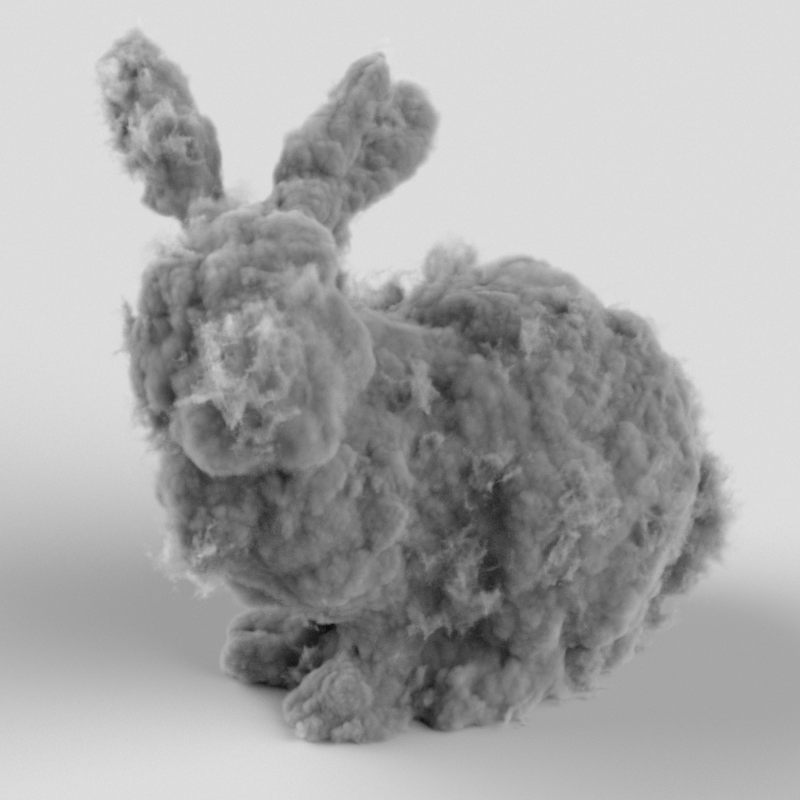
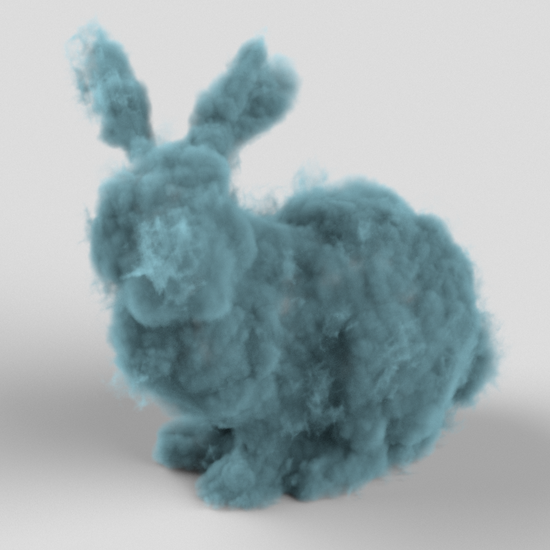

# Redshift
## Compositing Equation
- `Beauty = DiffuseFilter_DiffuseLightingRaw + DiffuseFilter_GlobalIlluminationRaw + DiffuseFilter*SubsurfaceScatteringRaw + SpecularLighting + Reflections + Refractions + Emission + Caustics`
- If using "Caustics Raw" instead of "Caustics", these would have to also be multiplied by "Diffuse Filter".
- [Redshift Doc](https://docs.redshift3d.com/display/RSDOCS/AOV+Tutorial?product=houdini)
- Volume AOVs
  - **Multiply** the primary AOV composite by the Volume Fog Tint AOV
    - Volume Fog Tint AOV is a multiplicative layer/volume transmittance
  - **Add** the Volume Lighting AOV to the primary AOV composite.
    - Additive layer that contains only the volume lighting information
  - **Add** the Volume Fog Emission AOV to the primary AOV composite.
    - Additive layer that contains only the emission component

## Volume Rendering
- If want to make volume darker but preserve approximate intensity, adjust scatter and absorption coefficients together
- use the "Scatter Tint" to adjust the overall color of the volume
- advanced manipulation of scattering can happen vie the scatter color ramp to remap density to different color
- Absorption also can be remapped. Its a scalar as it's conceptually remapping opacity

  |  |  |  |             |            |
  | ----------------------------------- | ----------------------------------- | ----------------------------------- | ---------------------------------------------- | --------------------------------------------- |
  | `Scatter=5`,`Absorption=5`          | `Scatter=10`,`Absorption=10`        | `Scatter=10`,`Absorption=5`         | `Scatter=3`,`Absorption=3`,`ScatterTint=White` | `Scatter=3`,`Absorption=3`,`ScatterTint=Blue` |
