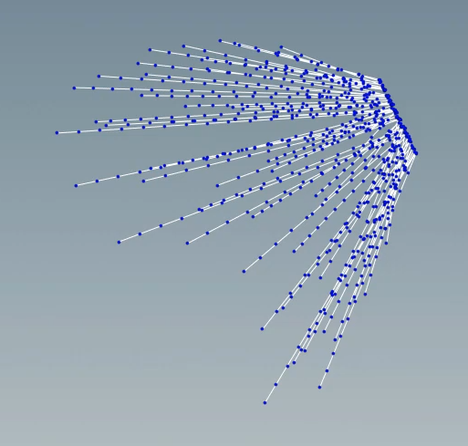

# Common Techniques

- Convert Splines to Geo: Polyline or wire node
- Convert Polygon to Volume
  - Use GameDev Voxel Mesh Node: Creates watertight mesh
  - Use VDB From Polygons Node: Needs watertight mesh
- Convert Volume to Polygon:
  - Convert VDB: Convert to=polygons
- Convert Volume to surface/isosurface/sdf:
  - Convert VDB: VDB Class: Fog -> SDF
  - VDB Topology to SDF: will create shrink wrapped sdf around active vdb nodes. By definition, will create water tight meshes

## Useful Nodes

| Node                          | Description                                                                                                                                                                                                                                                                                                                                                                                                                                                                  |
| ----------------------------- | ---------------------------------------------------------------------------------------------------------------------------------------------------------------------------------------------------------------------------------------------------------------------------------------------------------------------------------------------------------------------------------------------------------------------------------------------------------------------------- |
| Draw Curve                    | Allows you to draw curve and on projected geometry                                                                                                                                                                                                                                                                                                                                                                                                                           |
| Rotoshape                     | Allow to rotoscope image files                                                                                                                                                                                                                                                                                                                                                                                                                                               |
| Polyframe                     | Generate frames along curves, Mikkt Tangents, etc.                                                                                                                                                                                                                                                                                                                                                                                                                           |
| Connectivity                  | Generates mesh connectivity information so you can grab /destroy mesh islands                                                                                                                                                                                                                                                                                                                                                                                                |
| Cookie                        | Create outline of intersection of one geo onto another (useful for getting silhouette curve of geo on a plane)                                                                                                                                                                                                                                                                                                                                                               |
| Point Deform                  | Computes delta xform between two point clouds (with or without connectivity) and applies it as a lattice deformation to object. Useful for applying deformation from animation onto something you computed at frame 1 (like a silhouette)                                                                                                                                                                                                                                    |
| BlendPose CHOP                | This does a blendpose solve along the lines of Point Deform. Look at BlendPose Basic example                                                                                                                                                                                                                                                                                                                                                                                 |
| Cloth Capture                 | Assignes weights of a low res different topology mesh on higher resolution mesh. Can use this to convert blend shapes to bones                                                                                                                                                                                                                                                                                                                                               |
| Capture Attribute Pack/Unpack | Allows capture attributes to be accessible to vex                                                                                                                                                                                                                                                                                                                                                                                                                            |
| Skin Surface                  | Create skin patch from curvese                                                                                                                                                                                                                                                                                                                                                                                                                                               |
| Dissolve                      | Remove points but hole fill                                                                                                                                                                                                                                                                                                                                                                                                                                                  |
| Shrink Wrap                   | The Shrinkwrap operation computes the convex hull of the input geometry using the same method as Tetrahedralize, and translates the resultant polygonal primitives inwards along their normals. Unlike the Peak SOP, which takes the point and moves it according to the average of the neighboring polygons, Shrinkwrap moves the polygons and recomputes their intersections, possibly creating new and removing old points, but maintaining polygon normal directions. |
| Peak/Soft Peak                | Move points along their normal to contract/dilate mesh                                                                                                                                                                                                                                                                                                                                                                                                                       |
| Ray                           | Project Geo onto another for attribute transfer                                                                                                                                                                                                                                                                                                                                                                                                                              |
| Carve                         | Automatically can cut geo/paths along u,v                                                                                                                                                                                                                                                                                                                                                                                                                                    |
| Fall-off                      | Compute fall-off over surface with using either geodesic, or cartesian falloff                                                                                                                                                                                                                                                                                                                                                                                               |
| Rest                          | Creates an attribute which causes material textures to stick to surfaces deformed using other operations.                                                                                                                                                                                                                                                                                                                                                                    |
| Magnet + Metaball             | Offset/deform points/curves based on scaling of a metaball sphere                                                                                                                                                                                                                                                                                                                                                                                                            |
| Ray                           | Can use it to project curves to geometry                                                                                                                                                                                                                                                                                                                                                                 |
| Pointsfromvolume              | Generate points inside a volume. You can also connect use Scatter SOP + vdb input                                                                                                                                                                                                                                                                                                                                                                                            |

## Poly Clean Up

- Workflow
  1. Roundtrip: Polymesh to vdb back to polygons to remove small interior triangles
  2. PolyDoctor (better version of clean) to detect mesh issues
  3. Run instantmeshes to quadrangulate
  4. PolyReduce to reduce down topology
  5. Divide to triangulate
- Workflow Alt
  - Remesh => to create uniform triangle sizes of everything

| Node          | Description                                                             |
| ------------- | ----------------------------------------------------------------------- |
| PolyDoctor    | Clean up/visualize problem polys/re-orient winding order                |
| Remesh        | Re-topologize                                                           |
| InstantMeshes | (custom) Use instant-remesher                                           |
| PolyReduce    | Reduce poly                                                             |
| Polydeform    | Warp one mesh to another                                                |
| Divide        | Triangulate. Bricker option ensures uniform internal division of points |
| Clean         | Clean-up bad geo                                                        |
| UV Unwrap     |                                                                         |
| UV Flatten    |                                                                         |
| UV Layout     |                                                                         |
| UV Visualize  | Visualize UV seams and islands                                          |

## Chops

| Node            | Description                                                                                                                          |
| --------------- | ------------------------------------------------------------------------------------------------------------------------------------ |
| Envelope/Filter | Use in chops to allow you to operate on a local window aka convolutions                                                              |
| Geometry chop   | Import geo attributes into channels                                                                                                  |
| Channel sop     | import channels into geo attributes                                                                                                  |
| Slope           | Calculate 1st, 2nd, 3rd derivatives (velocity, acceleration, jerks)                                                                  |
| Trigger         | Analysis of peaks using attack/decay/sustain/release ADSR envelope. Trigger occurs when 1st input increases across trigger threshold |

## COPS

| Node   | Description                         |
| ------ | ----------------------------------- |
| GeoKey | Isolate based on geo attribute data |
