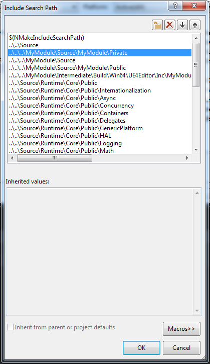

# Unreal Engine 4 build file demystified

_**Note**: this is [internet archive snapshot](https://web.archive.org/web/20160526151908/http://dmitry-yanovsky.com/2015/08/unreal-engine-4-build-file-demystified/) of Dmitry Yanovsky's article because that now redirects to NSFW spam_

In this post I’ll try to describe and explain the internals of the Unreal Engine `*.Build.cs` file. There is a lot of confusion going on among the beginners and people often just copy/paste contents of this file without actually knowing what they’re doing.

This article expects the reader to have a certain level of ability in programming and to be familiar with at least the very basics of C++ language. Otherwise, you may end up being even more confused. If you’ve noticed a mistake in the text or if you think that I’ve got something totally wrong, I urge you to use the comments section below.

So, what is this `*.Build.cs` file exactly?

Unreal Engine 4 is split into different modules, each having its own `*.Build.cs` file that controls how this particular module is built. To perform project building Unreal Engine 4 uses a proprietary tool called UnrealBuildTool. This `*.Build.cs` file is a configuration file which allows to define module dependencies and include paths along with providing a number of other interesting options to the user, but in this post I would like to talk about these two in particular.

To make it easier for you, I’ve bundled together a test project with a single module in it that you can download [here](https://web.archive.org/web/20160526151908/http://dmitry-yanovsky.com/wp-content/uploads/2015/08/MyModule.zip). It doesn’t make any sense from the functional point of view but you can use it to follow along with this article and then continue experimenting with it on your own to see how different settings affect the building process.

There is also a single convention I’ll stick to in this article: when you see the word ‘project’ it means that I refer to our MyModule module. And when I explicitly say ‘module’ then it means that I’m talking about other modules.

Here is our project’s `MyModule.Build.cs` file:

```csharp
namespace UnrealBuildTool.Rules
{
  public class MyModule : ModuleRules
  {
    public MyModule (TargetInfo Target)
    {
      PublicDependencyModuleNames.AddRange(new string[]{ "Core" });
      PrivateDependencyModuleNames.AddRange(new string[]{ });
      PublicIncludePaths.AddRange(new string[]{ });
      PrivateIncludePaths.AddRange(new string[]{ });
      PublicIncludePathModuleNames.AddRange(new string[]{ });
      PrivateIncludePathModuleNames.AddRange(new string[]{ });
    }
  }
}
```

As you can see, there is a whole bunch of variables used to configure the build process. We shall talk about them one at a time, but first let’s take a look at the general folder structure of a module inside Unreal Engine 4:

`Runtime\Core\Private Runtime\Core\Public Runtime\Core\Core.Build.cs`

Private folder (aka ‘src’) as the name implies contains the module’s private implementation details which are not to be exposed to other modules. You can store not only .cpp but also .h files there, provided you don’t want other modules to make use of them. Public folder (aka ‘includes’) contains a public interface that will be available to other modules.

Now, let’s talk about the options we have to control the build process.

## Public Dependency Module Names

---

```csharp
PublicDependencyModuleNames.AddRange(new string[]{ });
```

This list contains names of other modules that your project’s code in Public folder depends on.

This list is somewhat mandatory if you plan to use Unreal Engine features in your module. The bare minimum you need is:

```csharp
PublicDependencyModuleNames.AddRange(new string[] { "Core" });
```

You might already know that in order to use your game project with Unreal Engine, you need to first ‘implement’ it as a module, using the special macro:

```csharp
IMPLEMENT_PRIMARY_GAME_MODULE( FDefaultGameModuleImpl, MyModule, "MyModule" );
```

This macro comes from the ModuleManager.h file which resides in the Core module of Unreal Engine 4. Thus you must have it as your dependency. The more or less standard set of modules that your project publically depends on looks like this:

```csharp
PublicDependencyModuleNames.AddRange(new string[] { "Core", "CoreUObject", "Engine", "InputCore" });
```

Marking module as a “dependency” makes sure that its code gets “exported” with your project by the linker. In this particular case we say that our project is ‘statically linked’ to these modules.

The compiler automatically invokes the linker as the last step of the compilation process. With static linking it resolves project’s references to the code in other modules by copying it right into the project and combining different modules of the project into a single executable which can be loaded into memory. Thus it generally requires more space and memory than dynamic linking, but although it is usually faster. And more portable, because you don’t have to make sure that there are all needed additional libraries on the system where the program is executed.

## Private Dependency Module Names

---

```csharp
PrivateDependencyModuleNames.AddRange(new string[]{ });
```

This list contains names of other modules that your project’s code in Private folder depends on.

This one follows the same pattern as public dependencies but for the code in your Private folder. It means that your public interface does not need to know on which modules the project depends on in its implementation. Only the private implementation itself cares. Thus you really should not include headers from the Private dependencies list inside of your project’s Public folder. Though there is nothing to stop you from doing that.

## Private Include Paths

---

```csharp
PrivateIncludePaths.AddRange(new string[]{ });
```

This list contains paths to header files in our project’s Private folder that are exposed to our project.

There are two syntactically correct ways how you can #include header files. One is by using double quotes (“”) and the second one is by using angle brackets (<>). Depending on which you choose, the preprocessor will behave slightly differently:

If we pick double quotes variation then the order in which the preprocessor will search for include files looks like this:

- In the same directory as the file that contains the #include statement.
- In the directories of the currently opened include files, in the reverse order in which they were opened. The search begins in the directory of the parent include file and continues up through the directories of any grandparent include files.
- Along the path that’s specified by each /I compiler option.
- Along the paths that are specified by the INCLUDE environment variable.

If we pick angle brackets then that list gets diminished. It is mostly used for system libraries which are usually already set up via environment variable:

- Along the path that’s specified by each /I compiler option.
- When compiling occurs on the command line, along the paths that are specified by the INCLUDE environment variable.

In our project we have this header file inside of our Private folder:

MyModule/Private/MyModulePrivateClass.h

Let’s try to include it in our MyModule/Private/MyModulePrivateClass.cpp file like this:

```cpp
#include "MyModulePrivateClass.h"
```

Everything should compile just fine, because both files are in the same folder.

But let’s try to include it like this:

```cpp
#include <MyModulePrivateClass.h>
```

And we will get an error message saying:

`fatal error C1083: Cannot open include file: 'MyModulePrivateClass.h': No such file or directory`

You will also get an error if you try to include a header file from the subfolder. E.g. MyModule/Private/MyModulePrivateSubfolder/MyModuleOtherPrivateClass.h

If we try to include it in our MyModule/Private/MyModulePrivateClass.cpp, we’ll get the same error as before:

`fatal error C1083: Cannot open include file: 'MyModuleOtherPrivateClass.h': No such file or directory`

We can fix it in several ways. First option is to specify the whole path, relative to the project’s source root folder. Like this:

```cpp
#include "MyModulePrivateSubfolder/MyModuleOtherPrivateClass.h"
```

But we can also make use of the PrivateIncludePaths specifier. If we add this line to our MyModule.Build.cs file:

```csharp
PrivateIncludePaths.Add({ "MyModule/Private/MyModulePrivateSubfolder" });
```

Then our project should compile just fine and now we can include header files from this folder within our project. Same rules apply to the root Private folder. If you try to include MyModule/Private/MyModulePrivateClass.h inside any of the files from MyModule/Private/MyModulePrivateSubfolder then you’ll also get this error. To fix it, you should (now knowingly) add the path to the root Private folder to our PrivateIncludePaths:

```csharp
PrivateIncludePaths.Add({ "MyModule/Private" });
```

I’m adding these paths one by one for the purpose of a better article flow, but you can of course add multiple entries at once using AddRange method:

```csharp
PrivateIncludePaths.AddRange(new string[] { "MyModule/Private", "MyModule/Private/MyModulePrivateSubfolder" });
```

You might ask yourself – what magic is this? What if we didn’t have the awesome UBT tool? How would we do all the above?

Here is how.

Unreal Engine makes use of NMake build system. You can find more information about it [on the web](https://web.archive.org/web/20160526151908/https://msdn.microsoft.com/ru-ru/library/dd9y37ha%28v=VS.120%29.aspx 'Microsoft MSDN').

If you go to your project’s properties and go under NMake category you will find ‘Include search paths’ section.


When you generate your project file using GenerateProjectFiles.bat or UnrealVS plugin this list gets populated by UBT depending on the contents of your project’s `*.Build.cs` file.



But since UBT appends all these include paths using /I compiler option on each build of your project anyways, this list is mostly here for IntelliSense error-checking. So if you start getting weird IntelliSense related errors, it’s a good idea to regenerate your project solution file. Perhaps, you’ve recently added new include paths to your build file of which IntelliSense is not aware yet.

But you generally don’t need to regenerate your project file every time you make changes to your `*.Build.cs` file.

## Public Include Paths

---

```csharp
PublicIncludePaths.AddRange(new string[]{ });
```

This list contains paths to header files in our project’s Public folder that are exposed to other modules.

It follows the same rules as above with a difference that UBT is already set up in such a way that it automatically adds Public folder (and all of it subfolders) of a module to the include paths. So you generally don’t need to use this specifier in your project.

## Private Include Path Module Names and Public Include Path Module Names

---

```csharp
PrivateIncludePathModuleNames.AddRange(new string[]{ });
```

```csharp
PublicIncludePathModuleNames.AddRange(new string[]{ });
```

These lists contain names of other modules that your project’s code in Private (or Public) folder may make use of but does not ‘depend’ on. E.g. a dynamically loaded plug-in module. This is what is called ‘dynamic linking’.

With dynamic linking, the linker only saves the name of the library our project depends on and put it in the executable. Actual linking happens at runtime when the executable is run and placed in memory along with the library it depends on. With this method, you can have multiple programs share the same library. It is the natural behaviour of the so called “plug-in” modules.

Phew, if you’re still here – well done! Now you will knowingly work with this file in order to simplify the building process of your project.

If you have questions or ideas for future posts like this one, feel free to leave a comment! Thank you for taking a time to read this article!
