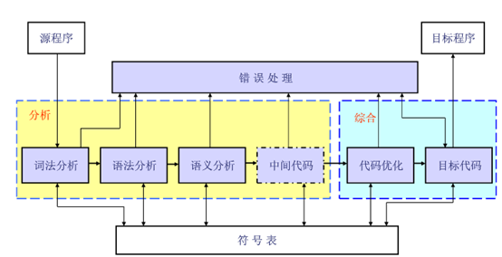
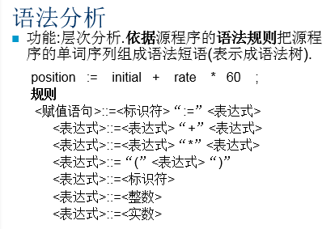
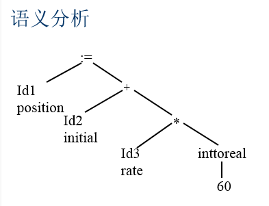
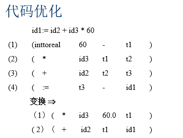
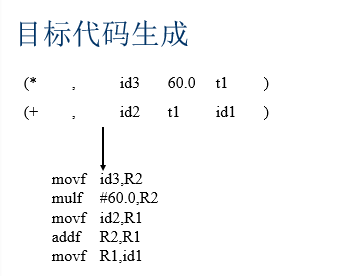

# Blueprint Compiler Internals I

Translated from this excellent series <https://www.cnblogs.com/ghl_carmack/p/5995007.html>

## Foreword

Blueprint-Visual Scripting System in Unreal Engine is a complete game scripting system. The idea is to use the node-based interface to create game playability elements in the Unreal Editor. Like some other common scripting languages, the use of blueprints is through object-oriented classes or objects defined in the engine. In using Unreal 4, you often encounter objects defined in blueprints, and such objects are often referred to directly as "Blueprints." This article explains the compilation of the blueprint in the Unreal Engine from the code level (including the code of the editing part, the version used is UE4 4.13.0). This article assumes that you already have a clear understanding of the blueprint.

## Compiler-related terms

A compiler is a basic part of a modern computer system. From a functional point of view, a compiler is a language translator that translates a program written in one language (called the source language) into another language (called the target language) ) Equivalent procedure.

We only briefly introduce some terms here. If you want to learn compilation principles systematically, you need to find some professional books (such as Dragon Books, Tiger Books, Whale Books, etc., which can be found with search engines), and you need to practice In order to have a thorough and understanding of the principle of compilation.

Generally, a compiler compiles a program into lexical analysis, syntax analysis, semantic analysis, intermediate code generation, code optimization, and target code generation.

## Lexical analysis

Read the source program of the character stream from left to right and recognize (spell) words.

* Word --- token
* Reserved word --- reserved word
* Identifier --- identifier (user-defined name)

Example:

## Parsing

Function: Hierarchical analysis. According to the grammar rules of the source program, the word sequence of the source program is composed into grammatical phrases (represented as a syntax tree). The grammar analysis program obtains the source code in the form of tokens from the scanning program and completes the grammatical analysis that defines the program structure syntax analysis), which is similar to the syntax analysis of sentences in natural language. Parsing defines the structural elements of a program and their relationships. The results of parsing are usually expressed as a parse tree or a syntax tree.

Example:

## Semantic Analysis

The semantics of a program is its "meaning", which is different from syntax or structure. The semantics of a program determine its operation, but most programming languages ​​have features that are determined before execution and are not easily represented by syntax and analyzed by an analysis program. These features are called static semantics, and the task of a semantic analysis program is to analyze such semantics (the "dynamic" semantics of a program have characteristics that can only be determined when the program is executed. Since the compiler cannot execute the program, it It cannot be determined by the compiler). Typical static semantics of general programming languages ​​include declarations and type checking. Additional information (such as data types) calculated by the semantic analyzer is called attributes, and they are usually added to the tree as comments or "decorations" (attributes can also be added to the symbol table).

* Contextual relevance
* Type matching
* Type conversion

Example:

Semantic analysis results:

## Intermediate code generation

The internal (middle) representation of the source program:

Ternary, quaternary, P-Code, C-Code, U-Code, bytecode

## Code optimization

* Intermediate code optimization
* Objective code optimization

## Object code generation

Object code generation is the last stage of compilation. The object code generator transforms the parsed or optimized intermediate code into object code.

## Symbol Table Management

The information in this data structure is related to identifiers: functions, variables, constants, and data types. The symbol table interacts with almost all stages of the compiler: scanners, parsers, or semantic analyzers that enter identifiers into tables; semantic analyzers will add data types and other information; optimization and code generation phases will also use The information provided by the symbol table selects the appropriate code.

* Record the name used in the source program
* Collect various attribute information of each name

Type, scope, allocated storage information

## Error handling

Check errors, report error messages, troubleshoot, and resume compilation.