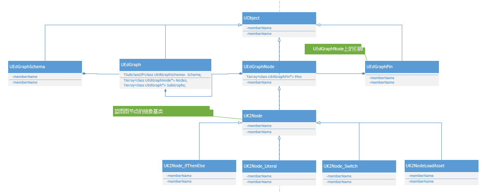

# Blueprint Compiler Internals II

Translated from this excellent series <https://www.cnblogs.com/ghl_carmack/p/5998693.html>

## Unreal 4 compilation related terms and class diagrams

Blueprint compilation in Unreal Engine is somewhat different from regular program compilation, but the basic principles are the same. We take the ordinary class blueprint as an example, a class contains multiple graphs, and each graph can contain some subgraphs. A graph will contain many nodes (UEdGraphNode), and each node can contain several pins (UEdGraphPin) to connect two nodes. Nodes are divided into execution nodes and pure nodes (there are no execution pins on them). There is also a schema class (UEdGraphSchema) for verifying that the syntax is correct, etc. The class diagram looks like this:

## Graph (UEdGraph)

Many others in Unreal 4 are also implemented using graphs, so it also has many derived classes, such as UAIGraph, UAnimationGraph, UAnimationStateMachineGraph, UmaterialGraph, and so on. The class diagram looks like this:

## Node (UEdGraphNode)

A directed acyclic graph is composed of countless nodes. This node is UEdGraphNode. Because the graph mentioned above supports graphs with various functions, there are also a variety of nodes. Below we only pick some Node type. Since our focus is on blueprint compilation, we focus on UK2Node, which is the base class for all blueprint nodes. The class diagram shows:

## Pin (UEdGraphPin)

Each node can have multiple nodes, input, output nodes, parameter pins, etc. These pins are used to record which pins are connected, type, default value, etc.

## Schema (UEdGraphSchema)

It is used for syntax checking (seeing if two pins can be connected, trying to connect pins) and other functions. As all the above have multiple diagrams, multiple modes are required. The blueprint uses UEdGraphSchema_K2. Animation and UMG will have their own schema. The class diagram looks like this:

## FKismetCompilerContext

The class that actually executes the compilation work will generate a new instance each time it is compiled, which is used to store references to compiled classes and blueprints. The entire compilation process is divided into many steps, which are done in the Compile () function.

## FKismetFunctionContext

Holds all the information for compiling a function, including references to related graphs (UEdGraph), properties, and generated functions.

## FBlueprintCompiledStatement

Units work during compilation. Compile translates the node into a series of compiled statements, which are then compiled into bytecode by the compiler backend. For example, variable assignment, goto, call, etc.

## FBPTerminal

An endpoint (literal, constant, or variable reference) in the graph. Each data pin is associated with one of them. You can generate your own items in NodeHandlingFunctor, which are used to store variables, intermediate results, etc.

## FNodeHandlingFunctor

A helper class for handling a class of node compilation, including functions for registering pin connections (RegisterNets ()), and generating compiled statements (FBlueprintCompiledStatement). Created by the UK2Node :: CreateNodeHandler () function. The following class diagram only lists a few HandlerFunctors.

## FBlueprintCompileReinstancer

When the compilation is basically completed, because the class may have changed size or new attributes have been added or removed, the compiler needs to re-instantiate the object instance we just compiled the class, generate a new one, and then use CopyPropertiesForUnrelatedObjects ( ) Function to copy the data from the old instance to the new instance.

## FKismetCompilerOptions

Compile options, which are used to specify compile-time settings, including compilation type (compile only Skeleton, compile all, generate bytecode only, generate cpp only), etc.

## Skeleton Class

The Skeleton class, as its name is defined as a skeleton class, will be re-created when adding member variables or member functions (there is no code and automatically generated hidden variables in it)
