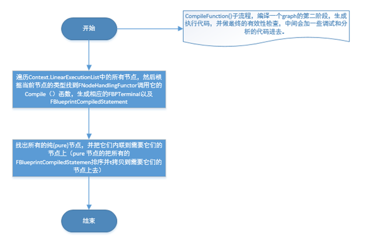
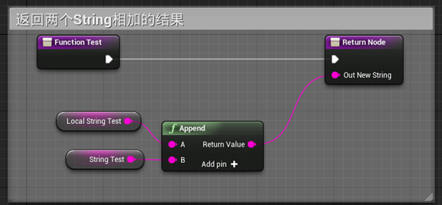

# Blueprint Compiler Internals III

Translated from this excellent series <https://www.cnblogs.com/ghl_carmack/p/6014655.html>

## Compile

The basic terms above have been introduced, let's enter into the blueprint compilation process analysis. The compilation process of the blueprint is in the FKismetCompilerContext :: Compile () function. It will take different branches depending on the type of compilation (the above-mentioned compilation options only compile Skeleton, only generate bytecode, only generate cpp code, etc.). We explain here with a full compilation. Here is the approximate flow, if you want to see the detailed flow, please refer to the flowchart and the code.


## Clear class

The class is compiled in-place, which means that the same UBlueprintGeneratedClass will be cleaned up every time it is compiled and reused, so that the pointer to this class does not need to be fixed. CleanAndSanitizeClass () puts properties and functions in a trash class of a temporary package, and then clears all data from the class.

## Create Class Properties

The CreateClassVariablesFromBlueprint () function traverses the Blueprint's NewVariables array. It also includes construction scripts, Timeline, etc. to find all the properties required by the class, and then creates UProperties.

## Create Function List

Functions are created by processing event graphs, regular function graphs, agents, and interfaces.


## Processing event chart

The CreateAndProcessUberGraph () function is used to process the event graph. It copies all the event graphs into a large graph, at which point the node has the opportunity to do the expansion operation (expand, if it needs to). Then a function stub is created for each event node in the graph, and finally a FKismetFunctionContext is created for the current event graph, which is used to process the entire event graph as a function.

## Processing function chart

The processing of conventional function graphs is done through the ProcessOneFunctionGraph () function. It copies each node in the graph to another node. At this time, each node has the opportunity to expand, and finally it will be for each function. Create a FKismetFunctionContext for later compilation of the function.

## Precompiled functions

The function's precompilation is achieved by calling PrecompileFunction () for each FKismetFunctionContext. This function mainly performs the following operations:

1. Determine execution order and calculate data dependencies.
2. Remove those nodes that are not connected or have no data dependencies.
3. For each remaining RegisterNets () function that runs each node processor (FNodeHandlingFunctor), it creates FBPTerminal for the value in the function.
4. Create UFunction objects and related properties.


## Binding and Linking Classes

Now that the class has UFunctions and UProperties, it is now possible to bind and link classes. It contains a list of populated property chains, property sizes, and functions. At this time it is related to having a class header file, excluding the final markup, metadata, and CDO objects.

## Compile function

Next, you need to use the AppendStatementForNode() function of the Compile() function of each node processor (FNodeHanlingFunctor) to add FKismetBlueprintStatement for this node. This function may also create FBPTerminal objects as long as they are only used locally.


## Post-compiled functions

PostCompileFunction () is the last stage of compiling functions. It is called after all functions call CompileFunction (), mainly to repair cross-references.


## Completed compilation class

To finish compiling the class, the compiler will eventually set the class tag, inherit the tag and metadata from the parent class, and finally determine that everything is correct during the compilation process.

## Backend generated code

The compiler backend converts all statements in the function into code. There are currently two backends used:

1. FKismetCompilerVMBackend converts FKismetCompilerStatement to bytecode and serializes it into a script array.

   

1. FKismetCppBackend generates C ++ code for debugging purposes only.

## Byte code

The bytecode is defined in the EExprToken enumeration in Script.h. The definition is as follows. It can be seen that it has some general instructions, such as EX_Jump EX_JumpIfNot, etc., and some special instructions such as EX_DynamicCast EX_SetArray.

```cpp
//
// Evaluatable expression item types.
//
enum EExprToken
{
  // Variable references.
  EX_LocalVariable        = 0x00,    // A local variable.
  EX_InstanceVariable        = 0x01,    // An object variable.
  EX_DefaultVariable        = 0x02, // Default variable for a class context.
  //                        = 0x03,
  EX_Return                = 0x04,    // Return from function.
  //                        = 0x05,
  EX_Jump                    = 0x06,    // Goto a local address in code.
  EX_JumpIfNot            = 0x07,    // Goto if not expression.
  //                        = 0x08,
  EX_Assert                = 0x09,    // Assertion.
  //                        = 0x0A,
  EX_Nothing                = 0x0B,    // No operation.
  //                        = 0x0C,
  //                        = 0x0D,
  //                        = 0x0E,
  EX_Let                    = 0x0F,    // Assign an arbitrary size value to a variable.
  //                        = 0x10,
  //                        = 0x11,
  EX_ClassContext            = 0x12,    // Class default object context.
  EX_MetaCast = 0x13, // Metaclass cast.
  EX_LetBool                = 0x14, // Let boolean variable.
  EX_EndParmValue            = 0x15,    // end of default value for optional function parameter
  EX_EndFunctionParms        = 0x16,    // End of function call parameters.
  EX_Self                    = 0x17,    // Self object.
  EX_Skip                    = 0x18,    // Skippable expression.
  EX_Context                = 0x19,    // Call a function through an object context.
  EX_Context_FailSilent    = 0x1A, // Call a function through an object context (can fail silently if the context is NULL; only generated for functions that don't have output or return values).
  EX_VirtualFunction        = 0x1B,    // A function call with parameters.
  EX_FinalFunction        = 0x1C,    // A prebound function call with parameters.
  EX_IntConst                = 0x1D,    // Int constant.
  EX_FloatConst            = 0x1E,    // Floating point constant.
  EX_StringConst            = 0x1F,    // String constant.
  EX_ObjectConst         = 0x20,    // An object constant.
  EX_NameConst            = 0x21,    // A name constant.
  EX_RotationConst        = 0x22,    // A rotation constant.
  EX_VectorConst            = 0x23,    // A vector constant.
  EX_ByteConst            = 0x24,    // A byte constant.
  EX_IntZero                = 0x25,    // Zero.
  EX_IntOne                = 0x26,    // One.
  EX_True                    = 0x27,    // Bool True.
  EX_False                = 0x28,    // Bool False.
  EX_TextConst            = 0x29, // FText constant
  EX_NoObject                = 0x2A,    // NoObject.
  EX_TransformConst        = 0x2B, // A transform constant
  EX_IntConstByte            = 0x2C,    // Int constant that requires 1 byte.
  EX_NoInterface            = 0x2D, // A null interface (similar to EX_NoObject, but for interfaces)
  EX_DynamicCast            = 0x2E,    // Safe dynamic class casting.
  EX_StructConst            = 0x2F, // An arbitrary UStruct constant
  EX_EndStructConst        = 0x30, // End of UStruct constant
  EX_SetArray                = 0x31, // Set the value of arbitrary array
  EX_EndArray                = 0x32,
  //                        = 0x33,
  EX_UnicodeStringConst = 0x34, // Unicode string constant.
  EX_Int64Const            = 0x35,    // 64-bit integer constant.
  EX_UInt64Const            = 0x36,    // 64-bit unsigned integer constant.
  //                        = 0x37,
  EX_PrimitiveCast        = 0x38,    // A casting operator for primitives which reads the type as the subsequent byte
  //                        = 0x39,
  //                        = 0x3A,
  //                        = 0x3B,
  //                        = 0x3C,
  //                        = 0x3D,
  //                        = 0x3E,
  //                        = 0x3F,
  //                        = 0x40,
  //                        = 0x41,
  EX_StructMemberContext    = 0x42, // Context expression to address a property within a struct
  EX_LetMulticastDelegate    = 0x43, // Assignment to a multi-cast delegate
  EX_LetDelegate            = 0x44, // Assignment to a delegate
  //                        = 0x45,
  //                        = 0x46, // CST_ObjectToInterface
  //                        = 0x47, // CST_ObjectToBool
  EX_LocalOutVariable        = 0x48, // local out (pass by reference) function parameter
  //                        = 0x49, // CST_InterfaceToBool
  EX_DeprecatedOp4A        = 0x4A,
  EX_InstanceDelegate        = 0x4B,    // const reference to a delegate or normal function object
  EX_PushExecutionFlow    = 0x4C, // push an address on to the execution flow stack for future execution when a EX_PopExecutionFlow is executed. Execution continues on normally and doesn't change to the pushed address.
  EX_PopExecutionFlow        = 0x4D, // continue execution at the last address previously pushed onto the execution flow stack.
  EX_ComputedJump            = 0x4E,    // Goto a local address in code, specified by an integer value.
  EX_PopExecutionFlowIfNot = 0x4F, // continue execution at the last address previously pushed onto the execution flow stack, if the condition is not true.
  EX_Breakpoint            = 0x50, // Breakpoint. Only observed in the editor, otherwise it behaves like EX_Nothing.
  EX_InterfaceContext        = 0x51,    // Call a function through a native interface variable
  EX_ObjToInterfaceCast = 0x52,    // Converting an object reference to native interface variable
  EX_EndOfScript            = 0x53, // Last byte in script code
  EX_CrossInterfaceCast    = 0x54, // Converting an interface variable reference to native interface variable
  EX_InterfaceToObjCast = 0x55, // Converting an interface variable reference to an object
  //                        = 0x56,
  //                        = 0x57,
  //                        = 0x58,
  //                        = 0x59,
  EX_WireTracepoint        = 0x5A, // Trace point. Only observed in the editor, otherwise it behaves like EX_Nothing.
  EX_SkipOffsetConst        = 0x5B, // A CodeSizeSkipOffset constant
  EX_AddMulticastDelegate = 0x5C, // Adds a delegate to a multicast delegate's targets
  EX_ClearMulticastDelegate = 0x5D, // Clears all delegates in a multicast target
  EX_Tracepoint            = 0x5E, // Trace point. Only observed in the editor, otherwise it behaves like EX_Nothing.
  EX_LetObj                = 0x5F,    // assign to any object ref pointer
  EX_LetWeakObjPtr        = 0x60, // assign to a weak object pointer
  EX_BindDelegate            = 0x61, // bind object and name to delegate
  EX_RemoveMulticastDelegate = 0x62, // Remove a delegate from a multicast delegate's targets
  EX_CallMulticastDelegate = 0x63, // Call multicast delegate
  EX_LetValueOnPersistentFrame = 0x64,
  EX_ArrayConst            = 0x65,
  EX_EndArrayConst        = 0x66,
  EX_AssetConst            = 0x67,
  EX_CallMath                = 0x68, // static pure function from on local call space
  EX_SwitchValue            = 0x69,
  EX_InstrumentationEvent    = 0x6A, // Instrumentation event
  EX_ArrayGetByRef        = 0x6B,
  EX_Max                    = 0x100,
};
```

## Copy Class Default Object (CDO) Properties

Using a special function CopyPropertiesForUnrelatedObjects (), the compiler copies the values ​​from the old CDO of the class to the new CDO. Attributes are copied via tagged serialization. As long as the names are consistent, they should be copied correctly. The components in the CDO are re-instantiated.

## Reinstantiation

Because the class may have changed size or attributes have been added or removed, the compiler needs to re-instantiate all objects instantiated by the class. It uses TOjbectIterator to find instances of the class, creates a new one, and uses the CopyPropertiesForUnrelatedObjects () function to copy the data from the old instance to the new instance. Refer to the FBlueprintCompileReinstancer class for details.

# Example

I created a new Blueprint in the blueprint that inherits from Actor. It has a variable StringTest and implements a BeginPlay event and a FunctionTest () function. This function has a local variable LocalStringTest.

The following are the definitions of BeginPlay and FunctionTest:




In order to see the compilation results, we need to modify the setting in BaseEngine.ini to set CompileDisplaysBinaryBackend to true. If you want to display the generated cpp file, you can also set CompileDisplaysTextBackend to true. Note that you need to restart the editor. The result obtained after clicking compile in OutputLog is shown in the following code:

　　　　
```
BlueprintLog: New page: Compile NewBlueprint

LogK2Compiler: [function ExecuteUbergraph_NewBlueprint]:

Label_0x0:

$4E: Computed Jump, offset specified by expression:

$0: Local variable named EntryPoint

Label_0xA:

$5E: .. debug site ..

Label_0xB:

$5A: .. wire debug site ..

Label_0xC:

$5E: .. debug site ..

Label_0xD:

$1B: Virtual Function named FunctionTest

$0: Local variable named CallFunc_FunctionTest_OutNewString

$16: EX_EndFunctionParms

Label_0x24:

$5A: .. wire debug site ..

Label_0x25:

$5E: .. debug site ..

Label_0x26:

$19: Context

ObjectExpression:

$20: EX_ObjectConst (000000003022A100:KismetSystemLibrary /Script/Engine.Default__KismetSystemLibrary)

Skip Bytes: 0x3D

R-Value Property: (null)

ContextExpression:

$1C: Final Function (stack node KismetSystemLibrary::PrintString)

$17: EX_Self

$0: Local variable named CallFunc_FunctionTest_OutNewString

$28: EX_False

$27: EX_True

$2F: literal struct LinearColor (serialized size: 16)

$1E: literal float 0.000000

$1E: literal float 0.660000

$1E: literal float 1.000000

$1E: literal float 1.000000

$30: EX_EndStructConst

$1E: literal float 2.000000

$16: EX_EndFunctionParms

Label_0x79:

$5A: .. wire debug site ..

Label_0x7A:

$4: Return expression

$B: EX_Nothing

Label_0x7C:

$53: EX_EndOfScript

LogK2Compiler: [function ReceiveBeginPlay]:

Label_0x0:

$1B: Virtual Function named ExecuteUbergraph_NewBlueprint

$1D: literal int32 10

$16: EX_EndFunctionParms

Label_0x13:

$4: Return expression

$B: EX_Nothing

Label_0x15:

$53: EX_EndOfScript

LogK2Compiler: [function UserConstructionScript]:

Label_0x0:

$5E: .. debug site ..

Label_0x1:

$5A: .. wire debug site ..

Label_0x2:

$4: Return expression

$B: EX_Nothing

Label_0x4:

$53: EX_EndOfScript

LogK2Compiler: [function FunctionTest]:

Label_0x0:

$5E: .. debug site ..

Label_0x1:

$5A: .. wire debug site ..

Label_0x2:

$5E: .. debug site ..

Label_0x3:

$F: Let (Variable = Expression)

Variable:

$0: Local variable named LocalStringTest

Expression:

$1F: literal ansi string "Bluepirnt Test: "

Label_0x27:

$5A: .. wire debug site ..

Label_0x28:

$F: Let (Variable = Expression)

Variable:

$0: Local variable named CallFunc_Concat_StrStr_ReturnValue

Expression:

$19: Context

ObjectExpression:

$20: EX_ObjectConst (0000000030229B00:KismetStringLibrary /Script/Engine.Default__KismetStringLibrary)

Skip Bytes: 0x1C

R-Value Property: CallFunc_Concat_StrStr_ReturnValue

ContextExpression:

$1C: Final Function (stack node KismetStringLibrary::Concat_StrStr)

$0: Local variable named LocalStringTest

$1: Instance variable named StringTest

$16: EX_EndFunctionParms

Label_0x6C:

$5E: .. debug site ..

Label_0x6D:

$F: Let (Variable = Expression)

Variable:

$48: Local out variable named OutNewString

Expression:

$0: Local variable named CallFunc_Concat_StrStr_ReturnValue

Label_0x88:

$5A: .. wire debug site ..

Label_0x89:

$4: Return expression

$B: EX_Nothing

Label_0x8B:

$53: EX_EndOfScript
```

One thing that needs to be explained is that we can see the event ReceiveBeginPlay. As we said above, it doesn't do anything specifically. The instruction of the entire function is put into function ExecuteUbergraph_NewBlueprint, and what it does is call Virtual Function named ExecuteUbergraph_NewBlueprint and passed an int32 value. This value is the offset value at ExecuteUbergraph_NewBlueprint. At the beginning of ExecuteUbergraph_NewBlueprint, an unconditional jump is performed to the corresponding location for program execution based on the passed in value.


# Summary

At this point, we have a basic understanding of the blueprint compilation process, and roughly explained how the blueprint is finally compiled from the results of our editing. In the next article, we will introduce the implementation of the blueprint virtual machine in Unreal 4. Please look forward to. Of course, due to my limited ability to understand, there are inevitably errors in it. Please correct me if the reader finds it.

References:
- <https://docs.unrealengine.com/latest/INT/Engine/Blueprints/TechnicalGuide/Compiler/index.html>
- <http://www.cnblogs.com/ghl_carmack/p/5804737.html>
- Scripting Language Primer Game Scripting Mastery
- <http://blog.csdn.net/tangl_99/article/details/5600>
