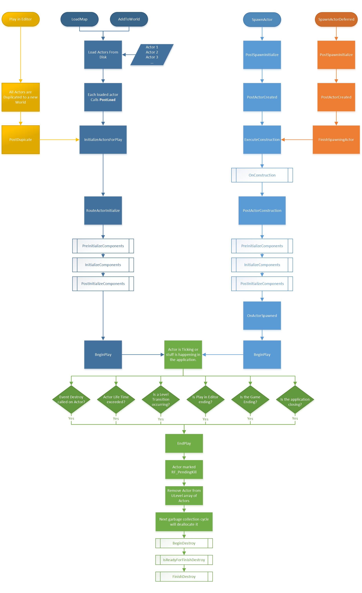

# Actor Load/Init Function Cheat sheet

| Actor Function                    | Component Function                                                | On CDO? | On Level Load? | On Place In Level? | On Play? | On Spawn? | On Open Blueprint? |
| --------------------------------- | ----------------------------------------------------------------- | ------- | -------------- | ------------------ | -------- | --------- | ------------------ |
| `#!cpp PostInitProperties`        | -                                                                 | **_Y_** | **_Y_**        | **_Y_**            | **_Y_**  | **_Y_**   | **_Y_**            |
| `#!cpp PostLoad`                  | -                                                                 | **_Y_** | **_Y_**        | N                  | **_Y_**  | N         | N                  |
| `#!cpp PostActorCreated`          | `#!cpp OnComponentCreated`                                        | N       | N              | **_Y_**            | **_Y_**  | **_Y_**   | **_Y_**            |
| `#!cpp PostRegisterAllComponents` | `#!cpp OnRegister`                                                | N       | **_Y_**        | **_Y_**            | **_Y_**  | **_Y_**   | **_Y_**            |
| `#!cpp PostInitializeComponents`  | `#!cpp InitializeComponent iff bWantsInitializeComponent == true` | N       | N              | **_Y_**            | **_Y_**  | **_Y_**   | **_Y_**            |

# Actor Life Cycle

<https://docs.unrealengine.com/en-US/Programming/UnrealArchitecture/Actors/ActorLifecycle/index.html>

## Load from Disk

This path occurs for any Actor that is already in the level, like
when LoadMap occurs, or AddToWorld (from streaming or sub levels) is
called.

1. Actors in a package/level are loaded from disk.

2. **PostLoad** - is called by serialized
   Actor after they have finished loading from disk. Any custom versioning
   and fixup behavior should go here. PostLoad is mutually exclusive with **PostActorCreated**.

3. **InitializeActorsForPlay**

4. **RouteActorInitialize** for any non-initialized Actors (covers seamless travel carry over)

   1. **PreInitializeComponents** - Called before InitializeComponent is called on the Actor's components

   2. **InitializeComponent** - Helper function for the creation of each component defined on the Actor

   3. **PostInitializeComponents** - Called after the Actor's components have been initialized

5. **BeginPlay** - Called when the level is started

## Play in Editor

The Play in Editor path is mostly the same as Load from Disk, however the Actors are never loaded from disk, they are copied from the Editor.

1. Actors in the Editor are duplicated into a new World

2. **PostDuplicate** is called

3. **InitializeActorsForPlay**

4. **RouteActorInitialize** for any non-initialized Actors (covers seamless travel carry over)

   1. **PreInitializeComponents** - Called before InitializeComponent is called on the Actor's components

   2. **InitializeComponent** - Helper function for the creation of each component defined on the Actor

   3. **PostInitializeComponents** - Called after the Actor's components have been initialized

5. **BeginPlay** - Called when the level is started

## Spawning

When spawning (instancing) an Actor, this is the path that will be followed.

1. **SpawnActor** called

2. **PostSpawnInitialize**

3. **PostActorCreated** - called for spawned
   Actors after its creation, constructor like behavior should go here.
   PostActorCreated is mutually exclusive with PostLoad.

4. **ExecuteConstruction**:

   - **OnConstruction** - The construction of the
     Actor, this is where Blueprint Actors have their components created and
     blueprint variables are initialized

5. **PostActorConstruction**:

   1. **PreInitializeComponents** - Called before InitializeComponent is called on the Actor's components

   2. **InitializeComponent** - Helper function for the creation of each component defined on the Actor

   3. **PostInitializeComponents** - Called after the Actor's components have been initialized

6. **OnActorSpawned** broadcast on UWorld

7. **BeginPlay** is called.

## Deferred Spawn

An Actor can be Deferred Spawned by having any properties set to "Expose on Spawn."

1. **SpawnActorDeferred** - meant to spawn procedural Actors, allows additional setup before Blueprint construction script

2. Everything in SpawnActor occurs, but after PostActorCreated the following occurs:

   1. Do setup / call various "initialization functions" with a valid but incomplete Actor instance

   2. **FinishSpawningActor** - called to Finalize the Actor, picks up at ExecuteConstruction in the Spawn Actor line.

## Coming to the End of Life

Actors can be destroyed in a number of ways, but the way they end their existence is always the same.

### During Gameplay

These are completely optional, as many Actors will not actually die during play.

**Destroy** - is called manually by game any time an
Actor is meant to be removed, but gameplay is still occurring. The Actor is marked pending kill and removed from Level's array of Actors.

**EndPlay** - Called in several places to guarantee the life of the Actor is coming to an end. During play, Destroy will fire this, as well Level Transitions, and if a streaming level containing the Actor is unloaded. All the places EndPlay is called from:

- Explicit call to Destroy

- Play in Editor Ended

- Level Transition (seamless travel or load map)

- A streaming level containing the Actor is unloaded

- The lifetime of the Actor has expired

- Application shut down (All Actors are Destroyed)

Regardless of how this happens, the Actor will be marked RF_PendingKill so during the next garbage collection cycle it will be deallocated. Also, rather than checking for pending kill manually, consider using an `FWeakObjectPtr<AActor>` as it is cleaner.

**OnDestroy** - This is a legacy response to Destroy. You should probably move anything here to EndPlay as it is called by level transition and other game cleanup functions.

## Garbage Collection

Some time after an object has been marked for destruction, Garbage Collection will actually remove it from memory, freeing any resources it was using.

The following functions are called on the object during its destruction:

1. **BeginDestroy** - This is the object's chance to free up memory and handle other multithreaded resources (ie: graphics thread proxy objects). Most gameplay functionality related to being destroyed should have been handled earlier, in `EndPlay`.

2. **IsReadyForFinishDestroy** - The garbage collection process will call this function to determine whether or not the object is ready to be deallocated permanently. By returning `false`, this function can defer actual destruction of the object until the next garbage collection pass.

3. **FinishDestroy** - Finally, the object is really going to be destroyed, and this is another chance to free up internal data structures. This is the last call before memory is freed.

### Advanced Garbage Collection

The garbage collection process in **Unreal Engine 4** builds clusters of objects that are all destroyed together. Clustering reduces the total time and overall memory churn associated with garbage collection compared to deleting objects indivudally. As an object loads, it may create subobjects. By combining the object and its subobjects into a single cluster for the garbage collector, the engine can delay freeing the resources used by the cluster until the entire object is ready to be freed, and can then free all of the resources at once.

Garbage collection does not need to be configured or modified at all for most projects, but there are some specific cases in which the "clustering" behavior of the garbage collector can be altered to improve efficiency in the following ways:

1. **Clustering** - Turn clustering off. In **Project Settings**, under the **Garbage Collection** section, the **Create Garbage Collector UObject Clusters** option can be set to false. For most projects, this will result in less efficient garbage collection, so it is recommended that this only be done in cases where performance testing reveals that it is definitely beneficial.

2. **Cluster Merging** - If clustering is set to true, the **Merge GC Clusters** option (in **Project Settings**, under the **Garbage Collection** section) can be set to true in order to activate cluster merging. This behavior is turned off by default, and is not suited for every project. During the process of building an object's cluster, the object will be examined, and references to other objects may be found within it. Without cluster merging (the default behavior), those references are noted, but the object being loaded, and its subobjects, remain in their original cluster. With cluster merging, the clusters of the object being loaded and the referenced object will be combined. For example, a particle system asset may reference a material asset, but if cluster merging is turned off, the material and the particle system will remain in separate clusters for garbage collection purposes. With cluster merging turned on, the particle asset cluster will be merged with the material cluster due to the particle system referencing the material. This behavior is often not desired in games that stream content, such as open-world games, as many clusters may merge together and form bigger, more diverse groups of objects. Since objects in clusters will not be destroyed indivudally, waiting until every object in the group is set for destruction, this can result in large clusters of objects that are kept in memory due to a small number of those objects being in constant use. However, enabling cluster merging and manually adding clusters, in code, for special cases like assets with large numbers of referenced objects that are not shared by other objects, can improve performance by unifying cleanup of the subobjects and decreasing the individual number of entries and dependencies the garbage collector must maintain and check during the game.
