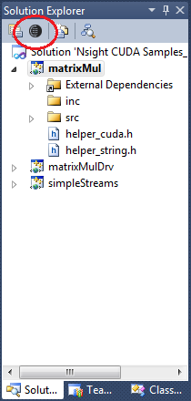

# RenderDoc

## Custom visualization shader to display stencil values

```glsl
uint RENDERDOC_TextureType; // hlsl
// selected MSAA sample or -numSamples for resolve. See docs
int RENDERDOC_SelectedSample;

Texture2DArray<uint2> texDisplayTexStencilArray : register(t5);
Texture2DMSArray<uint2> texDisplayTexStencilMSArray : register(t7);
uint4 RENDERDOC_TexDim; // xyz == width, height, depth. w == # mips Texture2DArray<uint2> texDisplayTexStencilArray : register(t5);

#define KL_GOLDEN_RATIO_CONJUGATE   0.618033988749895


float3 hsv2rgb(float3 c)
{
  float4 K = float4(1.0, 2.0 / 3.0, 1.0 / 3.0, 3.0);
  float3 p = abs(frac(c.xxx + K.xyz) * 6.0 - K.www);
  return c.z * lerp(K.xxx, clamp(p - K.xxx, 0.0, 1.0), c.y);
}


float3 GetGoldenRatioColor(const int colorIndex, const float3 baseHSVColor, const float hueRange) {
  float hue = (baseHSVColor.r + frac(float(colorIndex) * KL_GOLDEN_RATIO_CONJUGATE) * hueRange) % 360.0f;
  return hsv2rgb(float3(hue/360.0f, baseHSVColor.g, baseHSVColor.b));
}

float3 GetGoldenRatioColor(const int colorIndex){
  return GetGoldenRatioColor(colorIndex, float3(0.0, 0.5, 0.99), 360.0);
}

float4 main(float4 pos : SV_Position, float4 uv : TEXCOORD0) : SV_Target0 {
  float4 Colors[8] =
  {
    float4(116/255.0,187/255.0,134/255.0, 1.0),
    float4(153/255.0,101/255.0,197/255.0, 1.0),
    float4(193/255.0,81/255.0,58/255.0, 1.0),
    float4(76/255.0,63/255.0,61/255.0, 1.0),
    float4(153/255.0,173/255.0,189/255.0, 1.0),
    float4(182/255.0,154/255.0,75/255.0, 1.0),
    float4(144/255.0,209/255.0,73/255.0, 1.0),
    float4(186/255.0,82/255.0,131/255.0, 1.0)
  };

  uint stencil = 0;
  if (RENDERDOC_TextureType == 5) {
    stencil = texDisplayTexStencilArray.Load(int4(uv.xy * RENDERDOC_TexDim.xy, 0, 0)).g;
  }
  else if (RENDERDOC_TextureType == 7) {
    stencil = texDisplayTexStencilMSArray.Load(int3(uv.xy * RENDERDOC_TexDim.xy, 0), RENDERDOC_SelectedSample).g;
  }
  stencil = stencil & 0x7;

  float4 ret = float4(0,0,0,1);

  //ret = Colors[(stencil+4) % 8];
  ret = float4(GetGoldenRatioColor(stencil, float3(0,0.5,0.99), 360), 1.0);

  return ret;
}
```

# Nvidia Insight

## Installation

For the full on debug experience (shader GPU debugging), you'll need a target & host machine because the debugger's going to halt your GPU which means no OS updates.

High-level installation steps:

- Install the latest nVidia drivers on the target machine

- Install nVidia Insight on your target & host machine

- Ensure the requisite firewall exceptions have been set on both machines

  - NSight Monitor needs to have an exception on the host & target

  - Visual Studio needs to have an exception on the host

Download and detailed configuration instructions: <http://developer.nvidia.com/nvidia-nsight-visual-studio-edition> (You'll need to register for a free dev account).

## Debug the Unity Project

- Open up the Unity solution in visual studio and configure the remote debugging options for nvidia nsight.

- Unity can't use msbuild to generate the solution so you have to build your project inside of Unity (so do a standalone Development build with script debugging to a Debug/ folder)

- Make sure you set this as the working directory for Nvidia's Nsight profiler and make sure to add this directory to the list of directories to synchronize

- Select the Launch External Program option and set the path to your Unity project

- **Problem:** For some reason, when the file gets sync'ed over, the app bitches when it gets launched on the target machine, saying it can't find the \[project]\_Data folder. Still investigating this, but for now, workaround is to just manually copy over the project directory to the target machine.  (Default: C:\\Users\\\[current-user-on-target]\\AppData\\Roaming\\NVIDIA Corporation\\Nsight\\Monitor\\Mirror\\\[hostname]\\\[host-outdir] so for example


All the Paths you specify are relative to the target machine's synchronization directory (the default is specified above). However, if you select "Don't synchronize", all of the paths will be relative to the machine

## Profiling Tips

- HUD can be activated in real-time by pressing **CTRL-Z**

- Will show you in real-time performance counters & graphs overlayed on your Unity Window

- **Problem:** In full screen mode, the Unity Oculus app won't release the hardware cursor to allow you to click around the Nvidia Nsight graphs. Just alt-tab in and out of the app and that should fix your problem.

- **CTRL+D** will give you a depth complexity test. Test to see if you're getting a lot of overdraw => do better culling, render front to back, z-only pass

- **CTRL+M** will give you minimum geometry

- Frame Capture: Allows you to capture an entire frame's rendering

  - Can scrub through the timeline to see the drawcalls build on

  - Hold **CTRL+SHIFT** key to get an even more zoomed in view around mouse cursor

  - Hold **SHIFT** to zoom around a render target.

  - Right click to re-center everything

- Shader Debugger: Can set breakpoints in your shader, step-in/over functions, add variables to watch. Full on visual studio editing for your shaders

  - Can also dynamically modify your shaders and A/B test your shaders

  - Graphics Focus picker allows you to visually see the pixel/vertices that have changed. Can also pick the pixel you want to break on

  - Can also pick a pixel to show the entire pixel history to see the different values of the pixel

  - Breakpoint conditionals evaluated on GPU so it's at full speed

## Launch Project with NSight HUD

Commandline: `C:\\Program Files (x86)\\NVIDIA Corporation\\Nsight Visual Studio Edition 5.3\\Monitor\\Common\\Nvda.Launcher.exe" "%1"`

Ex: `C:\\Program Files (x86)\\NVIDIA Corporation\\Nsight Visual Studio Edition 5.3\\Monitor\\Common\\Nvda.Launcher.exe" "C:\\UE4Editor.exe" BBR.uproject -log`

## Nsight + Visual Studio

### Debug an Exe Not Part of VS Solution

Sometimes, you may want to debug an executable that is not part of a Visual Studio project. It may be an executable you created outside of Visual Studio or an executable you received from someone else.

The usual answer to this problem is to start the executable outside of Visual Studio and attach to it using the Visual Studio debugger. For more information, see [Attach to Running Processes with the Visual Studio Debugger](https://docs.microsoft.com/en-us/visualstudio/debugger/attach-to-running-processes-with-the-visual-studio-debugger?view=vs-2015)

Attaching to an application requires some manual steps, so it takes a few seconds. This slight delay means that attaching will not help if you are trying to debug a problem that occurs during startup. Also, if you are debugging a program that does not wait for user input and finishes quickly, you may not have time to attach to it. If you have Visual C++ installed, you can create an EXE project for such a program.

To create an EXE project for an existing executable

1. On the **File** menu, click **Open** and select **Project**.

2. In the **Open Project** dialog box, click the drop-down list next to the **File name** box, and select **All Project Files**.

3. Locate the executable, and click **OK**.

   This creates a temporary solution that contains the executable.

*Reference From <http://msdn.microsoft.com/en-us/library/0bxe8ytt.aspx>*

### Debugging External Applications

NVIDIA® Nsight™ Development Platform, Visual Studio Edition 4.2 User Guide

Early versions of NVIDIA Nsight were only able to debug projects built in Visual C++. However, with NVIDIA Nsight 4.2, CUDA and graphics debugging are now supported for both C++ and C# projects.

If you would like to use NVIDIA Nsight to debug an application that is built in an environment other than C++ or C#, use the tutorial outlined below.

Using NVIDIA Nsight Debugging with Other Project Types

1. In Visual Studio, create a "dummy" project by going to **File** > **New** > **Project**.

1. On the node for **Visual C++** templates, select **Empty Project**.

   Enter the name for your project and click OK.


3. Select the project's **Nsight User Properties** to edit the default settings. (As an alternative, you can also go to the **Project** menu > **Nsight User Properties**.)



4. Select **Launch external program**, and enter the path to the external program for the application that is to be debugged.


5. Configure any other launch options or file synchronization settings which may be necessary for your particular debugging environment.

(For assistance, refer to [Host Basics](https://docs.nvidia.com/gameworks/content/developertools/desktop/host_basics.htm) and [Synchronization](https://docs.nvidia.com/gameworks/content/developertools/desktop/synchronization.htm).)

6. Click OK to save your settings.

6. You can now begin debugging your application with NVIDIA Nsight.

To do so, go to the **Nsight** menu or right-click on your project, then select the appropriate activity (**Start CUDA Debugging**, **Start Graphics Debugging**, etc.).

*Reference From <http://docs.nvidia.com/gameworks/content/developertools/desktop/debug_external_applications.htm>*
