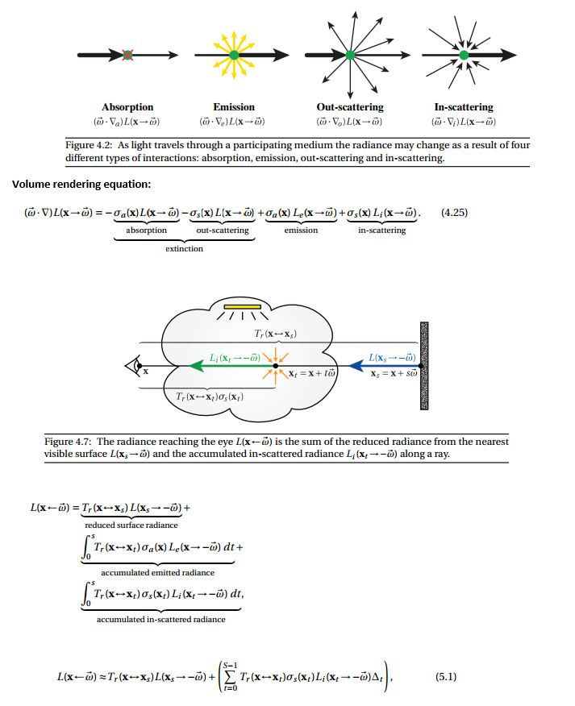
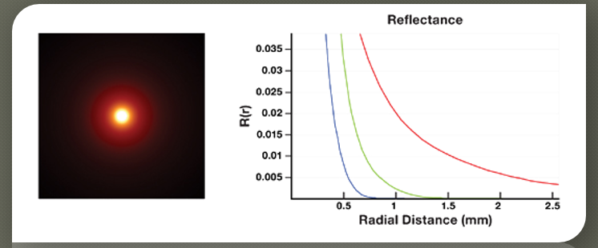
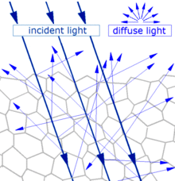

# Light transport notes: From Subsurface Scattering to Neutron Transport

<!-- @import "[TOC]" {cmd="toc" depthFrom=1 depthTo=6 orderedList=false} -->

<!-- code_chunk_output -->

* [Light transport notes: From Subsurface Scattering to Neutron Transport](#light-transport-notes-from-subsurface-scattering-to-Neutron-transport)
* [TLDR](#tldr)
    * [Highly explanative and parse-able papers](#highly-explanative-and-parse-able-papers)
    * [Advanced/useful for reference](#advanceduseful-for-reference)
    * [Practical production papers](#practical-production-papers)
    * [Prolific researchers/active practicioners (not exhaustive list!)](#prolific-researchersactive-practicioners-not-exhaustive-list)
    * [Useful links to bootstrap into subsurface rendering:](#useful-links-to-bootstrap-into-subsurface-rendering)
* [Notes: Volume Rendering](#notes-volume-rendering)
    * [Participating Media](#participating-media)
    * [Radiative Transfer Equation](#radiative-transfer-equation)
    * [Diffusion Theory of subsurface scattering:](#diffusion-theory-of-subsurface-scattering)
* [Foundational knowledge (but questionable if practically useful):](#foundational-knowledge-but-questionable-if-practically-useful)
    * [E&M Radiation](#em-radiation)
    * [Neutron Transport](#Neutron-transport)

<!-- /code_chunk_output -->

# TLDR

 * All rendering is a lie: Specular/Diffuse => approx. of SSS => approx of volume tracing 
 * Even "expensive" volume tracing is approximations. Single-scattering (deBeers law) => approx. of multiple scatter radiative transfer equation/participating media =>  approx. of non-exponential path walks => approx. of EM/Quantum optics
  

  * Game state of art (+- 2 yrs circa 2016) use variants of approx of approx of dipole model for SSS. 
  * Film on other hand over last couple of years 2016-2018 inched even more towards ground truth solutions, even for SSS! (path tracing randomwalks and non-exponential paths) 
    * For ex: it's been shown that multiple scattering random walks for isotropic media converge to HG Phase functions
    * Heitz showed that you can derive Smith microsurface model as a special case of microflake theory for volumes with additional constraints to enforce sharp interface constraint (aka make the volume a surface)
    * Not sure if fee-flight distributions/path walks are used in production
  * Some of practical problems with these models is albedo inversion - painting transmittence/absorption coefficients is very impossible for artists. Ideally want to say, here's the desired color properties and then renderer figures out co-efficients. Not trivial in practice

## Highly explanative and parse-able papers

**Best get up to speed quick**
Imho, the easiest/comprehensive path are the Volume rendering siggraph courses. Everything after volume rendering is just an approximation

* 2018 Siggraph Course: Path Tracing In Production: https://jo.dreggn.org/path-tracing-in-production/2018/course-notes.pdf
* 2017 Siggraph Course: Production Volume Rendering: https://graphics.pixar.com/library/ProductionVolumeRendering/paper.pdf
* 2011 Siggraph Course: Production Volume Rendering I Fundementals: http://magnuswrenninge.com/productionvolumerendering
* 2011 Siggraph Course: Production Volume Rendering II Systems: http://magnuswrenninge.com/productionvolumerendering
* 2011 Siggraph Course: Volumetric methods: http://magnuswrenninge.com/volumetricmethods

**Academic courses:**
* Volumetric Path Tracing: http://www.cs.cornell.edu/courses/cs6630/2012sp/notes/08radiative-transfer.pdf
* Volumetric Path Tracing: MC Estimators: http://www.cs.cornell.edu/courses/cs6630/2012sp/notes/09volpath.pdf
* Volumetric Path Tracing: Dipole Derivation: https://www.cs.cornell.edu/courses/cs6630/2012sp/notes/10diffusion.pdf
* The Path to Path-Traced Movies: https://graphics.pixar.com/library/PathTracedMovies/paper.pdf
* Efficient Monte Carlo Methods for Light Transport in Scattering Media: https://cs.dartmouth.edu/wjarosz/publications/dissertation/
* Implementing a skin BSSRDF by Christophe Hery: http://www.treyharrell.com/prman-notes/scat.pdf

**Lecture Notes:**
* CS667 Lecture 8: Light Transport in Medium - http://www.cs.cornell.edu/courses/cs667/2005sp/notes/08tchao.pdf
* CS667 Lecture 9: Volume Rendering Equation: http://www.cs.cornell.edu/courses/cs667/2005sp/notes/09wang.pdf
* Lecture 10: Monte Carlo Solutions to Rendering Equations:  http://www.cs.cornell.edu/courses/cs667/2005sp/notes/10cai.pdf
* Lecture : Volumetric diffusion http://www.cs.cornell.edu/courses/cs667/2006sp/notes/4apr-diffusion.pdf
* Lecture 17: Subsurface Light Diffusion http://www.cs.cornell.edu/courses/cs667/2005sp/notes/17liberman.isganitis.pdf

## Advanced/useful for reference
**Overview on Advanced techniques**
* This FXGuide article on the frontier of light transport is a great overview of the advanced set of techniques: https://www.fxguide.com/featured/its-not-rocket-science-oh-wait/
* This is a good next step in more details: A Hitchhiker's Guide to Multiple Scattering: http://www.eugenedeon.com/hitchhikers
* 2018 State of Art Monte Carlo Methods for Volumetric Light Transport Simulation: https://cs.dartmouth.edu/wjarosz/publications/novak18monte.html

**A list of papers in no-particular order:**
* A Better Dipole
* A Generalized Linear Transport Model for Stochastic Media
* A Practical Model for Subsurface Light Transport
* A Quantized-Diffusion Model for Rendering Translucent Materials
* Classical and Improved Diffusion Theory
* Computing the Scattering Properties of Participating Media
* Directional Dipole Model for Subsurface Scattering
* Forms of Approximate Radiation
* Multiple-Scattering Microfacet BSDFs with the Smith Model
* Path Integration for Light Transport in Volumes
* Photon Beam Diffusion- Hybrid Monte Carlo Method For Subsurface Scattering
* Practical Rendering of Multiple Scattering Effects in ParticipatingMedia

## Practical production papers
* Physically Based Shader Design In Arnold: https://www.arnoldrenderer.com/research/physically_based_shader_design_in_arnold.pdf
* Volumetric Skin and Fabric Shading at Framestore: https://blog.selfshadow.com/publications/s2017-shading-course/walster/s2017_pbs_volumetric_notes.pdf
* Extending  the  Disney  BRDF  to  a  BSDF  with Integrated Subsurface Scattering: https://blog.selfshadow.com/publications/s2015-shading-course/burley/s2015_pbs_disney_bsdf_notes.pdf

## Prolific researchers/active practicioners (not exhaustive list!)
* Wojciech Jarosz  
* Per H. Christensen  
* Christope Henry  
* Eugene D'eon  
* Eric Heitz  
* Henrik Jensen  
* Magnus Wrenninge  
* Wenzel Jakob

## Useful links to bootstrap into subsurface rendering:
Masters/Undergrad thesis are usually super great for getting up to speed on foundational techniques in the field. Here's some good overview links
* Dipole approximation for dummies I: https://flashypixels.wordpress.com/2016/02/10/chronicles-of-a-tour-in-skin-shading-dipole-approximation-for-dummies/
* Dipole approximation for dummies II: https://flashypixels.wordpress.com/2016/02/28/chronicles-of-a-tour-in-skin-shading-some-useful-biological-aspects-used-in-cg/
* Photon Path Distribution in Inhomogeneous Scattering Media: http://www.mia.uni-saarland.de/schmaltz/Diplom.ps.gz
* The Radiance Field: http://reedbeta.com/blog/the-radiance-field/

# Notes: Volume Rendering

## Participating Media
Modeled through beam transmittence. Assumes out-scattering coefficient, absorption coefficient, & in-scattering
  - Mathematically defined: Beer's law
  - Transmission = $T_{r} \ =\ e^{-\sigma _{a} r}$
    
    Where ro is absorption coefficient. Most materials this is constant, for some like marble it's position dependent, and for smoke, it's direction dependent as well
    $\sigma _{t} =\sigma _{a} \ +\ \sigma _{s}$
    
    $\sigma _{t}$ = attenuation coefficient, which is sum of absorption & out-scattering
    
    Avg distance a photon can travel: $\frac{1}{\sigma _{t}}$

    Albedo = fraction of energy that is re-emitted: $\frac{\sigma _{s}}{\sigma _{t}}$
    
    - Phase function tells us what direction photon will be scattered, which is a pdf taking incoming direction and outgoing ray and gives a probability that photon coming in from w_in will scatter in w_out
    - For almost all naturally ocurring media, phase function only depends on the angle between w_in & w_out
        ○ For isotropic materials, it's sometimes thought of as reflected intensity as a function of angle normalized by intensity at normal incidence. Anistropic needs angle between directions. Crystalline (rare) structures need all 4 dimensions
        ○ Isotropic phase function: 1
        ○ Anisotropic: analytical model parameterized by g ε [-1,1]
    
Henyey-Greenstein phase function:
  - Defines function parameterized by one function defines how much backscattering vs forward scattering
  - http://www.astro.umd.edu/~jph/HG_note.pdf

## Radiative Transfer Equation

http://www.cs.cornell.edu/courses/cs6630/2012sp/notes/09volpath.pdf
http://www.cs.cornell.edu/courses/cs6630/2012sp/notes/08radiative-transfer.pdf
The RTE is a macroscale, empirical model that has proved extremely useful for a variety of problems, though it is not a physical theory derived by first principles from Maxwell’s equations. Rather, it describes the behavior of incoherent light on a large scale, and is derived from intuitive arguments about the interaction of light with small particles suspended in the medium—for instance, water droplets in a cloud or particles of ash and soot in smoke

Absorption coefficient:
q = density of charged particles
Ap = cross sectional area of particle

σs = Product q*Ap (1 / length) = absorption coefficient. Theory derived from particles but generally just a value because we use it to model things like tissue

Steve Marschner's (of hair rendering fame)'s lecture notes are very informative and parse-able:
http://www.cs.cornell.edu/courses/cs6630/2012sp/notes/08radiative-transfer.pdf

## Diffusion Theory of subsurface scattering:
References:
https://developer.nvidia.com/gpugems/GPUGems3/gpugems3_ch14.html

Summary:
  - For most translucent materials, after a handful of multiple events after a light ray enters a material, it tends to diffuse isotropically
  - Model diffusion with another virtual light underneath the surface and one above the surface. This is done so they cancel each other out based on some boundary condition
  - Boundary condition is net radiant flux of light at exit radiance has to be zero:
      $\int _{dV} \nabla u\ \cdotp \overrightarrow{n\ } dS$

    which simplifies to

    $div\ \nabla u\ =\ \Delta u\ =\ 0$
    

Dipole Approximation: Making subsurface translucency more accurate
  - Dipole Approximation Explanation: https://computergraphics.stackexchange.com/questions/81/what-is-the-dipole-approximation-for-subsurface-scattering
    The assumption underlying such model is the same as lots of other models for skin rendering; the subsurface scattering can be approximated as a diffusion phenomenon. This is good because in highly scattering media, the distribution of light loses dependency from the angle and tends to isotropy.
    The dipole approximation is a formulation for the resolution of such diffusion problem in an analytical fashion.
    Basically they start by approximating the BSSRDF as a multiple scattering and single scattering component. The multiple scattering is then defined as:
    
    Where FtFt are Fresnel terms and RR is the diffusion profile expressed as function of the distance between the entry and exit point.
    This RR is referred to as diffusion profile and they formulate this profile via a dipole approximation. The contribution of the incoming light ray is considered to be the one of two virtual sources: one negative beneath the surface and one positive above it (that's why dipole)
    

    Why one positive and one negative light? Is the goal for them to cancel each other in some way?
    Yes, the dipole source method (which dates way before Jensen's paper) is such defined to satisfy some boundary condition. Specifically the fluence must be zero at a certain extrapolated boundary that has a distance from the surface of 2AD2AD where
    
    Being FdrFdr the fresnel reflectivity of the slab considered and that sigma value is the reduced extinction coefficient described below.
    
    
  - Mean free path & Transport mean free path: (note, u_s here is rho_t, the extinction co-efficient)
    This lecture notes from biophotonics class describes mfp affects in digestable form http://www.its.caltech.edu/~bi177/private/L6_handout.pdf
        

  - In homogenous objects, diffusion profiles are radially symmetric
    
    
  
  

# Foundational knowledge (but questionable if practically useful):

## E&M Radiation
 - Charged particles create an electric field around them
 - As they vibrate (due to heat), the electric field changes around them
 - Electric field propagates at the speed of light
 - And we see that as light

  Great lecture series on physics of light: 
    - https://www.youtube.com/user/ilectureonline/playlists?sort=dd&view=50&shelf_id=10
    - https://www.youtube.com/playlist?list=PLX2gX-ftPVXWDWYVe6oJwZCpZy-92Kd1k

  - Frequency of vibration of the atom is the frequency of the light wavelength

  - When light passes through an atom, the electrons are pushed in one direction while the protons are pushed in another direction by the oscillating electric field. This acceleration increases the average speed of these two charged particles and thereby increases the total energy of the atom (the kinetic energy of an object is proportional to its speed squared).

  - Thus, as the atoms gain energy by the growing oscillation of their electrons and protons, the electromagnetic wave loses energy, resulting in a decreased amplitude of the oscillations of the electric and magnetic fields. This decrease in amplitude is absorption.

  - Quantum mechanics limits the kinds of oscillations that can be observed in atoms. 
  - This is primarily limited by the allowed energies that the atoms can have. For example, the allowed energies of the hydrogen atom are EE = 13.6 eV / n2n2, where nn can be any positive integer (1 eV = 1 electron volt = 1.6×10−191.6×10−19 joules). 
  - Another lesson of quantum mechanics is that light itself is quantized, meaning that it can only give or take energy in discrete packets, called photons. If ff is the frequency of the oscillating electromagnetic wave, then the energy of each photon is hfhf, where hhis the Planck constant. Hence, when light gives energy to the atom, in driving this oscillation of the charged particles, it can only give it one photon at a time.
  - When light passes through a gas, it interacts with the lone atoms and the above description tells (almost) the whole story. 
  - When atoms join together to form solids and liquids it drastically changes the interaction between light and matter. Instead of the protons and electrons in the atoms oscillating freely within the atom, the electrons in a condensed phase (liquid or solid) may delocalize and/or interact with each other.
  - The microscopic effects can be very complicated and hard to tackle analytically, so we instead resort to a macroscopic description of the light-matter interaction, which is parameterized by the index of refraction.
  - The index of refraction of the ratio of the speed of light in vacuum (c≈c≈ 299792458 m/s) to the actual speed of light in the material. It is difficult and often impossible to calculate from first principles (i.e. solving the time-dependent Schrödinger equation for all the electrons in the material),
    From <https://www.quora.com/How-does-light-get-absorbed-by-different-objects> 
    From <https://www.quora.com/Why-are-some-materials-transparent-and-others-not> 

  - In classical electrodynamics, light is considered as an electromagnetic wave, which is described by Maxwell's equations. Light waves incident on a material induce small oscillations of polarisation in the individual atoms (or oscillation of electrons, in metals), causing each particle to radiate a small secondary wave in all directions, like a dipole antenna. All these waves add up to give specular reflection and refraction, according to the Huygens–Fresnel principle.
    In the case of dielectrics such as glass, the electric field of the light acts on the electrons in the material, and the moving electrons generate fields and become new radiators. The refracted light in the glass is the combination of the forward radiation of the electrons and the incident light. The reflected light is the combination of the backward radiation of all of the electrons.
    In metals, electrons with no binding energy are called free electrons. When these electrons oscillate with the incident light, the phase difference between their radiation field and the incident field is π (180°), so the forward radiation cancels the incident light, and backward radiation is just the reflected light.  
    From <https://en.wikipedia.org/wiki/Reflection_(physics)> 

  - General scattering mechanism which gives diffuse reflection by a solid surface
    
    Main article: Diffuse reflection
    When light strikes the surface of a (non-metallic) material it bounces off in all directions due to multiple reflections by the microscopic irregularities inside the material (e.g. the grain boundaries of a polycrystalline material, or the cell or fiber boundaries of an organic material) and by its surface, if it is rough. Thus, an 'image' is not formed.
    
    From <https://en.wikipedia.org/wiki/Reflection_(physics)> 

    - SCHLICK PHASE FUNCTION. While the Henyey-Greenstein phase function is a good approximation to Mie scattering, it is still relatively expensive to evaluate. Schlick observed that the accurate shape is often not crucial for rendering applications and he replaced a relatively expensive exponentiation with even simpler expression [7]: P(ω ,ω ) = 1−k2 (1+k cosθ)2 (4) where k is a parameter similar to the asymmetry parameter g: −1 ≤ k ≤ 1. The phase function still needs to be normalized by multiplying it by 1/4π, so that it will integrate to 1. R
    
    - Case A, where the E of the incident photon matches a gap between E levels of the atom, so the atom is excited into a higher state (electron transition). This is often called "resonance absorption". Case B, where the E of the incident photon is lower than such gap, so there is no such excitation / transition, and the photon goes out as it came in. This is called "Rayleigh scattering". When the E of the incident photon is higher than the gap, the photon loses energy to the particle but we don't say that there is partial absorption (?) and this is called "Raman scattering" (also Stokes scattering, but there is also an anti-Stokes effect, let us leave that aside...). But then you learn that in case A the excitation lasts for an incredibly short time after which the photon is re-emitted with the same E as it came in, just as in case B. May it be that the duration of "excitation" in A is longer than "whatever happens" in B? (but it doesn't look like a great difference, given that the time is very short).     From <https://www.physicsforums.com/threads/difference-between-scattering-and-emission-of-photons.899796/>  

  A common explanation that has been provided is that a photon moving through the material still moves at the speed of c, but when it encounters the atom of the material, it is absorbed by the atom via an atomic transition. After a very slight delay, a photon is then re-emitted. This explanation is incorrect and inconsistent with empirical observations. If this is what actually occurs, then the absorption spectrum will be discrete because atoms have only discrete energy states. Yet, in glass for example, we see almost the whole visible spectrum being transmitted with no discrete disruption in the measured speed. In fact, the index of refraction (which reflects the speed of light through that medium) varies continuously, rather than abruptly, with the frequency of light.
    
  Secondly, if that assertion is true, then the index of refraction would ONLY depend on the type of atom in the material, and nothing else, since the atom is responsible for the absorption of the photon. Again, if this is true, then we see a problem when we apply this to carbon, let’s say. The index of refraction of graphite and diamond are different from each other. Yet, both are made up of carbon atoms. In fact, if we look at graphite alone, the index of refraction is different along different crystal directions. Obviously, materials with identical atoms can have different index of refraction. So it points to the evidence that it may have nothing to do with an “atomic transition”.
    
  When atoms and molecules form a solid, they start to lose most of their individual identity and form a “collective behavior” with other atoms. It is as the result of this collective behavior that one obtains a metal, insulator, semiconductor, etc. Almost all of the properties of solids that we are familiar with are the results of the collective properties of the solid as a whole, not the properties of the individual atoms. The same applies to how a photon moves through a solid.
  
  A solid has a network of ions and electrons fixed in a “lattice”. Think of this as a network of balls connected to each other by springs. Because of this, they have what is known as “collective vibrational modes”, often called phonons. These are quanta of lattice vibrations, similar to photons being the quanta of EM radiation. It is these vibrational modes that can absorb a photon. So when a photon encounters a solid, and it can interact with an available phonon mode (i.e. something similar to a resonance condition), this photon can be absorbed by the solid and then converted to heat (it is the energy of these vibrations or phonons that we commonly refer to as heat). The solid is then opaque to this particular photon (i.e. at that frequency). Now, unlike the atomic orbitals, the phonon spectrum can be broad and continuous over a large frequency range. That is why all materials have a “bandwidth” of transmission or absorption. The width here depends on how wide the phonon spectrum is.
  
  On the other hand, if a photon has an energy beyond the phonon spectrum, then while it can still cause a disturbance of the lattice ions, the solid cannot sustain this vibration, because the phonon mode isn’t available. This is similar to trying to oscillate something at a different frequency than the resonance frequency. So the lattice does not absorb this photon and it is re-emitted but with a very slight delay. This, naively, is the origin of the apparent slowdown of the light speed in the material. The emitted photon may encounter other lattice ions as it makes its way through the material and this accumulate the delay.
  
  *Moral of the story*: the properties of a solid that we are familiar with have more to do with the “collective” behavior of a large number of atoms interacting with each other. In most cases, these do not reflect the properties of the individual, isolated atoms.     From <https://www.physicsforums.com/insights/do-photons-move-slower-in-a-solid-medium/> 

  - Quantum theory describes radiation as photons being wave packets, not continuous waves
      https://www.quora.com/How-does-the-amplitude-of-an-electromagnetic-wave-affect-its-energy
      
    
    - The usual description does assume that the “lattice” (because it is a collective behavior, see this FAQ) briefly vibrates with a non-resonant frequency and then re-emits it. That brief stop and ensuing delay is what would explain that light travels more slowly in the medium. Whether that is "scattering" or not is another question. I would say, yes, the light is scattered/re-emitted in random directions. How is it that it keeps its original direction? What I read (classical explanation) is that the network of atoms acts cooperatively so that there is destructive interference except in the original direction, but someone objected once to that in a discussion… Reference https://www.physicsforums.com/threads/difference-between-scattering-and-emission-of-photons.899796/
    

      The theory of light is described by a series of increasingly complete optical models, where each successive model is able to account for more optical phenomena. In computer graphics and this dissertation, we will restrict ourselves to the simplest model, ray optics.
    

## Neutron Transport
This is the most useful literature I found on describing the nature of scattering. But it's also very dense. Also humbling how much of this stuff was solved in the 60s without computers. 

http://www.nuclear-power.net/nuclear-power/reactor-physics/nuclear-engineering-fundamentals/neutron-nuclear-reactions/macroscopic-cross-section/
http://www.nuclear-power.net/nuclear-power/reactor-physics/nuclear-engineering-fundamentals/neutron-nuclear-reactions/neutron-absorption/neutron-absorption-cross-section/
http://moreira.tamu.edu/BAEN625/TOC_files/chapt6b.pdf

http://www.nuclear-power.net/nuclear-power/reactor-physics/nuclear-engineering-fundamentals/neutron-nuclear-reactions/microscopic-cross-section/
Difference between microscopic cross-section vs macroscopic crosssection: 
The difference between the microscopic and macroscopic cross sections is extremely important. The microscopic cross section represents the effective target area of a single nucleus, while the macroscopic cross section represents the effective target area of all of
the nuclei contained in certain volume.

From <http://www.nuclear-power.net/nuclear-power/reactor-physics/nuclear-engineering-fundamentals/neutron-nuclear-reactions/microscopic-cross-section/> 

Different cross-sections indicate characteristic target area that defines type of nuclear reaction that would occur

Types of scattering + microscopic cross-sections:

The transport length in a strongly diffusing medium (noted l*) is the length over which the direction of propagation of the photon is randomized. It is related to the mean free path l by the relation:[1]
$l*\ =\ \frac{l}{1\ -\ g}$
From <https://en.wikipedia.org/wiki/Transport_length> 

