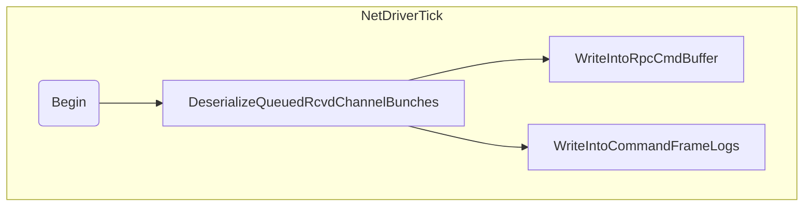
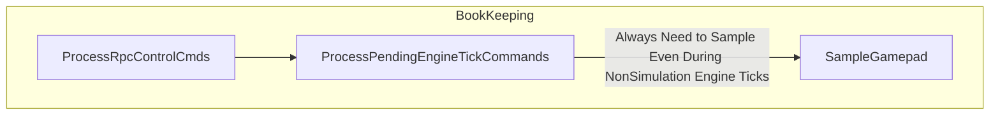
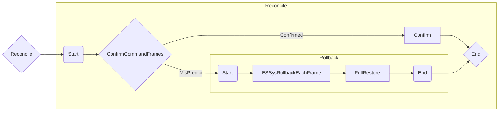
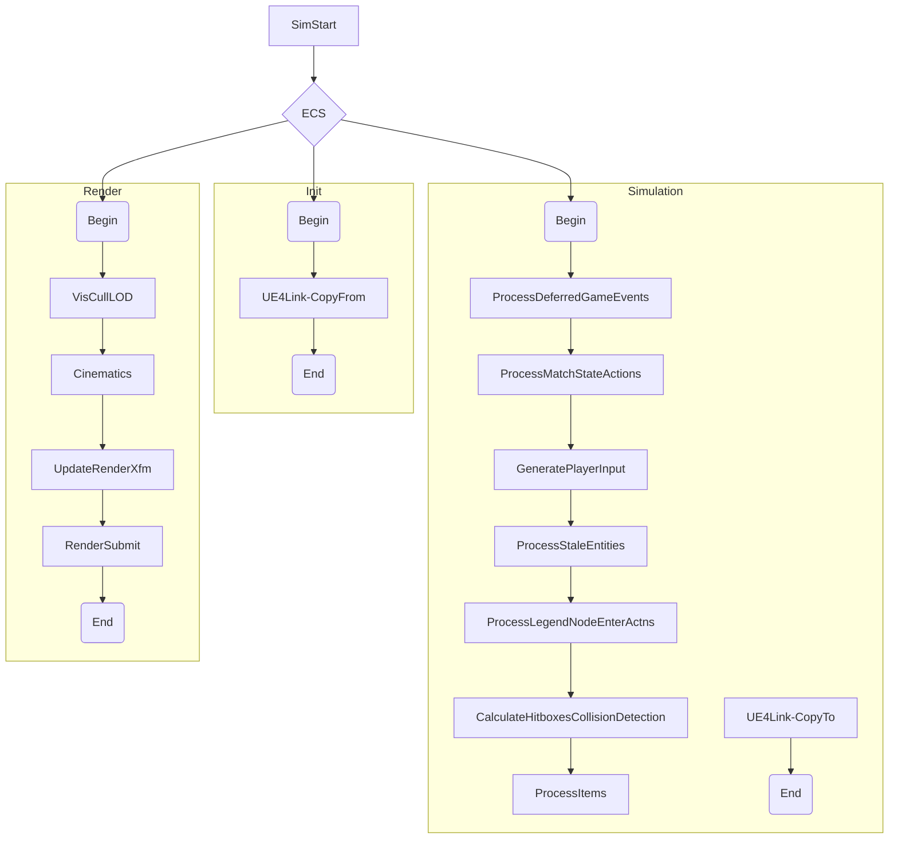

<!-- markdownlint-disable -->

# Code Review

- TODO format =>
  `//TODO: username: #FeatureArea-SubCat-SubSubCat: Comment`
- check() => grdchk/grdvfy
- FESProcessNetworkPacketDelegate() => meant for other hooks? if only lambda, prefer lambda param or TFunctionRef
- static constexpr => forces inline allocation
- #if CPP / #endif : Only necessary for later if you want to expose to UE4
- FORCEINLINE static FES2EngineTickEventParams&& Make => I think this is a mistake + pessimization
  - RVO/copy ellision is mandated now
- FORCEINLINE_DEBUGGABLE T& TES2CircularBuffer::EmplaceNext(T&& InElement) => not sure this does the same thing as perfect forwarding
- BB_DEV_FORCEINLINE_DEBUGGABLE over FORCEINLINE_DEBUGGABLE to get it turned on during debug game builds

==============================================================================================================

# Next sprint
- Add support for Synchronization points
  - IE: Client doesn't predict across specific frame number until confirmed
- Dedicated server in packaged game working on that simple map
- Decoupling Rendering vs Simulation Update Rate
- Time Management
  - Add hook into `ABBWorldSettings::FixupDeltaSeconds(float DilatedClampedRealDeltaSeconds, float ClampedRealDeltaSeconds)` to manage time for UE4

Reconcile Test cases/validation
    - Object Creation
      - for pure particle system actor
      - for pure sound
    - Object Deletion (using Mock Item & Mock Visual Cue)
      - for pure particle system actor
      - for pure sound

Timeout
Predictive timedilation

==============================================================================================================

# Sprint Planning

- Initial connection/replacing MachineConnectionComponent
  - Set their machine connection IDs
  - Wait for clients to connect and fully replicate
  - Call these events
    - `AGameState::HandleBeginPlay(); //Called only to set bReplicatedHasBegunPlay = true`
    - `AWorldSettings::NotifyBeginPlay();`

- Dedicated server in-proc working on that simple map

- Debug Driver/Network?

Future Backlog??
  - Movement
  - Delta encoding

~~Interface For Command Frames~~
~~Test~~
  - ~~Editor 2 players, PIE is running client, separate process dedicated server~~

Integrate
- Monday: State snapshot integrated with your interfaces
    - Make dummy command frame
    - Migrate State Snapshot into new interfaces
    - Expected Behavior: Should be able to see two legends moving around (out of sync) using dedicated server

- Tuesday: Rollback/Rollforth with simple POD ()
  - Expected Behavior
    - WASD moving around
    - Test rollback/rollforth
      - Need to add Debug Functionality to inject a deterministic misprediction/rollback/rollforth

- Wed-Fri: Rollback/Reconcile with entity creation/deletion
  - Details TBD

Test:
- Packaged Build
- Time Blocking

==============================================================================================================

# Code

Ship it
Make code easy to change
Working prototypes over detailed designs
Write code that's easy to debug

1. local
2. functional
3. copy/paste over abstraction
4. Composition over Inheritance
5. Object Oriented

==============================================================================================================

# Quick Setup

## High Level Goals

- `#Design-Goal`: Enable fast development of gameplay code
  - Enable game code to be written "as-if" single player agnostic of networking (prediction/rollback/rollforth/latency hiding)
  - Enables fast development
- `#Design-Goal`: Enable non-dev to not think of networking
  - Enable by default putting ppl in "Pit of success"
- `#Design-Goal`: Not blocking development on networking
  - If not possible with existing infra (code feature needs to be implemented that they can in turn use), enable fast stub using UE4 functionality
  - Should not break networking when enabling this
  - Should be a minimal delta when swapping out stub with correct implementation
- `#Design-NonGoal`: Support a general ECS system for any type of game

## ECS Goals
- Components => state, no behavior, or pure side-effect free
- Systems => no state, pure behavior
- Shared Behavior: Utility functions
  - Moving logic from systems to utility functions doesn't magically hide complexity; its just syntactic shuffling.
    - Breaks the advantage of ECS system as you are now coupling behavior & state into a shared function
  - Several call sites allowed
    - Must read few components
    - tiny side effects
    - pure functions
  - Few call sites allowed
    - Reads several components
    - big side effects
- Prefer deferment
  - System A,B,C => minor side effect (UpdatePendingHitsSingletonComponent)
  - System D => transform minor side effect to another (PendingHitsSingletonComponent)
  - System D => do major side effect Update()
- Systems can't call other systems
- Not all problems need ECS System; use ECS System components as opaque proxies
  - EX: Physics system/AI Navigation system

==============================================================================================================

## General Questions

- `#Design-Note`: "Auxiliary data" is two separate concepts
  - Some aux data is side effects of rollback/rollforth (aka don't replay sounds/vfx when we rollback/rollforth, dont delete)
  - Some aux data is just pointers to UE4
  - We should call these out separate things

- Simulation:
  - Proper Simulation
  - Visual Simulation
  - Prediction
  - Rollback
  - Rollforth

- `#Design-Open`: Handling Debug Commands
  -

- MachineConnectionID
  - More than 2 players?
  - Can rewrite

- Rewrite UE4 subsystems for ECS
  - PHysics? Collision Detection?
  - What else? path

Reconcile: Multiple frames or One
- UI while paused/reconcile/simming?

Visual Update
- Need to track visual state vs. actual state (smoothing correction)
  - `#Design-Open`: Separate component? VisualPredictedXfm
- Interpolation layer

Blueprint Interfacing:
- `#Problem-Open`: Timers/Events/Delegates
- `#Problem-Open`: Ensuring team is able to keep going. List of problematic systems:
  - Anything that touches the physics system
  - Anything that touches transforms
  - Anything that spawns actors manually
  - Anything using timers/delegates/events
  - Anything using timelines

- `#Design-Open`: Dealing with errors/network timeouts/etc in a clean manner
  - Full Desync
  - Timeout
  - Forced disconnects

- `#Design-Open`: Think about empowering debugging
  - Show local state, authoratative state, predicted state
  - Show corrections
  - Show reconciliations
  - Show IntraFrame snapshots

Rollback/Rollforth:
- `#Design-Requirement`:  Fixed Simulation Timestep
- `#Design-Requirement`:  Support Variable Render time, decoupled from simulation
- `#Design-Proposal-Decided`: Custom Timestep + FixedWorldUpdate
- `#Design-Open`: When blocking how to deal with things that need to tick? (UI menu)
  - `#Design-Proposal`: Possibly separate into multiple ECS systems?
  - `#Design-Proposal`: Possibly use multiple UWorlds
- `#Problem-Open`: How to deal with net sim death spiral

To think about:
  - `#Design-Open`: Prediction Requirements
    - If we have data
  - `#Design-Open`: Input buffering/input cancelling/input delay
  - `#Design-Open`: Cheating, lag switching
    - Even though the client is authoratative for input, we may need to send back down corrections
  - `#Design-Open`: Visual ticking
  - `#Design-Open`: Creation/Deletion deferment
    - Delete makes sense & easy for deferment
    - Creation??? Bias towards deferment
    - `#Design-Proposal`: Staging buffer

Future Proofing;
- Spectating?
- Not making entire gamestate lockstep sync
-
==============================================================================================================

# Sketch

CmdFrame => {Input, AuxState}
AuxState => { ??? }

Component

GameState x VisualState

FrameAuxState:
  AuxCmdBuffer:
    <CreateEntity>
    <DeleteEntity>
    <DestroyExternalResource>
      => Tightly coupled with component (Destroy sound asset/unload texture associated with component)
      => Tightly coupled with system (Rendering System needs to destroy/reallocate/prealloc buffers bc some LOD threshold crossed)

FESWorld:
  FESGameState // All the Game State
    TArray<Component>
    TArray<ExternalHandlesRecord>
    UWorld*
  FrameAuxState:
    Cmd
  FTransactionLog
    TArray<FESGameState>
    CmdFrameSyncStatus
    ...

class UECSSubSystem:
  Si

ECSystem::Iterate<CompA,CompB,CompC>(ConditionFunc)

Tags =>
  Authoratative
  Predicted
  SimulationNecessary
  Renderable
  Destroy
  Visual

ECSRollback_Movement<CompA,CompB>()

ECSComponentLink
  -> Add it automatically to actors

==============================================================================================================

==============================================================================================================
---

Goal: Spawn dummy two separate entities with config
  - Provide bootstrap/scaffolding so reconciliation framework can build on that to implement Object reconciliation
  - Highlight any implementation issues with spawning different types of entities with configuration and generating corresponding command buffer

End goal:
  - Press dbg key => generate debug cmd to spawn item
  - Press dbg key => generate debug cmd to spawn visual cue

Tasks:
  - ~~Add simple debug entity admin actor to network map~~
    - ~~add toggle to disable existing entity admin actor 2~~
  - ~~Bind debug keys in level blueprint~~
  - ~~Add ECS Debug func to generate debug command with spawn config params~~
    - ~~config params~~
      - ~~visual cue vs item~~
      - ~~Random color~~
    - ~~Create dbgcmd_createentity with config parms~~
      - ~~Create ES2DebugCommand sumtype to expose to bp~~
  - ~~Process dbgcmd~~
    - ~~Call IES2SideEffectMngr::CreateEntity for Items~~
    - ~~Call IES2SideEffectMngr::CreateEntity for VisualCue~~
    - ~~Remove DebugCmdComp after finishing processing~~
  - ~~IES2SideEffectMngr::CreateEntity~~
    - ~~call ecs_new_entity~~
    - ~~Add FSpawnedTag|EcsDisabled to demarcate entity was created this frame~~

  ~~QOL: Fit & Finish~~
    - ~~Bind native u4 loggig to flecs API~~
    - ~~Enable debugging for flecs API~~

  - ~~IES2SideEffectMngr::ApplySideFx for Creation~~
    - ~~Actually do the spawn logic~~
    - ~~Remove tag~~
    - ~~Generate Command Buffer For Reconciliation???~~
    - ~~Implemented in FES2FinalizeECSSimulationSysGroup
    - ~~Add Reactive Systems vs normal systems through template parm & if constexpr to elide Run) code~~

Tasks 2:

  - ~~Validate single proc dedi server + eschannel2~~

  - Reconciliator_BruteForce
    - ProcessPredictedFrame
      - Save spawned Item actors
      - Save movement
    - Rollback
      - Delete all items actors
    - ProcessRollforth
      - Create new Items
      - Stamp new position for stuff

  - Add IES2DebugDriver
    - Debug function to create misprediction
      - Add new DebugCmd
        - Mispredict new debugcmds
    - Add keybind to trigger

  - ECSFinalizer
    - Copy from syssnapshot to ecs world: Manual copy of handful of components
    - Copy from ecs world to syssnapshot: Manual copy of handful of components

  - IES2SideEffectMngr::ApplySideFx for Deletion
    - Actually do the spawn logic
    - Remove tag
    - Generate Command Buffer For Reconciliation???
  - Random static mesh asset to spawn

~~QOL: Make ECS Helper utils~~
  - ~~base system class to reduce boiler plate~~
  - ~~utils to create entities/strongly typed~~
  - ~~helper for empty init~~

QOL: Fit & Finish
  - Bind malloc/assert/etc in fles to our custom ones

Tasks 3:
- ECSFinalizer
    - ~~Implement entire world snapshot <copy> ecsworld~~
    - Validate loading

Task 4:
  - Swap FES2EntityWorld::TypeID maps to be FName + TSortedMap + FNameSortIndexes
    - Add
    - Optimal: Swap FES2EntityWorld::TypeID maps to be constexpr
  - Expose components through codegen to blueprints/editor
  - Add IPropertyTypeCustomizer for TSortedMap
  - Filter out systems when loading/saving snapshots
  - Implement delete of entities during restore
  - Finish boilerplate wrapper around builtin components
  -
==============================================================================================================

---

Player1 has healthgen statbuff, presses forward, bomb goes off near him with aoe radius

InCmdFrame:
  InputVec
  PlayerPos

// InCmdFrame -> InComponents
GameSim(InComponents, InCmdFrame, InAuxData)
  -> NetworkSystem?
  prepare frame
  Run.ECSGraph()
    -> Input
    -> Movement
    -> {Cinematics|Legend|Statbuff}

  reconcile frame

  //PlayerPos = 0,0                                            | ClientPredicted        | ServerAuth                | ClientCorrecting
  //ItemPos = 1.02,0, ItemRadius = .01                         |                        |                           |
  // Player.Vitals == 0                                        |                        |                           |
  // ItemComp.Damage == -15                                    |                        |                           |
  // PlyrSystem                                                |                        |                           |
  Plyr.Pos += InCmdFrame.InputVec /* 1,0 */ * dt  //"          | PlyrPos => 1,0         | Plyr.Pos => 1.01,0        |
                                                               |                        |                           |
  // Items                                                     |                        |                           |
  for all PlayerEntities                                       |                        |                           |
  if (PlayerEntity.Pos - ItemComp.Pos < ItemComp.AoeRadius)    | true                   | true                      |
    Plyr.Pos += ItemComp.DamageKnockback /* -5,0 */ //"        | PlyrPos => -4,0        | PlyrPos => -3.98          |
    SpawnVisualBomb(DetermenisticKey{SimFN,Owner,Instigator})
      - Spawning/Respawning depending on prediction
      - PlayingEffects vs not replaying them

| 0-no sound          | nothing | no-sound
| 5-sound             | nothing | wrong-sound
| 10-soundfinishes    | nothing | wrong-sound
| 15-where we'are at  | nothing | done

| 0-no sound          | nothing | no-sound
| 5-sound             | nothing | wrong-sound
| 8-where we'are at   | nothing | done
| 10-soundfinishes    | nothing | wrong-sound

IAuxState
  - SpawnVisualBomb()
    -> AddRow
  - IAuxStateService[]

PreviousState
CurrentState
 - find diffs
 - ApplyEndOfFrame(...)
 - ApplyEndOfAllFrames(...)

Previous
Current
?Auth

? Separate Update From Tick

=======
