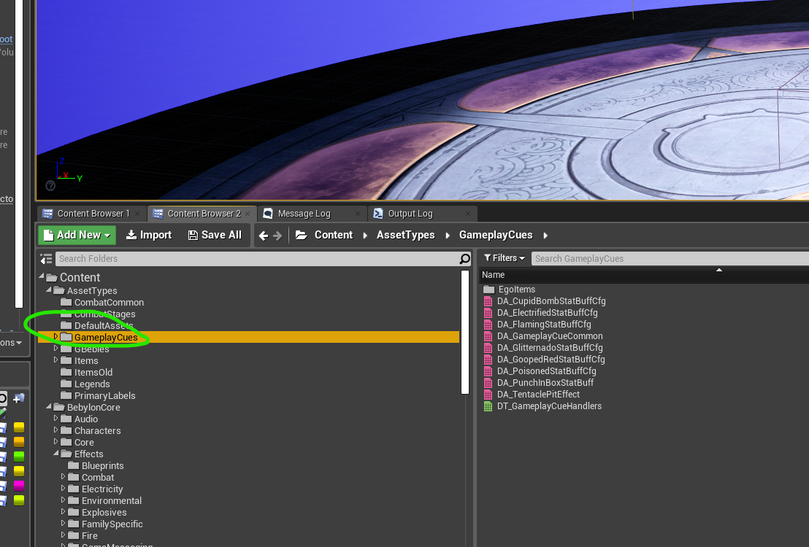
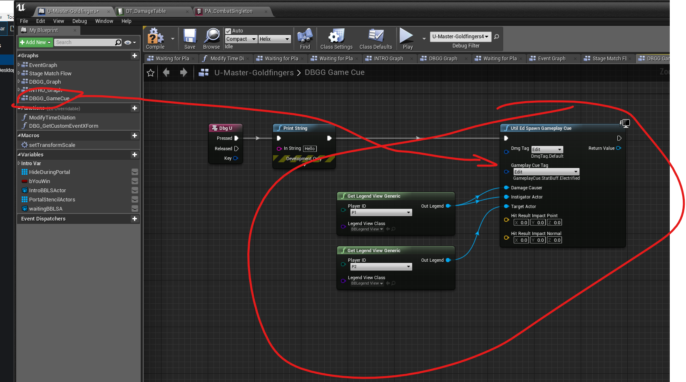
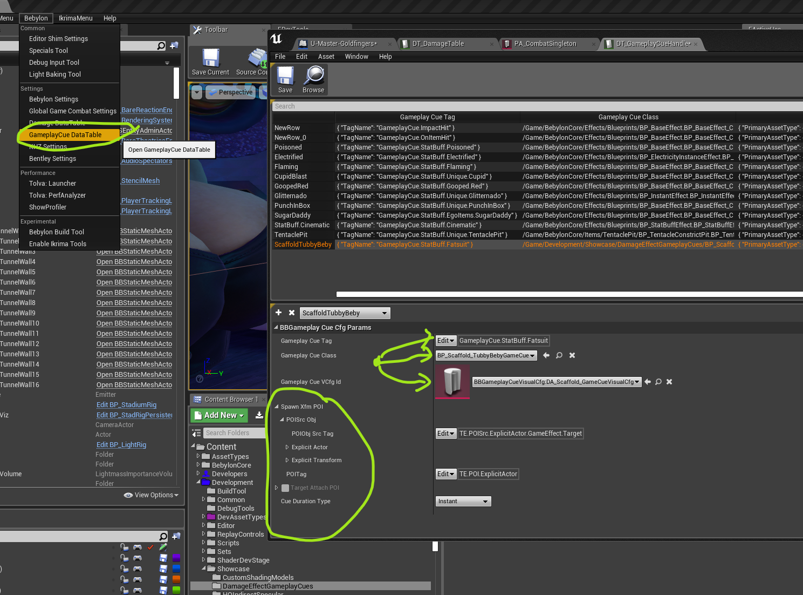
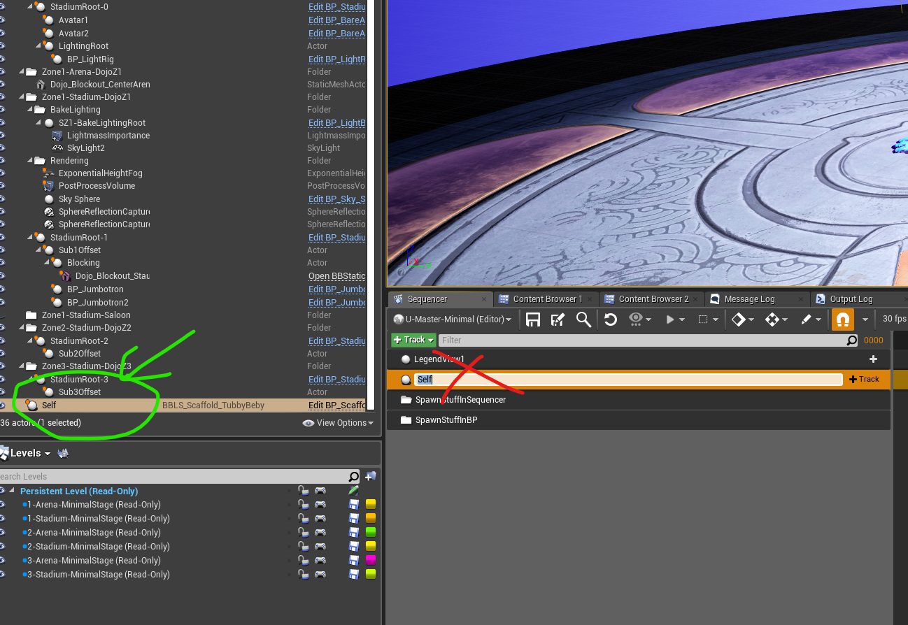
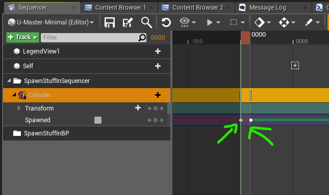
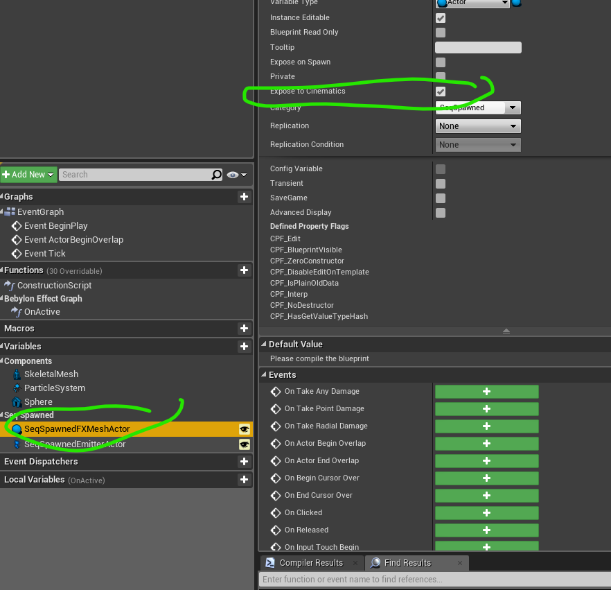
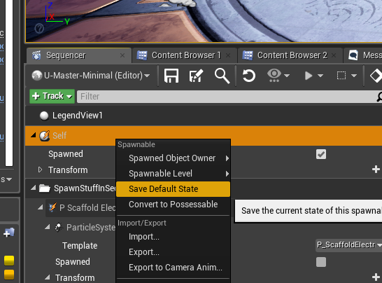
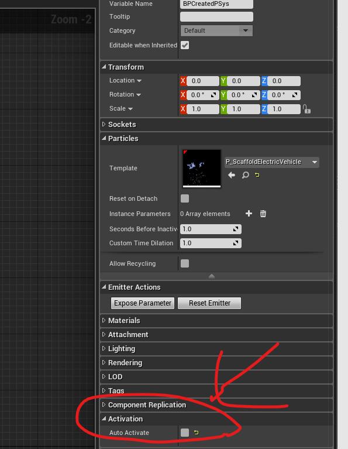
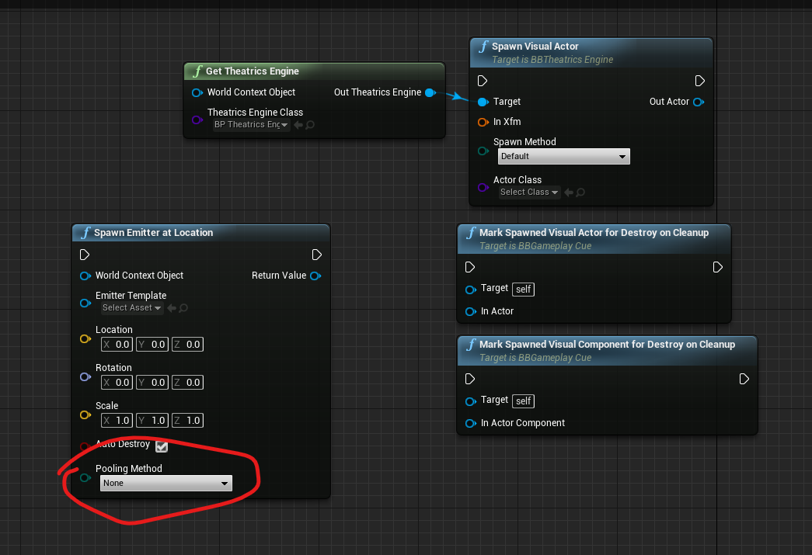

For all of them:
Want to test with a bomb or ideally just
DBG Event->AddStatusEffectToLegend() etc etc so I can test with a quick button press

Biggest questions:
- for lots of these I want to spawn a mesh attached to X that lasts the duration. But, I also want to animate material parameters on these meshes. Can they just be spawned in an intro sequencer and not deleted afterwards? Probably would rather need a ref to these meshes rather than spawnables.

ie

Intro sequence = 0.5s
Duration = 3s
Outro seq = 0.5s

Attached Item needs to be available throughout all this.
Maybe the attached/critical objects can use the GenericActor1/2/3/4 slots in sequencer?

==========================================================
- Mostly I just need an intro - looping section - outro/onRemove
- Particle pattern is probably have an indefinite length in cascade and react correctly when shutdown.

==========================================================
Tubby Beby->
Intro:
- Play Intro Sequence of car getting weighed down. LegendView to be bound to the sequence.
- Spawn skeletal mesh of fat suit rigged to beby and set beby rig as master pose component
- Play some visual effect on fat suit

Active:
- affect the weight of the car to drive the vehicle anim blueprint to automatically scrape along ground. Just need to set vehicle weight
- Set mobility to slower and wider turning circle, very small jump size

Outro:
- Remove fat suit skeletal mesh from earlier
- reset car weight parameter
- play simple sequence (with the correct player bound to it)

==========================================================
Covered In Goo
Intro:
- Play sequence of goo splatting on to car
- Spawn particles of car goo attached to Car
- Spawn particles of beby goo attached to Beby
- some way to set the above particle's parameter set (so I can key in color variations)

Active:
- The spawned particles from Intro would also have an ambient state of dripping goo to the floor.
- Mobility is super slow and can't jump at all

Outro:
- Clean up the spawned particles of car/beby goo and pop back the car
- probably also a sequence
- whatever parameter set was passed through to intro particles should also be passed through to outro particles.

==========================================================
Encased in Ice
Intro:
- Play sequence attached to victim (spawns particles)
- Spawn Ice block mesh attached to (the car? beby? both?) that lasts the duration. Should also play some Material FX (animate a scalar param over time)
- Play an animation on the beby and freeze in place - ? best way ?
- Spawn some attached FX to the ice that leave icy FX
- spawn an icy AOE mesh/decal at impact position. This should be a blueprint class as need to use stencil stuff.

Active:
(as per notes)
- the ambient fx spawned in intro play
- player is slippy and slidy
- if ice block takes damage, update a material parameter on it to add damage, and spawn particles. (probably a sequence.)

Outro:
- Ice block mesh smashes apart (material/skeletal animation), play particles. Probably a sequence bound to the victim.

==========================================================
Poisoned
Intro:
- Play sequence attached to victim (spawns particles)
- Spawn a particle on the bebys head socket to show he is poisoned (skull and cross bones) (this needs to last the duration)

Active:
- fx are idle

Outro:
- tell the spawned particle to shut down
- spawn a second particle on the bebys head socket as a quick shut down

=========================================================

---------------------------------------------------------

# Ikrima Tasks
=========================================================

- #ikrimae-questions:
   - *SpawnMeshes Attached To X*
     - X is ? Item? Instigator? Target? Specific Location?
     - Preference for Spawning in sequence vs out of sequence?
   - *Attached Item needs to be available throughout all this.*
     - Item?

TODO:

- ~~Add Debug functionality: AddStatusEffectToLegend()~~
  - ~~Add input to select damage effect~~
  - ~~Add input to specify cue~~
  - ~~Add make hit param func~~

TubbyBaby Scaffolding:
- ~~Intro sequence~~
  - ~~Asset~~
    - ~~Make Seq Asset~~
      - ~~Add Legend View~~
      - ~~Add FX Mesh For Spawning~~
        - ~~Make sure to set owner=> external~~
        - ~~restore state => false~~
      - ~~Legend Anim sequence~~
      - ~~Update configurations~~
        - ~~Add GameplayCue Row  DT_GameplayCueHandler~~

  - ~~BP~~
    - ~~On Activate=>~~
      - ~~Spawn Visual Actors~~
        - ~~Spawn Visual Fat Suit~~
        - ~~Spawn Mesh For Animation/FX~~
      - ~~Bind actors to sequence~~
        - ~~VisualFatSuit/SpawnedFXMesh~~
        - ~~Keyframe spawned stuff to object props~~
      - ~~Play sequence~~

- Active
  - BP
    - Play Active Sequence on loop
  - Make Asset
    - Add a proc track that jiggles some float
    - Add animation asset

- Outro
  - Make Asset
    - Create Sequence
      - Dissolve FatSuit Material to 0
      - Weight Parm to 0
      - Set restore to false

  - BP
    - Play Outro sequence
      - Dissolve fat Suit
      - Weight Parm to 0
    - Set Linger amount

# Features/Bugs
Add Mechanism To Destroy GameplayCueActors and spawned dependents
Add mechanism to control length duration between gameeffect/gamecue/configurationdata
---------------------------------------------------------

# GameplayCue & Damage Effect Guides

=========================================================

# Adding BP Cues

- Visual Data Assets Need to go in \Content\AssetTypes\GameplayCues
    - Made a folder for Showcasing/Devving: \Content\Development\DevAssetTypes\TestGameplayCues
    

- Trigger any GameplayCue with UtilEd_SpawnGameplayCue. Put an example one bound to 'U' in Gold Fingers
    

- Access configuration data for GameplayCue in the Gameplay Cue DataTable.
    

# Sequencer Notes

## Sequencer Runtime Binds are done by names.
***Note***: bug where you have to change the name of the actor before you add it to the sequence (changing the track doesnt actually end up doing anything)

## Sequencer Things that works for me/Superstitions

### Spawn always on not first frame. First frame, set explicit no spawn

### Reminder: Allowing persistent spawned objects

1. Set Spawned Object Owner to external

2. Make sure Spawned Track=> When Finished is Keep State, not restore state/project default

### Holding Refs to Sequencer Spawned Actors/Objects

1. Create actor properties on any blueprint and expose to cinematics

### Save Default

If you drag something in and want to modify initial props (before keyframes), "Save Default"

### Sequencer & ParticleSystems:

1. Make sure to disable AutoActivate (this will mess up sequencer scrubbing/restoring)

2. Particle Toggle tracks are necessary; spawn track is not enough
3. If spawning, I tend to spawn one frame before the particle activate track
4. This should allow you to
    * Scrub back/forth with sequencer and particle systems
    * You can animate ***particle params*** and you can change ***the psys template***
    * De-activate will deactivate PSys so will let remaining particles die out as expected
    * Toggling spawn off will force kill everything immediately

### PSys & Pooling Method: Watch out for setting pooling method to auto/manual and then destroying PS

