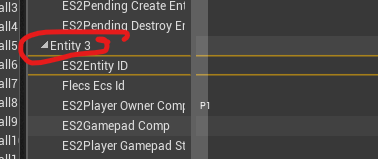

<!-- markdownlint-disable -->

- ~~Minor: Make EID show as header vs index count~~
  ~~~~

- SubFrame Visualization
  - Track View Widget
  - Table View Widget

- Visualize Ability Component
  - Visualize Sequencer Tracks
  - Visualize Ability Graph

- Serialization/Deserialization

- Debug View
  - Draw Collider Components as Spheres
    - Colorize based on Collider State (Active/shield/hurtbox)
  - Draw path
  - Onion Skin

-