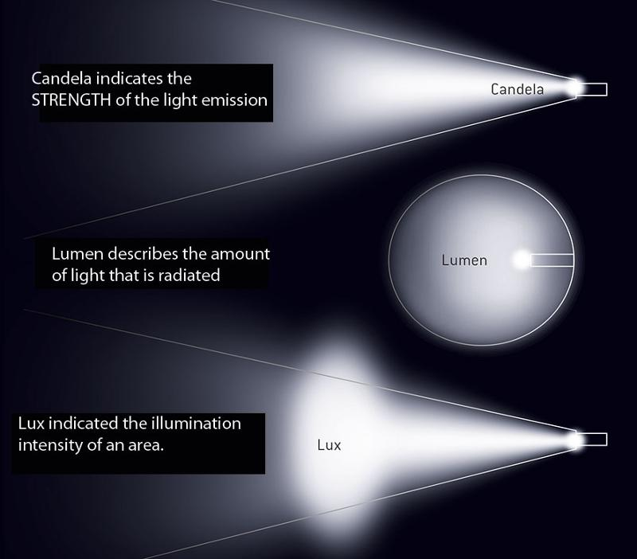
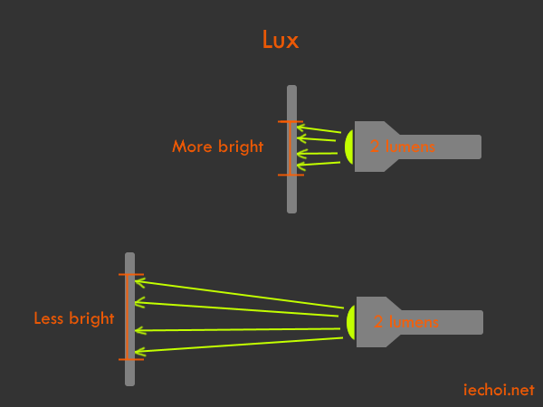

# Lighting Units (Candela vs Lumens vs Lux)

|                               | Radiometric | Spectral           | Photopic              |
| ----------------------------- | ----------- | ------------------ | --------------------- |
| Flux (Power)                  | Watts       | Power/Wavelength   | Luminous Flux (Lumen) |
| Flux Per Area                 | Intensity   | Spectral Intensity | Intensity             |
| Flux Per Area Per Solid Angle | Radiance    | Spectral Radiance  | Luminance (Nit)       |

**Candela:**

- Measures *Luminous intensity* aka luminous power in a given direction per unit solid angle

**Lumens:**

- Measures *Luminous flux*
- Photometric so it's radiant flux (power) weighted according to a luminosity function (modeling human eye's sensitivity to various wavelengths)
- $1 \operatorname{lm}=1 \  \mathrm{cd} \cdot \mathrm{sr}$

**Lux:**

- Measures *illuminance* aka luminous flux per unit area or how much light is falling on a surface
- Can also be used for *luminous emittance* which is emitted lumens (**note:** this is different from luminance)
- $1 \operatorname{lx}=1 \ \mathrm{lm} / \mathrm{m}^{2}=1 \mathrm{cd} \cdot \mathrm{sr} / \mathrm{m}^{2}$

**Luminance:**

- Measures luminous intensity reflected per unit area in specific direction
- $\mathrm{cd} / \mathrm{m}^{2}$

**Luminous efficacy:**

- measures efficacy of a light turning watts into lumens
- $\mathrm{lm} / \mathrm{W}$

| Illuminance (lux) | Surfaces illuminated by                           |
| ----------------- | ------------------------------------------------- |
| 0.0001            | Moonless, overcast night sky (starlight)[3]       |
| 0.002             | Moonless clear night sky with airglow[3]          |
| 0.05–0.3          | Full moon on a clear night[4]                     |
| 3.4               | Dark limit of civil twilight under a clear sky[5] |
| 20–50             | Public areas with dark surroundings[6]            |
| 50                | Family living room lights (Australia, 1998)[7]    |
| 80                | Office building hallway/toilet lighting[8][9]     |
| 100               | Very dark overcast day[3]                         |
| 150               | Train station platforms[10]                       |
| 320–500           | Office lighting[7][11][12][13]                    |
| 400               | Sunrise or sunset on a clear day.                 |
| 1000              | Overcast day;[3] typical TV studio lighting       |
| 10,000–25,000     | Full daylight (not direct sun)[3]                 |
| 32,000–100,000    | Direct sunlight                                   |

