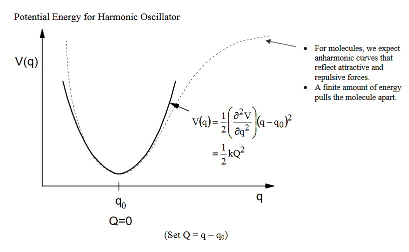
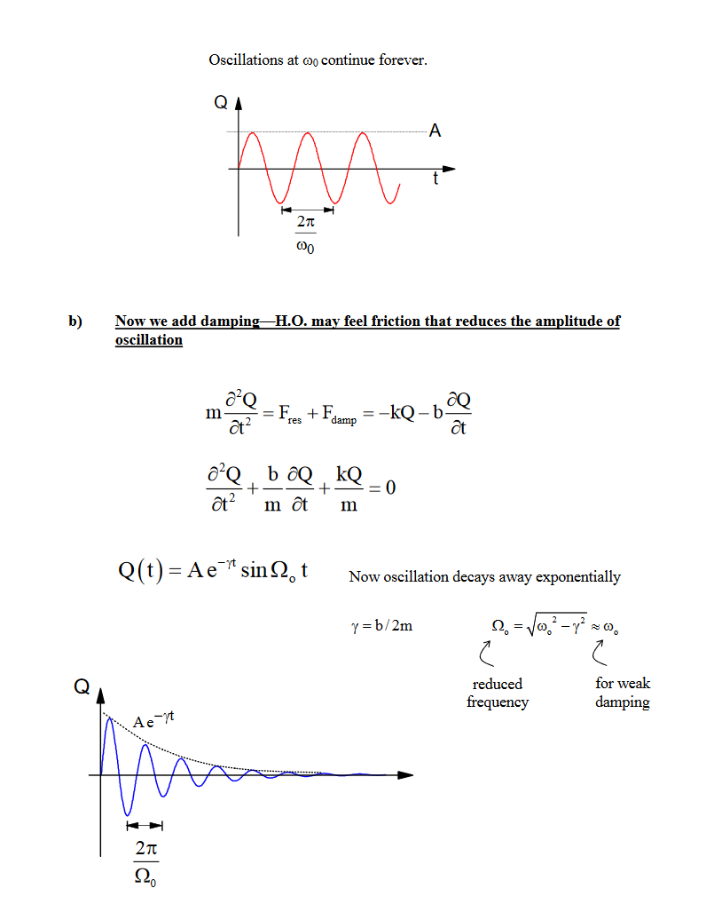
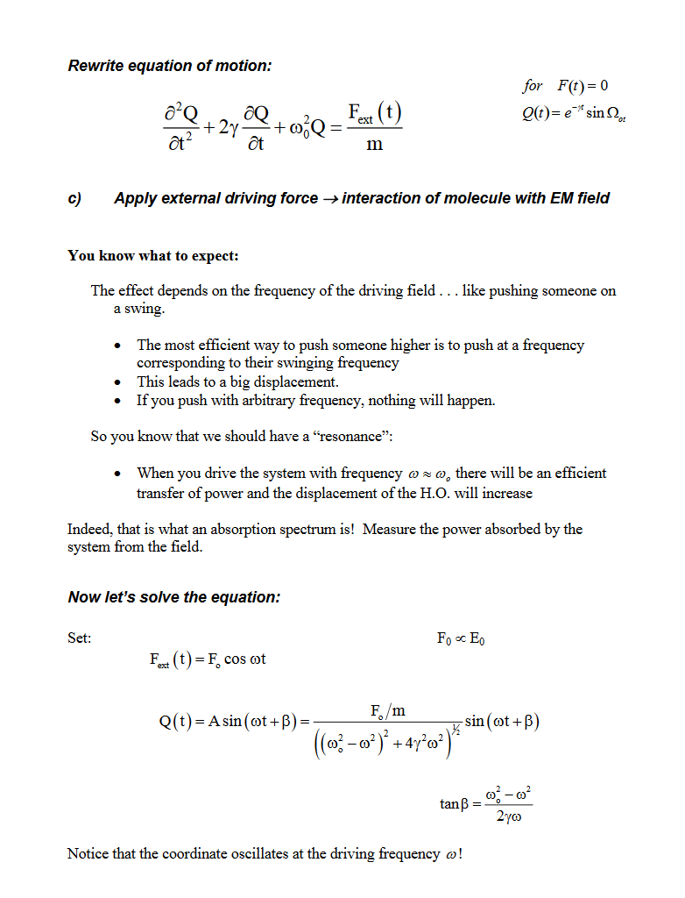

# Physics of Light: Absorption
[From MIT Lecture Notes: A Classical Model for Spectroscopy](https://ocw.mit.edu/courses/chemistry/5-33-advanced-chemical-experimentation-and-instrumentation-fall-2007/lecture-notes/classicalspec.pdf)

Why does light absorb? The quantum mechanical model is a bit opaque and doesn't tell us much. Let's use the classical model instead.

Molecules are composed of charged particles. Light (an E&M field) exerts a force on these charges. Force exerted on the molecules depends on the field strength, magnitude of the charges, and how far the charges move.

## **Classical Model:** Uses three things
- Light: an oscillating electric magnetic field
- Matter: we treat it as a harmonic oscilattor
- Interactions: oscillating external force field driving a harmonic oscillator

### 1. Light

$$
\overline{\mathrm{E}} (\overline{\mathrm{r}} ,\mathrm{t} )=\hat{\varepsilon } (\overline{\mathrm{r}} )\mathrm{E}_{\mathrm{o}}\cos (\omega \mathrm{t} -\overline{\mathrm{k}} \cdot \overline{\mathrm{r}} -\phi )
$$
$$
\hat{\varepsilon } (\overline{\mathrm{r}} )\ \Longrightarrow \ polarization\ vector
$$
$$
\mathrm{E}_{\mathrm{o}} \Longrightarrow amplitude
$$
$$
\omega \mathrm{t} \Longrightarrow frequency\ ( rad/s)
$$
$$
\overline{\mathrm{k}} \Longrightarrow wavevector\ defines\ direction\ of\ propogation
$$

Let's simplify:

1. Let's propogate along $\vec{x}$ and drop polarization so $\phi=0$

$$
\mathrm{E}(\mathrm{x}, \mathrm{t})=\mathrm{E}_{0} \cos (\omega \mathrm{t}-\mathrm{kx})
$$

We can also drop the wave vector $(|\mathrm{k}| \rightarrow 0, \text { since } \lambda>>\mathrm{x} \text { and we consider molecules at } \mathrm{x}=0)$

$$
\mathrm{E}(\mathrm{t})=\mathrm{E}_{0} \cos \omega \mathrm{t}
$$
$$
I=\frac{c}{4 \pi}\left|E_{0}\right|^{2}
$$
$$
\begin{array}{l}{|\mathrm{k}|=\frac{2 \pi}{\lambda}=\frac{\omega}{\mathrm{c}}} \\ {\mathrm{c}=2.998 \times 10^{8} \mathrm{m} / \mathrm{s}}\end{array}
$$

### 2. Molecules: treat as harmonic oscillator

Why should we be able to call molecules harmonic oscillators?  i.e., a mass on a spring?

Molecules feel a restoring force when pushed from equilibrium.

The covalent bond can be thought of as a spring.  The equilibrium length is a balance between attractive and repulsive forces. \
If we push/pull on this bond, there is a restoring force that pushes the system back to equilibrium.

This analogy works for other systems also
  - Electronic states—think of pushing electron clouds away from equilibrium distribution. (for instance, benzene pi orbitals)
  - Magnetic resonance—In a magnetic field, magnetic spin moments—nuclear spins—align with field.\
    If we push a spin away from field, it will want to relax back.

Summary:
- Scattering from Damped Harmonic Oscillator
- Assume that a molecule is a simple harmonic oscillator with a single harmonic oscillation frequency $\omega_{0}(2 \pi v)$
- When irradiated by monochromatic electromagnetic wave of frequencyω0,theelectromagneticwaveoffrequencyω0,theelectron undergoes an acceleration, while the nucleus, being massive, is assumed not to move
- An accelerating charge gives rise to electromagnetic radiationelectromagneticradiation.
- Scattering is governed byftiid    drefractive index andparticle size distributionparticlesizedistributio

## Deriving Scatering coefficients from Mie Theory

Mie theory is the basis for calculation of the scattering and absorption coefficients of a spherical particle having a given diameter and refractive index

Mie theory, also called Lorenz-Mie theory or Lorenz-Mie-Debye theory, is an analytical yyysolution of Maxwell's equations for the scattering of electromagnetic radiation by spherical ti  l(  lll  d Mitt   i) i   tfparticles (also calledMie scattering)in terms ofinfinite series. The Mie solution is named after its developer  German physicist Gustav Miedeveloper, GermanphysicistGustavMie. However, others like Danish physicist Lorenz preceded him independently developed the ppyptheory of electromagnetic plane wave scattering by a dielectric sphere. The term "Mie solution" is sometimes used more generically for any analytical solution in terms of infinite series

References:
https://www.gfdl.noaa.gov/wp-content/uploads/files/user_files/pag/lecture2008/lecture3.pdf
https://www.meto.umd.edu/~zli/AOSC621/Lesson%204%20Extinction%20&%20Scattering.pdf