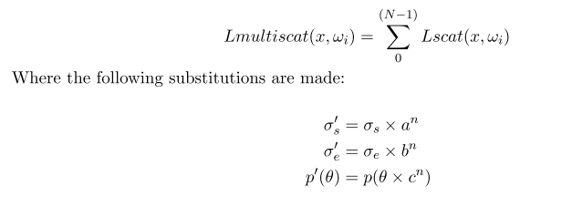

# TODO

## Techniques

- Reference pathtrace/raymarch
- Volume Flipbook
- Particle Rendering with Slabs sampling
- Channel Lighting
  - Volume Filtering with mips
- IsoSurface Tracking
  - Mean Occlusion
  - Directional Occlusion
  - Directional Lightfield
- Vertex Baking
- Basis Functions
  - Spherical Harmonics
  - Spherical Gaussians
  - Fourier Opacity Maps
  - Extinction Transmittance Maps \[Extinction Transmittance Maps]
- Precomputed Radiance Transfer for Volume Rendering
  - Do it inside the volume
  - Can also do it on the surface and tangent basis (use burley's normalized diffusion profile as it provides super simple artistic control)
    - Reference: Approximate Reflectance Profiles for Efficient Subsurface Scattering
    - Reference: *Extending the Disney BRDF to a BSDF with Integrated Subsurface Scattering*
- Multiple Scattering approximations
  - Contrast approximation for art directable multiple scattering
    - <http://magnuswrenninge.com/wp-content/uploads/2010/03/Wrenninge-OzTheGreatAndVolumetric.pdf>
    - <http://magnuswrenninge.com/wp-content/uploads/2010/03/Wrenninge-ArtDirectableMultipleVolumetricScattering.pdf>
    - Technique is basically exponentiation of single scattering with multiple octaves
    - Must make sure a &lt;= b to be energy conserving

- Take Mean Free Path/Transport mean free path into account
  - The scattering mean free path is the average distance between scattering events (in biological tissues around 100 μm)
  - The transport mean free path can be thought of as the mean distance after which a photon’s direction becomes random (in biological tissues around 1 mm)
  - The **transport length** in a strongly diffusing medium (noted l\*) is the length over which the direction of propagation of the [photon](https://www.wikiwand.com/en/Photon) is randomized. It is related to the [mean free path](https://www.wikiwand.com/en/Mean_free_path) l by the relation
- \#nicetohave Incorporate Baked VLM
  - VolumetricFog.usf: LightScatteringCS() - GetVolumetricLightmapSH2(BrickTextureUVs);
  - Radiance caching gradients
  - A Novel Sampling Algorithm for Fast and Stable Real-Time Volume Rendering: <https://github.com/huwb/volsample>
  - Amanatide ray marching: A Fast Voxel Traversal Algorithm for Ray Tracing
    - Gives list of voxel coordinates that will be hit
    - <https://developer.nvidia.com/gpugems/GPUGems3/gpugems3\_ch22.html>
    - <https://www.gamedev.net/blogs/entry/2265248-voxel-traversal-algorithm-ray-casting/>
    - <https://github.com/francisengelmann/fast\_voxel\_traversal>
    - Survey olf grid traversal: <http://www.cosenza.eu/papers/CosenzaEGITA08Grid.pdf>
- Linearly transformed cosines
  - Use them as a basis. Linear transform of cosine lobe (scale, skew, rotation) doesn't affect integral product and has closed form solution
  - <https://blog.magnum.graphics/guest-posts/area-lights-with-ltcs/>
  - <https://github.com/selfshadow/ltc\_code>
  - GPU Zen Chapter: Linear-Light Shading with Linearly Transformed Cosines

Tasks

- Channel Lighting (devon's approach)
  - Houdini modify to export 3 lighting channels + density
  - Modify shader to take channel ramps into account
  - Make pretty visuals

- Create ShowcaseZoo

  - IsoSurface Tracking
    - Mean Occlusion
    - Directional Occlusion
    - Directional Lightfield
  - Re-export Volume Flipbook sample
  - Reference pathtrace/raymarch
  - Particle Rendering with Slabs sampling
  - Basis Functions
    - Spherical Harmonics
    - Spherical Gaussians
    - \#nicetohave Incorporate Baked VLM
      - VolumetricFog.usf: LightScatteringCS() - GetVolumetricLightmapSH2(BrickTextureUVs);

- Basic Scaffolding
  - Make a simple houdini &lt;> ue4 plugin then iterate.

- Houdini:
  - create voxel grid
  - create attribs (bakedirect,scatter,env)
  - Make a nice volumetric mesh
  - Sample based on plane alignment
  - bake direct into samples
  - bake scattering into samples
  - bake indirect into samples
  - export
    - render volume texture
    - Sample cop into texture as channel lighting
    - render fbx of isosurface
  - Bake thickness
    - Bake to SH

- UE4:
  - import voltex
  - import mesh
  - write raymarch shader
    - raymarch lightcontrib
    - colorramp for direct/indirect
  - Temporal Reprojection
  - Perf
    - Optimize existing shader
    - LOD
      - Bake to IsoSurface
      - LOD Mips
    - Perf analysis
  - Monkey Engineering/Production grade
    - Support exporting to tangents basis
    - Support for skinned meshes
    - Remove 'houdinispace' swizzle and properly export out of houdini

- Debugging
  - VLM UE4 Debug
    - Peek Texel
  - Basis Func UE4 Debug Visualization
    - Peak basis function

- Nice2Have:
  - make a UE4 HDA
  - incorporate UE4 VLM
  - PRT Compression: Manny Ko - Practical Spherical Harmonics Based PRT Methods
  - Sloan - Efficient Spherical Harmonic Evaluation
  - Noise-Resistant Fitting for Spherical Harmonics
  - \#nicetohave Volume Filtering with mips
  - \#nicetohave linear regression on basis function

# **Notes:**

## **Math Reminders**

- Incremental averaging:
  - NewAvg = OldAvg + (NewVal - OldAvg) / NewSampleCount
  - Optimized: Avg = lerp(avg, NewVal, rcp(NewSampleCount))
  - For calculating variance as well: <https://www.wikiwand.com/en/Algorithms\_for\_calculating\_variance#/Online\_algorithm>
- Closest Point Transform
  - ∇\_sdf() is always unit vector. (SDF is 3D levleset of function embedded in 4D so all level set rules apply)
  - Xcpt(x) = x - sdf(x) \* ∇\_sdf(x)
  - Xcpt(x) => is a conservative field
    - Xcpt(x) = ∇U(x)
    - U(x) = 0.5 \* (|x|^2 - f^2(x))
    - Has no curl

Optimization Reminders

- Optimizing Graphics Pipeline: <https://www.slideshare.net/gwihlidal/optimizing-the-graphics-pipeline-with-compute-gdc-2016>
  - ~.9 prim/cy is a target. 2 prims/cycle is optimistic

### **Curve Fitting**

- Fast Polynomial Eval
  - Horner form for fast polynomial evaluation:
    y = x + a\*x\*x\*x + b\*x\*x\*x\*x\*x + c\*x\*x\*x\*x\*x\*x\*x + d\*x\*x\*x\*x\*x\*x\*x\*x\*x*;* // 24 mults, 4 adds
    z = x\*x; y = ((((z\*d+c)\*z+b)\*z+a)\*z+1)\*x; // 2 mults, 4 madds
- Error metrics
  - Absolute error metric: error_abs = abs(f_actual - f_approx)
    - good measure of accuracy but not of importance of any error
    - Ex: Error of 3 is fine if f(x) returns 38,000. Terrible if function returns 0.0001
  - Relative error metric: 1 - f_approx / f_abs
- Gaussian Quadrature
- Spherical Splines/Polynomials
- Spherical RBFs
  - Is There Anything Comparable to Spherical Harmonics But Simpler? <http://www.cs.cuhk.hk/~ttwong/papers/srbf/srbf.html>
    - <http://www.cs.cuhk.hk/~ttwong/demo/srbf/srbf.html>
    - <http://www.cs.cuhk.hk/~ttwong/>
  - Von Mises Basis Functions vs Gaussian Spherical Radial Basis Functions:
    - A Comparison of the von Mises and Gaussian Basis Functions for Approximating Spherical Acoustic Scatter
    - 3 orders of magnitude better than guassian
  - Real-time Rendering of Dynamic Scenes under All-frequency Lighting using Integral Spherical Gaussian
    - All-Frequency Precomputed Radiance Transfer using Spherical RadialBasis Functions and Clustered Tensor Approximation
    - <https://mynameismjp.wordpress.com/2016/10/09/sg-series-part-1-a-brief-and-incomplete-history-of-baked-lighting-representations/>

### **Promising:**

- Quantization baking: Noise-Resistant Fitting for Spherical Harmonics

### **Misc reminders:**

- Extinction Transmittance Maps
- Deep Shadow Maps
- Fourier Opacity Mapping
- Particle Shadows & Cache-Efficient Post-Processing
- Volumetric Billboards
- Interactive Light Scattering with Principal-Ordinate Propagation
- Try monochromatic scattering/absorption
- Volume Temporal Reprojection Unity implementation: <http://advances.realtimerendering.com/s2018/Siggraph%202018%20HDRP%20talk\_with%20notes.pdf>
- Review material
  - Physically Based and Unified Volumetric Rendering in Frostbite: Physically Based and Unified Volumetric Rendering in Frostbite
  - Volume Modeling and Rendering
  - <https://www.scratchapixel.com/lessons/advanced-rendering/volume-rendering-for-artists>
  - <https://developer.nvidia.com/sites/default/files/akamai/gameworks/downloads/papers/NVVL/Fast\_Flexible\_Physically-Based\_Volumetric\_Light\_Scattering.pdf>
  - The Magic of Computer Graphics
  - Dissertation - Efficient Monte Carlo Methods For Light Transport In Scattering Media
  - Transfer Equations in Global Illumination
  - Deep Compositing: <https://zero-radiance.github.io/post/deep-compositing/>
  - Spherical Harmonic Clipped integration: <https://belcour.github.io/blog/research/2018/02/01/sh-integral.html>
  - Disney Subsurface Scattering Unity implementation: <http://advances.realtimerendering.com/s2018/Efficient%20screen%20space%20subsurface%20scattering%20Siggraph%202018.pdf>
  - Cone Step Relief Mapping:
  - <http://www.lonesock.net/files/ConeStepMapping.pdf> <https://developer.nvidia.com/gpugems/GPUGems3/gpugems3\_ch18.html>
  - Hemisphere basis: A Novel HemisphericalBasisforAccurateandEfcientRendering
