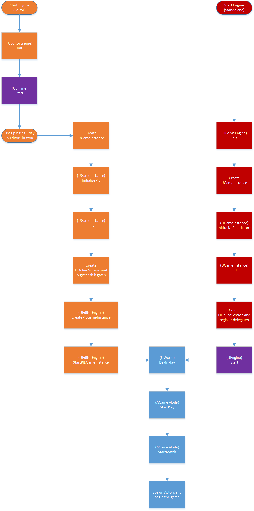

# Overview

|                                            |                                                                                                                                                                                                                                            |
| ------------------------------------------ | ------------------------------------------------------------------------------------------------------------------------------------------------------------------------------------------------------------------------------------------ |
| UnrealBuildTool::UnrealTargetConfiguration | `Debug` `DebugGame` `Development` `Shipping` `Test`                                                                                                                                                                                        |
| BuildConfiguration/TargetPlatformName      | `NoEditor/WindowsNoEditor/EPlatformType::Game/UE4Game` `Editor/Windows/EPlatformType::Editor/EPlatformType::Editor/UE4Editor` `Client/WindowsClient/EPlatformType::Client/UE4Client` `Server/WindowServer/EPlatformType::Server/UE4Server` |
| UnrealBuildTool::UnrealTargetPlatform      | `Win64` `Win32` `PS4` `XboxOne`                                                                                                                                                                                                            |

Reference: UnrealEngine\\Engine\\Source\\Programs\\UnrealBuildTool\\Configuration\\UEBuildTarget.cs

## Incredibuild

- Make sure Incredibuild agents are installed on your local machine

- Make sure Coordinator is running on the build server

## Build Automation:



- **New script for making Installed Builds:** The ‘Rocket’ build process has been re-written using our new BuildGraph script (similar in style to MSBuild scripts), which should make the process easier to follow and modify for other users who want to make their own Installed builds. The main script can be found at Engine/Build/InstalledEngineBuild.xml and can be run using one of the following command lines from AutomationTool:

  - BuildGraph -target=”Make Installed Build Win64” -script=Engine/Build/InstalledEngineBuild.xml

  - BuildGraph -target=”Make Installed Build Mac” -script=Engine/Build/InstalledEngineBuild.xml

  - If you run one of these **with -listonly added to the command**, you will be able to see what will be built and a list of additional options you can specify. By default it will attempt to build every target platform your host machine is capable of making builds for, except for XboxOne and PS4, which are disabled by default. You can disable target platforms by adding -set:WithWin64=false to the commandline and also skip over the creation of DDC for Engine and Template content by passing -WithDDC=false.

*Reference From <https://forums.unrealengine.com/showthread.php?119130-Unreal-Engine-4-13-Preview&p=575178&viewfull=1#post575178>*

- <https://answers.unrealengine.com/questions/416396/building-binary-editor-from-source-for-artists.html>

- <https://forums.unrealengine.com/showthread.php?123490-Current-advice-for-distributing-custom-engine-builds-to-team-without-recompiling>


- New: Using the -precompile option with UnrealBuildTool will now build all engine modules. Overriding the GetModulesToPrecompile() function from a game's target rules is no longer necessary, and has been deprecated.

*Reference From <https://www.unrealengine.com/blog/unreal-engine-4-11-released>*

- BuildGraph system & creating precompiled engine builds/installed builds:

  - <https://docs.unrealengine.com/latest/INT/Programming/Development/InstalledBuildReference/index.html>

  - <https://docs.unrealengine.com/latest/INT/Programming/Development/BuildGraph/index.html>

  - <http://jackknobel.com/How-To/BuildGraph>

  - <http://jackknobel.com/BuildGraph/Building-an-installed-ue4>

- (4.13 Deprecated) Coherent explanation on Rocket build process/GUBP: <https://github.com/Kalmalyzer/UE4RocketBuild>

  - Also deprecated: GetModulesToPrecompile(). Use -precompile flag instead which automatically gets the right engine modules for recompilation

- UBT uses empty text files in Engine/Build to demarcate stuff as well. Ex:

|                        |                                                                       |
| ---------------------- | --------------------------------------------------------------------- |
| SourceDistribution.txt | Whether it's a github source build?                                   |
| InstalledBuild.txt     | Whether we're using precompiled static engine libraries               |
| PerforceBuild.txt      | Whether Perfroce is building the engine (disables launcher autostart) |

## Swarm

- Copy the /Engine/Binaries/DotNET/ directory from an existing UE4 installation to a your computer

## Building Configuration With Custom Build Compiler Flags

- Reference: <https://docs.unrealengine.com/latest/INT/Programming/UnrealBuildSystem/TargetFiles>

- Your Game.target.cs file configures the build environment and flags

- UEBuildConfiguration contains a lot of the settings you would want to modify

- You modify this in the SetupGlobalEnvironment() call

- Here's how to add flags to the build system: In TargetFile.cs,

`IMPORTANT: Game targets will \*not\* have this function called if they use the shared build environment.`
`See ShouldUseSharedBuildEnvironment().`

```cpp
public override void SetupGlobalEnvironment(

TargetInfo Target,

ref LinkEnvironmentConfiguration OutLinkEnvironmentConfiguration,

ref CPPEnvironmentConfiguration OutCPPEnvironmentConfiguration

) {

…

//preprocessor defines

OutCPPEnvironmentConfiguration.Definitions.Add("ALLOW_LOG_FILE=0");

//Compiler flags

OutCPPEnvironmentConfiguration.AdditionalArguments = "/Zm46";

…

}
```

**DEPRECATED**

    //public override bool ShouldUseSharedBuildEnvironment(TargetInfo Target)

    //{

    // return false;

    //}

## Building Lighting from Command Line

UE4-Editor.exe \[Project Folder Path] -run=resavepackages -buildlighting -MapsOnly -ProjectOnly -AllowCommandletRendering -Map=\[Name of map]

*Reference From <https://wiki.unrealengine.com/LightingTroubleshootingGuide>*

GenerateProjectFiles.bat

- Can take arguments to specify which version of visual studio. Ex to force generate VS 2013 / VS 2015 (use when you have multiple versions of Visual Studio):

  GenerateProjectFiles.exe - 2017

## Explanation of Different Build Configurations:

Builds have 2 parts which you can combine, there also some hiddden options you can set in build script

1st part:

- Development - build that is used for devlopment, you can debug with it but there might be some memory reading variable reading problems on debug

- Debug - Build with a lot better debug symbols setup, you should use that if you plan to debug C++ code

- DebugGame - not sure what that is but probably other variant of debug build

- Shipping - Build ready for distribution without any development stuff

- Test - Test build which has extra utilities for testing

2nd part:

- *nothing* - With client and server code, without editor

- Editor - With everything

- Client - Without editor and server code, client only, with this build user wont able to set up server

- Server - Without editor and client, in other words dedicated server build, but note that other builds (except "Client" ofcorse) can function as dedicated server too

*Reference From <https://answers.unrealengine.com/questions/194712/differences-between-build-configurations.html>*

## Derived Data Cache

The Derived Data Cache (DDC) stores versions of assets in the formats used by the engine and its target platforms, as opposed to the source formats artists create that are imported into the editor and stored in .uasset files. Content stored in the DDC is disposable in that it can always be regenerated at any time using the data stored in the .uasset file. Storing these derived formats externally makes it possible to easily add or change the formats used by the engine without needing to modify the source asset file.

### Using a Shared DDC

Studios should use a shared DDC that all users in a particular location can access. This way, only one person needs to build the derived asset format(s) and they are automatically available to all other users. There will occasionally be stalls when assets need to be processed, but the results are remembered and shared. So with a handful of developers or more, most people will not notice any impact.

To set up a shared DDC, override the paths for the \[DerivedDataBackendGraph] by declaring this section in your game's **DefaultEngine.ini**. This section is originally declared in the **BaseEngine.ini** where the paths are set to Epic's internal DDC share. Re-declare the section and change the paths to point to a share on your network (e.g. Path=\\\\mystudio.net\\DDC):

```ini
[DerivedDataBackendGraph]
MinimumDaysToKeepFile=7
Root=(Type=KeyLength, Length=120, Inner=AsyncPut)
AsyncPut=(Type=AsyncPut, Inner=Hierarchy)
Hierarchy=(Type=Hierarchical, Inner=Boot, Inner=Pak, Inner=EnginePak, Inner=Local, Inner=Shared)
Boot=(Type=Boot, Filename=%GAMEDIR%DerivedDataCache/Boot.ddc, MaxCacheSize=256)
Local=(Type=FileSystem, ReadOnly=**false**, Clean=**false**, Flush=**false**, PurgeTransient=**true**, DeleteUnused=**true**, UnusedFileAge=17, FoldersToClean=-1, Path=../../../Engine/DerivedDataCache)
Shared=(Type=FileSystem, ReadOnly=**false**, Clean=**false**, Flush=**false**, DeleteUnused=**true**, UnusedFileAge=19, FoldersToClean=-1, Path=\\\\mystudio.net\\DDC, EnvPathOverride=UE-SharedDataCachePath)
AltShared=(Type=FileSystem, ReadOnly=**true**, Clean=**false**, Flush=**false**, DeleteUnused=**true**, UnusedFileAge=19, FoldersToClean=-1, Path=\\\\mystudio.net\\DDC2, EnvPathOverride=UE-SharedDataCachePath2)
Pak=(Type=ReadPak, Filename=%GAMEDIR%DerivedDataCache/DDC.ddp)
EnginePak=(Type=ReadPak, Filename=../../../Engine/DerivedDataCache/DDC.ddp)
```

Satellite studios working out of a single shared code base can set the **UE-SharedDataCachePath** environment variable to a path that all users at each location can read and write to. This allows each location to have its own shared DDC.

For example:

UE-SharedDataCachePath=\\\\mystudio.net\\DDC

###  

### Building Derived Data

You can fill your derived data caches at any time by passing the arguments below to the executable:

`UE4\\Engine\\Binaries\\Win64\\UE4Editor.exe MyGame -run=DerivedDataCache -fill`

<https://docs.unrealengine.com/latest/INT/Engine/Basics/DerivedDataCache/index.html>
