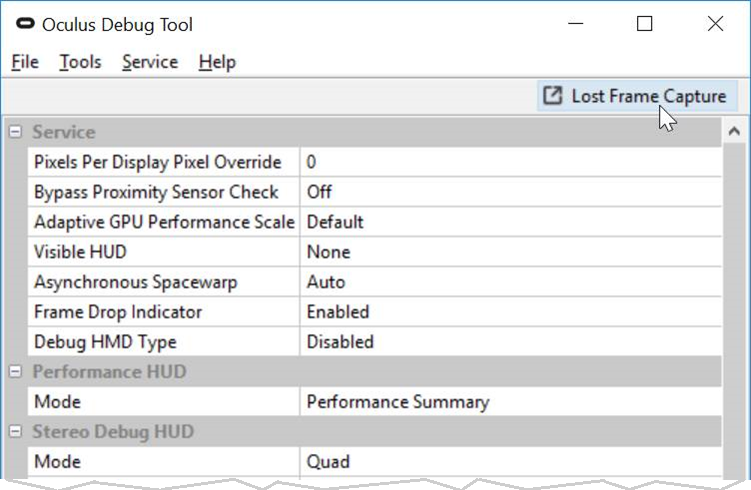

Perf Tool

- Editor Toolbar Button to launch current map for perf testing.

  - Command line is:

    ```cpp
    {full_path_to_ue4editor.exe}
    {fullpathto_BBR.uproject {current_map}?Listen -game -Multiprocess -messaging
    -SessionName="PerfTesting Mode" -MultiprocessSaveConfig -MultiprocessOSS WinX=5 WinY=495 SAVEWINPOS=1 -NoVerifyGC -NoAILogging
    ```

- Make sure to on launch:

  - For the existing instance:

    - Warn if EditorPerformance.UseLessCPUWhenInBackground == False

    - Set Editor Real Time Viewport = False

      - Reference (but probably already exposed in python)

        EditorViewportClient.SetRealtime( false, false )

        const FLevelEditorViewportClient& ViewClient = Viewport.Pin()->GetLevelViewportClient

        ViewClient.IsRealtime()


- Try to minimize the editor window.

  ```cpp
  TSharedPtr<SWindow> RootWindow = FGlobalTabmanager::Get()->GetRootWindow();

  if (RootWindow.IsValid() && bShouldMinimizeRootWindow)
  {
    RootWindow->Minimize();
  }
  ```

- For the launched instance(Likely need a command line arg to set a "profiling mode" or parse the -SessionName on-map-load and verify this state):

  - Make sure vsync, frame smoothing, and t.maxfps is off

  - Make sure r.ForceDebugViewModes=1

  - Make sure t.IdleWhenNotForeground=1


- Normal Mode options:

  - \-ResX=2160 -ResY=1200 -nohmd -windowed -ExecCmds="r.screenpercentage 140,r.pd=1"


- VR Emulation variant options:

  - \-ResX=2160 -ResY=1200 -nohmd -windowed -emulatestereo -ExecCmds="r.screenpercentage 140,r.pd=1"


- VR Mode:

  - vr

- Optional useful Params:

  - Deterministic (shortcut for -fixedtimestep/-fixedseed)

  - fixedtimestep

  - FixedSeed

  - usefixedtimestep

  - debug (To Launch In DebugGame)

  - log or -log LOG=logfile.txt

  - FORCELOGFLUSH

  - nologging

  - NoTextureStreaming

  - nosound

D3D Debugging

- D3DDEBUG

- d3dbreakonwarning

- ONETHREAD

- VSPerf

- VTune

For Paths, look at FPaths struct (e.g. FPaths::GetProjectFilePath()) or the onenote section [Application/OS/Generic Platform](fixme_self_referential_link)

- Command to build + cook + launch game

  - Click the command => SWindow Popout with checkboxes+comboboxes to {build|cook} {engine|standalone} {development|debuggame} BBR

  - Persist to config (kiteandlightning.py has example of ConfigParser)


- Create new ABBDebugController from ADebugCameraController. This can be our base class for debugging

  - Add capture debug frustum console command to this class. Easiest way is make a

    UFUNCTION(exec)
    void CaptureDebugFrustum();

    There's a UDrawFrustumComponent\* DrawFrustum that is already in ADebugCameraController. You just need to update its values

    Also look at Ethan Carter Extension to freeze rendering. Note: this might be not applicable anymore and also single eye frustum culling has been implemented in the engine already

    *I had added drawing a debug frustum to the FREEZERENDERING command to aid in debugging culling using a joint frustum for both eyes. I had* [*improved the DrawDebugFrustum() code*](https://github.com/inequation/UnrealEngine/commit/38127610bd153c949213e95564a97b5808e52d5d) *to better handle the* [*inverse-Z projection*](https://developer.nvidia.com/content/depth-precision-visualized) *matrices that UE4 uses, and also to allow a plane set to be the data source.*

    *Reference From <https://medium.com/@TheIneQuation/the-vanishing-of-milliseconds-dfe7572d9856>*

**Command To Launch Oculus Perf tool:**

- Should toggle the oculus perf hud (this is exposed through console command): Should have these modes

  - The 4 different modes for Oculus PerfHud

  - The minimal perf hud mode that shows L,C,F depending on what missed frame rate (<https://developer.oculus.com/documentation/pcsdk/latest/concepts/dg-performance-warning>)

- Also force disable timewarp when launching

- See if you can bypass proximity sensor check. The Oculus Lost Frame Capture tool has a setting which probably means it writes to a registry key. You can snoop it using ProcMon:



<https://developer.oculus.com/documentation/pcsdk/latest/concepts/dg-performance-lostframes>

- Pause Game Thread: (pause)


- Pause Game Thread Clock update (e.g. slomo = 0)

  - Game Thread should keep ticking but game engine should not increase the game clock so we can deterministically analyze current frame tick

**Low-Pri**

- Low-pri: Add Ethan Carter's implementation of STAT RELEVANTLIGHTS:

<https://github.com/inequation/UnrealEngine/commit/c986362a92c56b498982b200b0f36a09723202a4>

- Command to capture ETW tracefile using ovrlog or ovrlog_win10.

  - Oculus Guide on ETW/GPUView: <https://developer.oculus.com/documentation/pcsdk/latest/concepts/dg-performance-tutorial>

- This chapter from this book is another detailed good resource (I have the ebook, ask me when you get to it):

- Chapter 2. Understanding, Measuring, and Analyzing VR Graphics Performance (by James Hughes, Reza Nourai, and Ed Hutchins) in the book *GPU Zen: Advanced Rendering Techniques (Wolfgang Engel*, ed)

- Grab Individual stat numbers and construct our own groups:

  For reference, Look at

- DumpFrame(int64 Frame)

- DumpHistoryFrame(Stats, Latest, DumpCull, MaxDepth, \*NameFilter);

- DumpCPUSummary()

- DrawStatsHUD() is where the stats drawing happens

- [Accessing Single Stat Values]


- Command to programmatically capture a frame:

  - Use dxcap: <https://msdn.microsoft.com/en-us/library/hh780905.aspx>

    dxcap -c UnrealEngine\\Engine\\Binaries\\Win64\\UE4Editor-Win64-Debug.exe BBR\\BBR.uproject 0-Lobby -log -debug -d3ddebug -game

    dxcap -frame 8s -c UnrealEngine\\Engine\\Binaries\\Win64\\UE4Editor-Win64-Debug.exe BBR\\BBR.uproject 0-Lobby -log -game


- Programmatic NSight capture would be great too:

  - **Launch Project with NSight HUD:**
  - "C:\\Program Files (x86)\\NVIDIA Corporation\\Nsight Visual Studio Edition 5.3\\Monitor\\Common\\Nvda.Launcher.exe" "%1"
  - Ex:
  - "C:\\Program Files (x86)\\NVIDIA Corporation\\Nsight Visual Studio Edition 5.3\\Monitor\\Common\\Nvda.Launcher.exe" "C:\\UE4Editor.exe" BBR.uproject -log

**Launch NSight Monitor**

1. Make sure to launch nsmonitor with admin priv

1. Adjust WDDM TDR for Nsight

1. Enable Driver Instrumentation

1. Make sure to warn if these settings arent set:

   - t.maxfps=0

   - Set BBIsGPUProfiling = true

1. Remember to pass -d3ddebug

1. Exhaustive D3D11 shader collection

1. Make sure to set shader include paths

1. Make sure to set application is a launcher

1. Set Force Assembly debugging if you cant find source = true

1. Set Preferred remote shader debugging mode = Replay-based debugging

- Tick One Frame Forward at Fixed Interval


- Command to Toggle Determinism (e.g. Fixed Random Seed, Set Fixed Timestep, etc). Look at what these commandline options are and see if it's possible to set them at runtime

- Deterministic (shortcut for -fixedtimestep/-fixedseed)

- fixedtimestep

- FixedSeed

- usefixedtimestep

- Custom Stats Visualizer Widget: Should display window with visualizer for render budget

  - Make a better variant of "Budget BebylonPerf"

  - Diagram for Stats System: [Stats System Diagram]

  - Expose a way to Python to extract specific stats

  - Slate widget for graphs/charts: <https://www.unrealengine.com/marketplace/datatracker-plugin> or <https://www.unrealengine.com/marketplace/kantan-charts>


- Launcher Mode for Shader Debugging:

## Commands for toggling debug & perf markers:

ToggleDrawEvents: Emits helpful draw event markers for use with GPU Capture/PIX

```ini
r.ShowMaterialDrawEvents: Shows material around each drawcall in profilegpu
r.EmitMeshDrawEvents
r.RHISetGPUCaptureOptions
r.ProfileGPUSort 2, ProfileGPU
r.ProfileGPU.Pattern
r.ProfileGPU.ShowLeafEvents
r.ProfileGPU.ShowTransitions
r.ProfileGPU.PrintAssetSummary
r.ProfileGPU.AssetSummaryCallOuts
r.ProfileGPU.Sort
r.RHICmdUseThread=0
r.RHICmdBypass=1
r.RHICmdUseParallelAlgorithms=1
ToggleRHIThread
r.ParallelTranslucency
```

## Commands for debug logging

```ini
r.D3DDumpAMDCodeXLFile

r.D3DDumpD3DAsm
```

## General

```ini
; Uncomment to get detailed logs on shader compiles and the opportunity to retry on errors
r.ShaderDevelopmentMode=1
r.CompileShadersForDevelopment=1
r.MaterialEditor.UseDevShaders=1

[DevOptions.Shaders]
; See FShaderCompilingManager for documentation on what these do
bAllowCompilingThroughWorkers=True
bAllowAsynchronousShaderCompiling=True
; Make sure we don't starve loading threads
NumUnusedShaderCompilingThreads=3
; Make sure the game has enough cores available to maintain reasonable performance
NumUnusedShaderCompilingThreadsDuringGame=4
; Batching multiple jobs to reduce file overhead, but not so many that latency of blocking compiles is hurt
MaxShaderJobBatchSize=10
bPromptToRetryFailedShaderCompiles=True
bLogJobCompletionTimes=False
; Only using 10ms of game thread time per frame to process async shader maps
ProcessGameThreadTargetTime=.01
;For XboxOne PIX support
ShaderPDBRoot=D:\DirectoryOfChoice
```

## Sanity Checking Commands

```ini
r.ShowShaderCompilerWarnings=1
r.D3DCheckShadersForDouble=1
```

## Debug Logging

```ini
; Uncomment to dump shaders in the Saved folder
; Warning: leaving this on for a while will fill your hard drive with many small files and folders
r.DumpShaderDebugInfo=1
; When this is enabled, dumped shader paths will get collapsed (in the cases where paths are longer than the OS's max)
r.DumpShaderDebugShortNames=1
; When this is enabled, when dumping shaders an additional file to use with ShaderCompilerWorker -direct mode will be generated
r.DumpShaderDebugWorkerCommandLine=1
```

## Add these when running with a graphical debugger like NSight (but not when profiling)

```ini
r.Shaders.Optimize=0
r.Shaders.KeepDebugInfo=1
r.ShowShaderCompilerWarnings=1
r.XGEShaderCompile=0
r.D3D.RemoveUnusedInterpolators=0
r.GraphicsAdapter=0
r.D3D12GraphicsAdapter=0
ToggleDrawEvents: Emits helpful draw event markers for use with GPU Capture/PIX
r.ShowMaterialDrawEvents: Shows material around each drawcall in profilegpu
r.EmitMeshDrawEvents=1
r.RHISetGPUCaptureOptions=1
r.RHICmdUseThread=0
r.RHICmdBypass=1
bb.IsGPUProfiling=1
  - Prevents render heartbeat thread from reporting a deadlock if we're in a debugger and paused
bb.perf.SetShaderCompileMode=0
  - This is equivalent to at runtime doing:
    [DevOptions.Shaders]
    ; See FShaderCompilingManager for documentation on what these do
    bAllowCompilingThroughWorkers=False
    bAllowAsynchronousShaderCompiling=False
```
