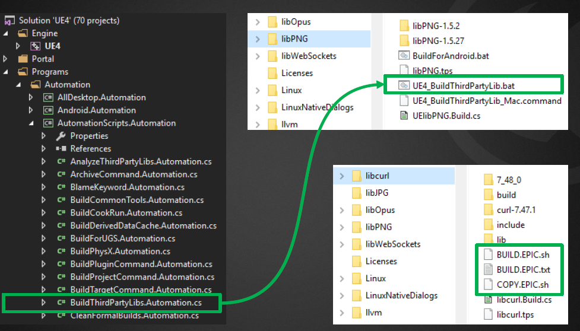

```
sortIndex: 2
```

Dynamic DLL
https://wiki.unrealengine.com/Linking_Dlls

Plugins Overview & Third Party Overview:
https://www.slideshare.net/GerkeMaxPreussner/plugins-thirdparty-sdks-in-ue4

Add header only (no dll/lib) third party stuff:

- Have to make a module (look at SDL2.build.cs or Leap.Build.cs)

- https://forums.unrealengine.com/development-discussion/engine-source-github/36571-how-do-i-add-dynamic-libraries-to-the-engine-plugins?p=383246#post383246

Linking 3rd Third Party Static Library:

https://wiki.unrealengine.com/Linking_Static_Libraries_Using_The_Build_System

https://answers.unrealengine.com/questions/243103/how-to-i-link-a-third-party-library-using-the-unre.html

https://wiki.unrealengine.com/Integrating_OpenCV_Into_Unreal_Engine_4
PublicDelayLoadDLLs.Add("opencv_calib3d2410d.dll");
PublicAdditionalLibraries.Add("opencv_video2410d.lib");

**NOTE: IF YOU NEED TO JUST LINK AGAINST AN EXTERNAL SET OF HEADER FILES, USE** PrivateIncludePathModuleNames OR PublicIncludePathModuleNames.

**IF A HEADER NEEDS TO INCLUDE EXTERNAL HEADER AND THE HEADER IS IN A PUBLIC FOLDER, YOU HAVE TO USE** PublicIncludePathModuleNames

### Notes:

##### Module Types

•Developer – for development only
•Editor – for Unreal Editor only
•Runtime – for anything
•Programs – for standalone programs
•Third Party – for external code & libs
_Note: The UE4 EULA prohibits inclusion of Editor modules in shipping games_

**Structure of Modules**

- Private folder
- Internal implementation
- Module initialization
- Pre-compiled header
- Public folder
- Interfaces
- Exported Types
- Build.cs file

Https

PrivateIncludePaths

- Sub-folders inside your module’s Private folder

PublicIncludePaths

- Sub-folders inside your module’s Public folder (not needed)

PrivateIncludePathModuleNames

- Modules whose public headers your module’s private implementation includes, but doesn’t link to PublicIncludePathModuleNames

- Modules whose public headers your module’s public interface includes, but doesn’t link to

PrivateDependencyModuleNames

- Modules that your module’s private implementation requires for compiling and linking

PublicDependencyModuleNames

- Modules that your module’s public interface requires for compiling and linking DynamicallyLoadedModuleNames

* Modules that are loaded at run-time via ModuleManager (this is to ensure that they get compiled)

More options in RulesCompiler.cs

PublicLibraryPaths

- Paths to folders containing additional libraries

PublicAdditionalLibraries

- Additional libraries (.lib or .a files) to link against

PublicFrameworks

- Additional XCode frameworks (iOS, macOS only)

PublicWeakFrameworks

- Weak frameworks (for OS transition)

PublicAdditionalShadowFiles

- Files that need to be copied for remote compilation

RuntimeDependencies

- Runtime dependencies to be staged for a packaged build

Structure of Plug-ins

- One or more modules

* Plug-in descriptor

- Content (optional)

* Resources (optional)
  - Plug-in Descriptor
  - Json file {PluginName.uplugin}
  - Inside root of plug-in directory
    - Contains:
      - Version information
      - User friendly description
      - Module loading rules

**Third-Party Libraries**

Structure of Engine Dependencies

•Located in /Engine/Source/ThirdParty

•Each has its own Build.cs file

​ • Just like any other module

​ • Public includes (for headers to be

​ compiled into dependent modules)

​ • Public libraries (for libraries to be

​ linked into dependent modules)

​ • Optional pre-processor definitions

Building Engine Dependencies

•Source code is often included, but…

• We provide pre-compiled libs for everything

• UBT never compiles them when building your projects

•Internally, we pre-compile the libraries using…

​ • BuildThirdPartyLibs UAT script (automated)

​ • Batch files and shell scripts (manual)

​ • Specialized UAT scripts (i.e. for PhysX)

•Sometimes there are text files with instructions



Structure of Plug-in Dependencies

​ •Same as Engine third-party dependencies

​ •Same build rules


