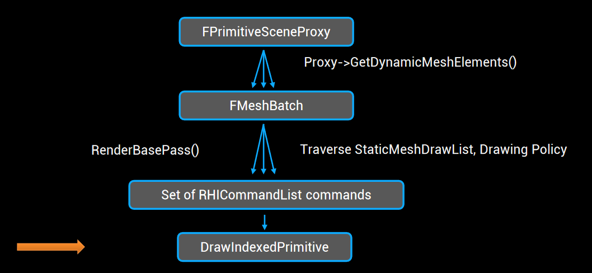
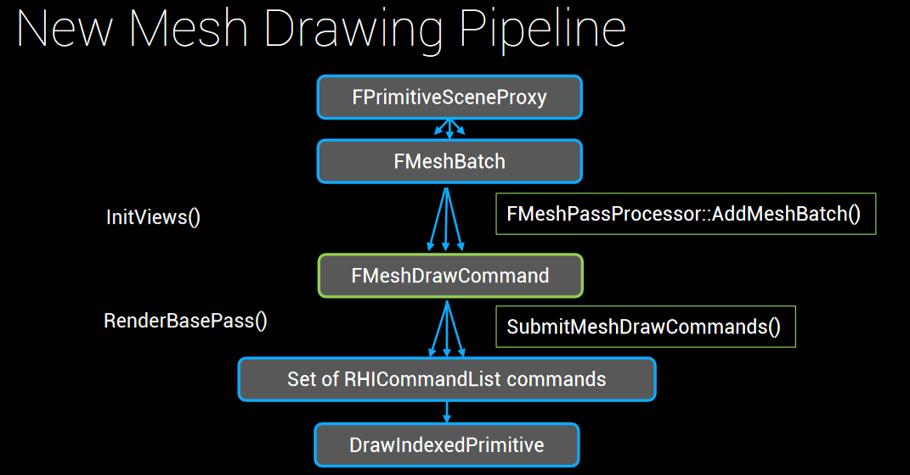
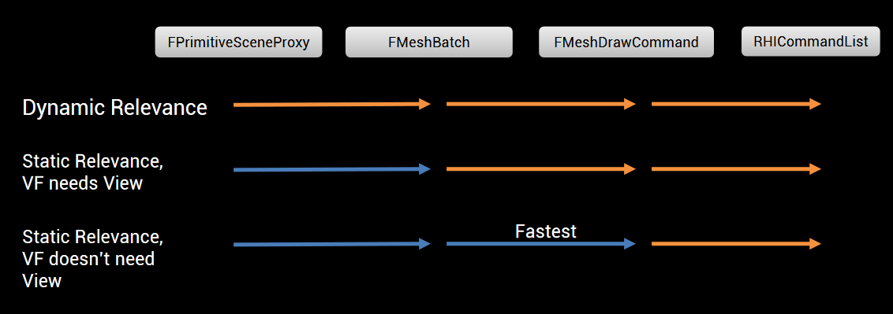

Motivation: Need to execute lot of draws

- Modular construction

- Dynamic lighting/shadowing need extra mesh passes

- Some techniques (DXR/GPU culling) needs to eval entire scene

Approach:

- Draw call merging based on RHI
- No more per draw per frame shader params

Mesh Drawing/Render Refactor:

- Very quick description would be: no more draw policies and static draw lists. Everything is now done through mesh processors, mesh draw commands (draw state) and EMeshPass lists.

- Mesh draw commands are build and cached when you attach your prim to scene.

  Mesh processors convert mesh batches to mesh draw commands.

  EMeshPass is basically a list of visible mesh draw commands for a given pass, which is sorted, merged and drawn.

  Now, as for render graph it's currently not used too much in 4.22 :)

​	MeshBatch is now converted into mesh draw command, which contains all the draw state (binding etc).

​	FMeshBatch is like an interface for rendering.

# Review

- FPrimitiveSceneProxy: Render Thread View of UE4 Gamecode Component
- FMeshBatch: decouples FPrimitiveSceneProxy implementations from mesh passes
  - Contains everything pass needs to know
  - Agnostic of passes
- DrawingPolicy: Converts FMeshBatch to RHIDrawCommands
- RHICommandList: Platform independent render commands

Every frame, generate FMeshBatch from Scene proxies


# New Way



- FMeshDrawCommand: Stateless description of draw command
- FMeshPassProcessor: Builds one ore more FMeshDrawCommands from FMeshBatch
  - Select shader
  - Collect pass/vertex factory/material bindings
  - Describes a mesh pass

# Shader Binding

## Overview

- Shader Parms are submitted in big GPU buffers
- Anything referenced by FMeshDrawCommands must not change frequently bc it will be invalidated
- Instead, keep bindings stable and reference one big Uniform Buffer
  - Code path to update uniform buffer: RHIUpdateUniformBuffer
    
- Uniform Buffers: FPersistentUniformBuffers
  - PrimitiveUniformBuffer: Data unique to primitive like LocalToWorldTransform
  - MaterialUniformBuffer: Material params
  - MaterialParameterCollections: MPC
  - PrecomputedLightingUniformBuffer: Which lightmaps to reference, etc
  - PassUniformBuffers: Any data that pass needs that's per primitive that's not shared across passes
- Validation Mode: VALIDATE_UNIFORM_BUFFER_LIFETIME
  - Remember, shader bindings are cached so those need to be invalidated (eg: changing skylight)
- VertexFactory: How UE4 generates vertex data from CPU to GPU
  - Only VFs that don't require View are cached (eg: FLocalVertexFactory)
    

## High level Frame with Caching

- FPrimitiveSceneInfo::AddToScene
  - If Static, cache FMeshBatch’s on FPrimitiveSceneInfo
    - Also generate FMeshDrawCommands and store on the scene
- FScene::SetSkyLight
  - Invalidate cached FMeshDrawCommands
- InitViews
  - Foreach Primitive
    - If Static Relevance
      - Compute LOD and add cached FMeshDrawCommands to visible list
    - If Dynamic Relevance
      - Gather FMeshBatch’s with GetDynamicMeshElements
- RenderDepth
  - Foreach FMeshDrawCommand in visible list, Draw

## Drawcall Merging

- Happens in FMeshDrawCommand::MatchesForDynamicInstancing

- Assigning state buckets for merging is slow so its cached at FPrimitive::AddToScene
  - `cpp>TSet<FMeshDrawCommandStateBucket, MeshDrawCommandKeyFuncs> CachedMeshDrawCommandStateBuckets;`

- Actual merging operation is just transformation on visible FMeshDrawCommand list
  - For each drawcommand in the same statebucket, it gets replaced with an instanced mesh draw command

- To be effective, need to get rid of per-draw bindings

- Created Pass uniform buffer frequency

  - Moved 64 per-draw bindings into OpaqueBasePassUniformBuffer

  ```cpp
  BEGIN_GLOBAL_SHADER_PARAMETER_STRUCT(FSharedBasePassUniformParameters,)
    SHADER_PARAMETER_STRUCT(FForwardLightData, Forward)
    SHADER_PARAMETER_STRUCT(FForwardLightData, ForwardISR)
    SHADER_PARAMETER_STRUCT(FReflectionUniformParameters, Reflection)
    SHADER_PARAMETER_STRUCT(FPlanarReflectionUniformParameters, PlanarReflection) // Single global planar reflection for the forward pass.
    SHADER_PARAMETER_STRUCT(FFogUniformParameters, Fog)
    SHADER_PARAMETER_TEXTURE(Texture2D, SSProfilesTexture)
  END_GLOBAL_SHADER_PARAMETER_STRUCT()

  BEGIN_GLOBAL_SHADER_PARAMETER_STRUCT(FTranslucentBasePassUniformParameters,)
    SHADER_PARAMETER_STRUCT(FSharedBasePassUniformParameters, Shared)
    SHADER_PARAMETER_STRUCT(FSceneTexturesUniformParameters, SceneTextures)
    // Material SSR
    SHADER_PARAMETER(FVector4, HZBUvFactorAndInvFactor)
    SHADER_PARAMETER(FVector4, PrevScreenPositionScaleBias)
    SHADER_PARAMETER(float, PrevSceneColorPreExposureInv)
    SHADER_PARAMETER_TEXTURE(Texture2D, HZBTexture)
    SHADER_PARAMETER_SAMPLER(SamplerState, HZBSampler)
    SHADER_PARAMETER_TEXTURE(Texture2D, PrevSceneColor)
    SHADER_PARAMETER_SAMPLER(SamplerState, PrevSceneColorSampler)
    // Translucency Lighting Volume
    SHADER_PARAMETER_TEXTURE(Texture3D, TranslucencyLightingVolumeAmbientInner)
    SHADER_PARAMETER_SAMPLER(SamplerState, TranslucencyLightingVolumeAmbientInnerSampler)
    SHADER_PARAMETER_TEXTURE(Texture3D, TranslucencyLightingVolumeAmbientOuter)
    SHADER_PARAMETER_SAMPLER(SamplerState, TranslucencyLightingVolumeAmbientOuterSampler)
    SHADER_PARAMETER_TEXTURE(Texture3D, TranslucencyLightingVolumeDirectionalInner)
    SHADER_PARAMETER_SAMPLER(SamplerState, TranslucencyLightingVolumeDirectionalInnerSampler)
    SHADER_PARAMETER_TEXTURE(Texture3D, TranslucencyLightingVolumeDirectionalOuter)
    SHADER_PARAMETER_SAMPLER(SamplerState, TranslucencyLightingVolumeDirectionalOuterSampler)
  END_GLOBAL_SHADER_PARAMETER_STRUCT()
  ```

- Remaining per draw bindings
  - We can upload these to a scene-wide unified buffer
  - Dynamically index them from the shader via InstanceId
  - Ex:
    - GlobalConstantBuffer values
      - PreviousLocalToWorld BasePass Velocity
      - Dither LOD
    - PrimitiveUniformBuffer
    - PrecomputedLightingUniformBuffer
    - DistanceCullFadeUniformBuffer

- GPU Scene Primitive Data buffer: GPU TArray implementation with dynamic resizing
  - Renderthread tracks Primitive add / update / remove, uses a compute shader to update them on the next frame (only operate on deltas)
  - Need to use GetPrimitiveData(Parameters.PrimitiveId) in shaders now

## Gotchas

- Static Mesh Components that are in different lightmaps wont get merged
  - Tweak DefaultEngine.ini MaxLightmapRadius
- Deferred primtive update is gone (r.DeferUniformBufferUpdatesUntilVisible)
  - before, if an out of view primitive moved, its primitive buffer wouldn't be updated
  - Now it has to bc of caching
- Forward renderer now supports only single global planar reflection
- FMeshDrawCommand Performance Hazards
  - Going over inline allocator limit will cause performance hazard
  - FMeshDrawShaderBindings assumes 2 shader frequencies (Vertex + Pixel): `cpp>TArray<FMeshDrawShaderBindingsLayout, TInlineAllocator<2>>ShaderLayouts`
  - FMeshDrawCommand assumes 10 shader bindings among all frequencies: `cpp>const int32 NumInlineShaderBindings = 10;`
  - FMeshDrawCommand assumes 4 vertex streams from the vertex factory: `cpp>typedef TArray<FVertexInputStream, TInlineAllocator<4>>FVertexInputStreamArray;`

# Upgrade Notes

## Static Draw Lists and Primitive Sets

- static draw lists (TStaticMeshDrawList) and primitive sets (for example, FTranslucentPrimSet, FCustomDepthPrimSet) were replaced by FParallelMeshDrawCommandPass. FParallelMeshDrawCommandPass encapsulates a single per pass visible mesh draw command list
  - per scene mesh lists were replaced by visible mesh lists
  - previously drawing a Static Mesh pass would traverse the entire list of per-pass Static Meshes in-scene (TStaticMeshDrawList) to select visible ones by checking FViewInfo::StaticMeshVisibilityMap for each Static Mesh
  - new design, drawing is just a simple traversal of a visible mesh draw command array (FMeshDrawCommandPassSetupTaskContext::MeshDrawCommands)
- pipeline also has an immediate mode mesh rendering emulation through DrawDynamicMeshPass function.
  - should only be used for non-performance critical mesh passes, as it doesn’t support caching, automatic instancing, and makes multiple dynamic memory allocations. For example, it replaces DrawViewElements, which was responsible for rendering Editor-only helper meshes

## Drawing Policies

- Drawing policies like FDepthDrawingPolicy or FBasePassDrawingPolicy were replaced by FDepthPassMeshProcessor and FBasePassMeshProcessor
- Specific pass mesh processors are derived from a FMeshProcessor base class and are responsible for converting each FMeshBatch into a set of mesh draw commands for the pass.

## Shader Bindings

- Previously all shader parameters were directly set on RHICmdList by drawing policies

- Now, All parameters are gathered into FMeshDrawSingleShaderBindings (which later are set on RHICmdList by calling SetOnCommandList during drawing)

- Old: FDrawingPolicyRenderState to pass common high-level mesh pass render state (e.g. pass uniform buffer)

- New: Renames FDrawingPolicyRenderState to FMeshPassProcessorRenderState without major changes to its functionality

- Old: Other parts of shader bindings were filled inside of shader’s SetParameters and SetMesh functions

- New: Replaced by GetShaderBindings and GetElementShaderBindings, and pass per-draw parameters inside a customizable ShaderElementDataType
  - Since each FMeshPassProcessor must go through BuildMeshDrawCommands() to call the pass shader’s GetShaderBindings(), we need a mechanism to pass arbitrary data from the FMeshPassProcessor to the GetShaderBindings() call. This is accomplished with the ShaderElementData parameter to BuildMeshDrawCommands()

- Many loose parameters were pulled out into per-pass or other uniform buffers (do not use loose parameters)

- Old: uniform buffers like ViewUniformBuffer or DepthPassUniformBuffer were recreated every frame with new data

- New: those are persistent and global (kept inside FScene::FPersistentUniformBuffers)
  - instead of recreating them to pass new data — their contents are updated using new RHI function — to RHIUpdateUniformBuffer
  - This indirection enables shaders to receive per-frame data even though their mesh draw commands are cached

## FPrimitiveViewRelevance

- Extended with two extra relevance flags:
  - bVelocityRelevance is required for separate velocity pass
  - bTranslucentSelfShadow is required for translucency self shadow
- New: all dynamic draws now rely on view relevance, and disabling certain passes in view relevance will also disable its rendering

## Shaders

- The new pipeline introduced GPUScene, which is a structured buffer containing primitive uniform buffer data for all the primitives in the scene.
- Currently only the local vertex factory (Static Mesh Component) and the SM5 feature level can utilize this rendering path.
- Shaders need to use GetPrimitiveData(PrimitiveId) instead of accessing the Primitive uniform buffer directly to compile with GPUScene enabled.
  - Primitive.Member => GetPrimitiveData(Parameters.PrimitiveId).Member

Misc:

- <https://github.com/EpicGames/UnrealEngine/commit/b5d7db368977e263092be9b97f78944739f80476>

`youtube: https://www.youtube.com/watch?v=UJ6f1pm_sdU`

## Add Immediate Mode Custom Mesh Pass

```cpp
void DrawDecalMeshCommands(FRenderingCompositePassContext& Context, EDecalRenderStage CurrentDecalStage, FDecalRenderingCommon::ERenderTargetMode RenderTargetMode)
{
	FRHICommandListImmediate& RHICmdList = Context.RHICmdList;
	const FViewInfo& View = Context.View;

	const bool bPerPixelDBufferMask = IsUsingPerPixelDBufferMask(View.GetShaderPlatform());

	FGraphicsPipelineStateInitializer GraphicsPSOInit;
	FDecalRenderTargetManager RenderTargetManager(Context.RHICmdList, Context.GetShaderPlatform(), CurrentDecalStage);
	RenderTargetManager.SetRenderTargetMode(RenderTargetMode, true, bPerPixelDBufferMask);
	Context.SetViewportAndCallRHI(Context.View.ViewRect);
	RHICmdList.ApplyCachedRenderTargets(GraphicsPSOInit);


	DrawDynamicMeshPass(View, RHICmdList,
		[&View, CurrentDecalStage, RenderTargetMode](FDynamicPassMeshDrawListContext* DynamicMeshPassContext)
	{
		FMeshDecalMeshProcessor PassMeshProcessor(
			View.Family->Scene->GetRenderScene(),
			&View,
			CurrentDecalStage,
			RenderTargetMode,
			DynamicMeshPassContext);

		for (int32 MeshBatchIndex = 0; MeshBatchIndex < View.MeshDecalBatches.Num(); ++MeshBatchIndex)
		{
			const FMeshBatch* Mesh = View.MeshDecalBatches[MeshBatchIndex].Mesh;
			const FPrimitiveSceneProxy* PrimitiveSceneProxy = View.MeshDecalBatches[MeshBatchIndex].Proxy;
			const uint64 DefaultBatchElementMask = ~0ull;

			PassMeshProcessor.AddMeshBatch(*Mesh, DefaultBatchElementMask, PrimitiveSceneProxy);
		}
	});
}

void RenderMeshDecals(FRenderingCompositePassContext& Context, EDecalRenderStage CurrentDecalStage)
{
	FRHICommandListImmediate& RHICmdList = Context.RHICmdList;
	FSceneRenderTargets& SceneContext = FSceneRenderTargets::Get(RHICmdList);
	const FViewInfo& View = Context.View;
	FScene* Scene = (FScene*)View.Family->Scene;

	QUICK_SCOPE_CYCLE_COUNTER(STAT_FSceneRenderer_RenderMeshDecals);
	SCOPED_DRAW_EVENT(RHICmdList, MeshDecals);

	FSceneTexturesUniformParameters SceneTextureParameters;
	SetupSceneTextureUniformParameters(SceneContext, View.FeatureLevel, ESceneTextureSetupMode::All, SceneTextureParameters);
	Scene->UniformBuffers.MeshDecalPassUniformBuffer.UpdateUniformBufferImmediate(SceneTextureParameters);

	if (View.MeshDecalBatches.Num() > 0)
	{
		switch (CurrentDecalStage)
		{
		case DRS_BeforeBasePass:
			DrawDecalMeshCommands(Context, CurrentDecalStage, FDecalRenderingCommon::RTM_DBuffer);
			break;

		case DRS_AfterBasePass:
			DrawDecalMeshCommands(Context, CurrentDecalStage, FDecalRenderingCommon::RTM_SceneColorAndGBufferDepthWriteWithNormal);
			break;

		case DRS_BeforeLighting:
			DrawDecalMeshCommands(Context, CurrentDecalStage, FDecalRenderingCommon::RTM_GBufferNormal);
			DrawDecalMeshCommands(Context, CurrentDecalStage, FDecalRenderingCommon::RTM_SceneColorAndGBufferWithNormal);
			break;

		case DRS_Mobile:
			DrawDecalMeshCommands(Context, CurrentDecalStage, FDecalRenderingCommon::RTM_SceneColor);
			break;

		case DRS_AmbientOcclusion:
			DrawDecalMeshCommands(Context, CurrentDecalStage, FDecalRenderingCommon::RTM_AmbientOcclusion);
			break;

		case DRS_Emissive:
			DrawDecalMeshCommands(Context, CurrentDecalStage, FDecalRenderingCommon::RTM_SceneColor);
			break;
		}
	}
}
```

# Render Graph

Main file: UnrealEngine\\Engine\\Source\\Runtime\\RenderCore\\Public\\RenderGraph.h

Main class: FRDGBuilder
Currently used very lightly in 4.22 but looks like Compute Shaders can be dispatched with it
FComputeShaderUtils::AddPass(...)
