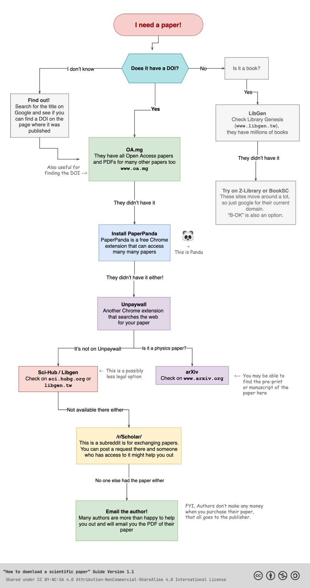

# Developer Tech Sites & Resources

## Privacy Resources

- [JustGetMyData](https://justgetmydata.com)
- [JustDeleteMe](https://justdeleteme.xyz)
- [JustWhatsTheData](https://justwhatsthedata.github.io)
- [Privacy Guides](https://www.privacyguides.org)
- [Privacy Tools](https://www.privacytools.io)

## Non-Spammy Reviews

- [ghacks](https://www.ghacks.net/)
- [AlternativeTo](https://alternativeto.net/)
- [Slant](https://www.slant.co/)
- [ProductHunt](https://www.producthunt.com)
- [RTINGS](https://www.rtings.com/)
- [Wccftech](https://wccftech.com/)

## Research Resources

### Research Papers/Science Journals

[Guide To Finding Science Papers](https://old.reddit.com/r/coolguides/comments/xr7dr0/how_to_get_scientific_papers_for_free/)

- Resources:
  - [OA.mg](https://oa.mg/)
  - [PaperPanda Chrome Extension](https://paperpanda.app/)
  - [Unpaywall Chrome Extension](https://unpaywall.org/)
  - [LibGen](https://www.libgen.tw/)
  - [Sci-Hub](https://sci.hubg.org/)
  - [arXiv](https://arxiv.org/)
  - [/r/Scholar/](https://old.reddit.com/r/Scholar/)
  - [Z-Lib](https://z-lib.org/)

### Internet Search

- [gwern's Internet Search Tips](https://gwern.net/search): advanced tips and tricks for effective Internet research of papers/books, with real-world examples
