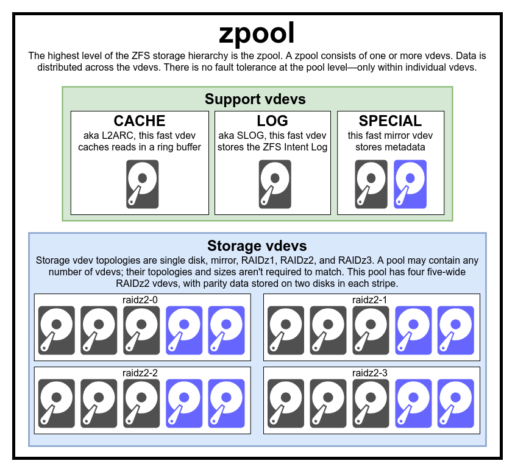
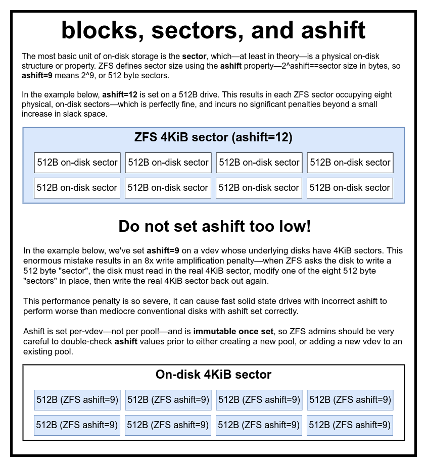

# ZFS Cheatsheet

## Resources

### Highlevel Guides

- [ZFS 101: understanding ZFS storage and performance](https://arstechnica.com/information-technology/2020/05/zfs-101-understanding-zfs-storage-and-performance/)
- [ZFS Guide for starters and advanced users](https://forum.level1techs.com/t/zfs-guide-for-starters-and-advanced-users-concepts-pool-config-tuning-troubleshooting/196035): concepts, pool config, tuning, troubleshooting
- [ZFS Administration](https://pthree.org/2012/04/17/install-zfs-on-debian-gnulinux/)
- [Understanding ZFS vdev Types](https://klarasystems.com/articles/openzfs-understanding-zfs-vdev-types/)

### Detail Guides

- [A Detailed Guide to TrueNAS and OpenZFS](https://jro.io/truenas/)
  
  - [Zero to TrueNAS as Fast as Possible](https://jro.io/truenas/zero_to_truenas/): A highly-distilled TrueNAS guide that gets straight to the point and aims to provide the basic understanding necessary to get started
  - [Hardware for CORE and SCALE](https://jro.io/truenas/hardware/): A guide to optimal hardware selection for any size TrueNAS system from a 1 TiB simple home server to 10 PiB of enterprise-class flash
  - [OpenZFS: The Final Word in File Systems](https://jro.io/truenas/openzfs/): A deep-dive into nearly every aspect of OpenZFS administration and a closer look at many of the mechanisms that make ZFS the final word in file system
  - [OpenZFS Capacity Calculator](https://jro.io/capacity/): A calculator application and guide on how to precisely determine the usable capacity and several other metrics of a ZFS storage pool
  - [RAID Reliability Calculator](https://jro.io/r2c2/): A calculator and guide that lets you determine and compare the probability of a pool failure given a certain RAID layout and disk failure rate
  - [RAIDZ Allocation Overhead](https://jro.io/nas/#overhead): A deep dive into the causes and the math behind RAIDZ allocation overhead including advise on how to minimize this on your own OpenZFS pool
  - [ZFS Performance Overview](../_assets/homelab/zfs-storage-pool-layout-white-paper.pdf): A discussion of how different OpenZFS pool designs and vdev layouts impact storage performance, reliability, and capacity
- ixsystems
  
  - [ZFS Storage Pool Layout on Pool Performance](../_assets/homelab/zfs-storage-pool-layout-white-paper.pdf)
    - [Choosing The Right ZFS Pool Layout](https://klarasystems.com/articles/choosing-the-right-zfs-pool-layout/)
    - `IOPS = 1000 / (AverageSeekTime + AverageLatency)` where values expressed in `ms`
    - `Latency_HDD = 0.5 * (1/RPM) * 60000ms`
    - `Latency_SSD ~= 0.1ms`
      - HDD disk `IOPS` depends on time disk platter takes to spin halfway around e.g. `T/2 = 1/2⋅ω`
      - SSD does not have rotating platters
    - `Average Seek Time`/`Average Latency` can be found in manufacturer datasheet/product manual (e.g. [IronWolf](https://www.seagate.com/content/dam/seagate/migrated-assets/www-content/product-content/ironwolf/en-us/docs/100807039k.pdf))
      - `HDD      ~= 55 to 180 IOPS`
      - `SATA_SSD ~= 3,000 to 40,000 IOPS`
      - `NVMe_SSD ~= 100,000 to 500,000 IOPS`
  - [Featured resources](https://www.truenas.com/community/resources/featured)
    - [Resources List including Detailed Hardware and System Build Notes (plus new user advice / help)](https://www.truenas.com/community/resources/resources-list-including-detailed-hardware-and-system-build-notes-plus-new-user-advice-help.216/)
    - [Hard Drive Burn-in Testing](https://www.truenas.com/community/resources/hard-drive-burn-in-testing.92/)
  - [How to: Backup to local disks](https://www.truenas.com/community/resources/how-to-backup-to-local-disks.26/)
- [Practical ZFS](https://discourse.practicalzfs.com/)
  
  - [mercenary_sysadmin's comments](https://old.reddit.com/user/mercenary_sysadmin/): /r/zfs moderator/domain expert who frequently answers questions
  - [ZFS: You should use mirror vdevs, not RAIDZ](https://jrs-s.net/2015/02/06/zfs-you-should-use-mirror-vdevs-not-raidz/)
  - [ZFS RAIDZ stripe width, or: How I Learned to Stop Worrying and Love RAIDZ](https://www.delphix.com/blog/zfs-raidz-stripe-width-or-how-i-learned-stop-worrying-and-love-raidz)
  - [ZFS tuning cheat sheet](https://jrs-s.net/2018/08/17/zfs-tuning-cheat-sheet/)

### ZFS on Unraid

- [Unraid-zfs 6.12.3: My setup, more things I learned along the way](https://old.reddit.com/r/unRAID/comments/15f6d2a/unraidzfs_6123_my_setup_more_things_i_learned/)
- [Things I have learned with zfs on unraid 6.12](https://old.reddit.com/r/unRAID/comments/14f4j09/things_i_have_learned_with_zfs_on_unraid_612x/)
- [Unraid-Zfs: what is an dataset?](https://old.reddit.com/r/unRAID/comments/14fwvhg/unraidzfs_what_is_an_dataset/)

## Overview

### Terminology Reference

- **Vdev:** ZFS virtual device, a group of one or more disks usually with some redundancy like mirroring or RAIDZ.
- **Mirror vdev:** Every disk in the vdev gets an identical copy of all data. Usually consists of 2 disks but can have more.
- **RAIDZ1:** Like RAID5, some number of data disks plus one parity disk (N+1).
- **RAIDZ2:** Like RAID6, some number of data disks plus two parity disks (N+2).
- **RAIDZ3:** Some number of data disks plus three parity disks (N+3).
- **zpool:** The logical ZFS volume or array consisting of one or more vdevs.
- **Resilver:** ZFS term for rebuilding a pool after a drive fails and is replaced.
- **Scrub:** Automatic scan of a pool to verify checksums and correct data corruption.
- **Dataset:** The logical container where ZFS stores data. There are four types of datasets: file systems, volumes, snapshots, and bookmarks. "Dataset" can also refer to a file system dataset.
- **Zvol:** Shorthand for a volume dataset. A zvol acts as a raw block device. ZFS carves out a chunk of disk space to be used by block sharing protocols like iSCSI.
- **ARC:** Adaptive Replacement Cache, the algorithm used by ZFS to cache data. Also refers to the cache itself which exists in a system's main memory. The ARC is shared by all pools on a system.
- **L2ARC:** A second tier of cache under the ARC. Despite its name, L2ARC uses a simple ring buffer algorithm and is typically deployed on one or more fast SSDs. L2ARCs are assigned per pool.
- **ZIL:** The ZFS intent log. Stable storage that acts as a temporary landing zone for incoming sync writes. Every pool has a ZIL regardless of whether the pool has a SLOG.
- **SLOG:** A separate device for the ZFS intent log (**s**parate **log** device, hence SLOG device). Added to a pool as a fast SSD if it's handling latency-sensitive sync writes. Like the L2ARC, it is assigned per pool.
- **Snapshot:** A read-only historical reference copy of a dataset. Only consumes space based on changed data since the snapshot was taken.
- **Clone:** A mounted, read/write copy of a snapshot. Can be used to recover files from a snapshot or to provide a new, separate working set of data.

### Details

`devices` -> `vdevs`  -> `zpool`  -> `datasets`

- `zpool`: top-level ZFS structure
  
  
  - roughly analogous to JBOD with complex distribution mechanism
     > 
     > \[!danger\] redundancy is at the `vdev` not `zpool` level
     > losing a `vdev` => losing the entire `zpool`. There is absolutely _no_ redundancy at the `zpool` level
  
  - common misconception that ZFS "stripes" writes across the pool
    - writes are mostly distributed across `vdevs` w.r.t their available free space
    - ensures all `vdevs` will theoretically become full at the same time
  - `zpools` cannot share `vdevs` with one another
- `vdev`: virtual device
  
  
  - consists of one or more real `devices`
  - mostly used for plain storage, but special vdevs exist (e.g. `CACHE`, `LOG`, `SPECIAL`)
  - `single-device`: cannot survive any failure; if used as storage or `SPECIAL`, failure will take the entire `zpool` down with it
  - `mirror`: each block is stored on every device in the vdev
  - `RAIDz1-3`: diagonal parity RAID where n is # of max disk failures
- `device`: just a random-access block device i.e. SSD/HDD
  
  - simple raw file useful alternative block devices for testing/practice
- `dataset`: roughly analogous to a standard, mounted filesystem
  
  - has its own set of underlying properties e.g. `quota`
  - `dataset properties`
    - `recordsize`: upper limit on how big chunks ZFS allocates to disk
      - `128k` default
      - datasets with purely small stuff benefit from lower recordsize while large media datasets work just fine with 1M or higher
      - You can split a 1MB file into 256 pieces or use a large 1M box
      - HDD loves large blocks but reading/writing the whole MB just to change a bit somewhere in the middle is far from efficient
    - `compression`: sets compression algorithm
      - `LZ4` is default; really fast (GB/s per core) compared to achieved compression
      - `ZSTD` is the new and fancy kid on the block and very efficient
      - `GZIP` is available too, but slow
      - recomend to use compression
    - `atime`: you want to turn this off immediately unless you absolutely need atime
    - `casesensitivity`: useful when dealing with Windows clients and everything where case sensitivity may become a problem
    - `sync`: consult the SLOG paragraph above on why you may want to change sync
    - `copies`: you can store multiple copies of data in a dataset
      - like a RAID1 on a single disk but only within this dataset
      - useful for very important data or when you don't have redundancy in the first place but still want self-healing of corrupt data
      - doesn't protect against drive failure
    - `mountpoint`: where you want the dataset to be mounted in the system
    - `primarycache`/`secondarycache`: you can exclude datasets from cache
      - or exclude everything by default and only allow some datasets to use cache
      - primary being ARC and secondary being L2ARC
- `zvol`: roughly analogous to a `dataset` without filesystem

- `blocks`: all data/metadata is stored in blocks
  
  
  - `recordsize property`: max block size in `dataset`
  - files composed of one or more blocks; block references only one file's data
  - `ashift property`: the binary exponent which represents sector size e.g. `ashift=9` => `sector size = 2^9 = 512 bytes`
     > 
     > \[!danger\] many disks lie about what their sector size causing an astronomical read/write amplification penalty
     > For Samsung EVO SSD which should have `ashift=13` but reports `ashift=9`

- `sectors`: smallest physical unit that can be written to or read from its underlying device
  
  
  - most disks use 4KiB sectors with some SSDs using 8KiB sectors

## Tuning

- [ZFS Performance: RAIDz1 vs mirroring](https://forums.FreeBSD.org/threads/performance-raidz1-vs-mirroring.78061/post-487090)

- [ZFS Raidz Performance, Capacity and Integrity](https://calomel.org/zfs_raid_speed_capacity.html)

- [ZFS Record Sizes for Different Workloads](https://jrs-s.net/2019/04/03/on-zfs-recordsize/)

- [Battle testing ZFS, Btrfs and mdadm+dm-integrity](https://www.unixsheikh.com/articles/battle-testing-zfs-btrfs-and-mdadm-dm.html)

- [ZFS tuning cheat sheet](https://jrs-s.net/2018/08/17/zfs-tuning-cheat-sheet/)

- Pro tip, don't go crazy with datasets; nifty for snapshots and zfs-send/receive-ing, but they are their own filesystems.
  
   > 
   > \[!note\]+ Moving files/folders across `datasets` requires `copy+delete` even if `datasets` are nested/in same `zpool`
   > Analogous to moving data across drives in windows (e.g. `fooFolder` from `c:\` to `d:\`)
   > Bad: `/tv/`, `/movies/`, `/downloads/` as separate `datasets`
   > Good: `/media/` dataset with folders `/media/tv/`, `/media/movies/`, `/media/downloads/`

- [Improve performance when browsing millions of files in ZFS by setting arc_meta_min](https://old.reddit.com/r/unRAID/comments/14y6yg4/improve_performance_when_browsing_millions_of/)
  
   > 
   > \[!quote\]
   > If you have a lot of files, like hundreds of thousands or millions photos on hard drives, there's a setting in ZFS you can change to improve performance when indexing or browsing the files.
   > 
   > Going through my 682,000 files went 64 seconds to only 5 seconds. It's amazing. ZFS usually keeps metadata cached in ARC but it's not very smart when ARC gets full.
   > You can set `arc_meta_min` to large enough to hold all the metadata, and then fill the arc metadata cache, so this will improve performance for rsync, find, or anything that scans through all the files and folders.
   > 
   > I can even scan and navigate the entire directory tree with the disks spun down, it's like the Dynamix cache dirs plugin but way better.
   > 
   > On unraid, you can do this
   > 
   > 1. Run a command to scan all files, eg. `ls -lahR /mnt/zpool/ > /dev/null` and see how long it takes (minutes)
   > 1. `cat /proc/spl/kstat/zfs/arcstats` and check how much `arc_meta_used` (if it's close to `arc_meta_max` then maybe increase your arc size and try again)
   > 1. Scan all files again and see how much faster it is (few seconds)
   > 1. Copy large file (several GB) from the ZFS share to your PC
   > 1. Scan all files again, if the times are all about the same then stop here because this won't help, but if it's slow then continue
   > 1. Make `zfs_arc_meta_min` a bigger number than your `arc_meta_used` in step 2 by doing `echo 3088630576 >> /sys/module/zfs/parameters/zfs_arc_meta_min` with your number
   > 1. Try steps 1 - 5 again, scanning should be always fast now
   > 1. To make the setting permanent, create/edit `/boot/config/modprobe.d/zfs.conf` and put `options zfs zfs_arc_meta_min=3088630576` there with your number

- `recordsize`: general rules of thumb
  
  - `1M`:  Sequential workloads
  - `1M`:  General-purpose file sharing/storage
  - `1M`:  BitTorrent download folders
  - `64K`: KVM virtual machines using Qcow2 file-based storage
  - `16K`: MySQL/InnoDB
  - `8K`:  PostgreSQL
