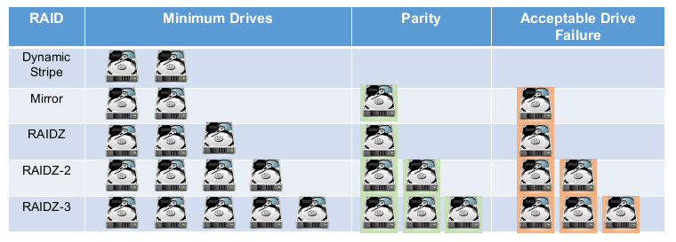
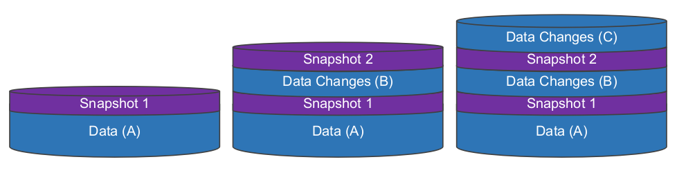

# ZFS for Dummies

As mentioned on previous posts, I have spent the past few weeks dealing with a ZFS crash on my FreeNAS install. Because of that, not only was I forced to learn how to troubleshoot ZFS, but I also had to learn how to setup new volumes and come up with new backup strategies (between a few other things).

This was a great opportunity for me to learn more about ZFS (because I new ‘nada’ to start with). And I’m happy to share some of the knowledge that I gathered with you on this post.

Please keep in mind that I don’t consider myself an expert on ZFS (not even close), but I will try to make things simple and easy to understand for someone, who like me, is just getting started with ZFS.

## About ZFS

#### What is ZFS and It’s History

ZFS is a local filesystem (i.e.: ext4, NTFS, exfat) and logical volume manager (i.e.: LVM on Linux) created by Sun Microsystems. ZFS was published under an open source license until Oracle bought Sun Microsystems and closed source the license. Because the source code was already in the open and ported to different OSs, eventually a project called ‘OpenZFS’ was created, and that is the core code that is used on most Unix like systems today (Linux, FreeBSD, etc.).

### ZFS Components


#### vdev

A vdev is composed of one or more physical drives (can also be of things other than hard drive, like files). They can be combined together in mirrors or RAIDZs.


💡 _**TIP:** There are 7 different types of vdevs, and some of them (like host spare, L2ARC and ZIL) are very important._

#### Pool

A pool is composed of one or more vdevs and they usually contain a volume or a dataset (which you create after creating the pool). You create/define your vdevs when you create a pool (with the `zpool` command which we’ll see later). This allows you to mix vdev types together to achieve other RAIDZ levels (see example below):


#### Datasets

Dataset is the filesystem part of ZFS (so far we’ve seen the LVM components). Here you can define user access, quotas, compression, snapshots, etc…

#### Volume

Volume is the brother of datasets but in a block device representation. It provides some of the features that datasets have, but not all. Volumes can be useful to run other filesystems on top of ZFS, or to export iSCSI extents.

### RAIDZ Types

- Dynamic/Simple Stripe (RAID0) - Distributes data without parity. Loosing a device means loosing all data
- MIRROR (RAID1) - Mirrored drives. Used with 2 to 4 disks (or more)
- RAIDZ-1 (RAID5) - Distributes parity along with the data and can lose one physical drive before a raid failure. RAIDZ requires at least 3 disks
- RAIDZ-2 (RAID6) - Distributes parity along with the data and can lose up to 2 physical drives. RAIDZ-2 requires at least 4 disks
- RAIDZ-3 - Distributes parity along with the data and can lose up to 3 physical drives. RAIDZ-3 requires at least 4, but should be used with no less than 5 disks



---

## Commands

Let’s take a look at the most common commands for handling ZFS pools and filesystem. We’ll use `/dev/sdx` to refer to device names, but keep in mind that using the device UUID is preferred in order to avoid boot issues due to device name changes.

### 1.ZFS Pool Commands

These are the commands related to creating vdevs and pools. We will be looking at:

- `zpool create` - Create a pool (and vdevs)
- `zpool status` - Displays pool status
- `zpool list` - List pool and it’s details
- `zpool history` - Shows history of commands for zpool
- `zpool import`\- Imports and mounts pool
- `zpool export` - Exports and unmounts pool
- `zpool destroy` - Destroy pool and all filesystems
- `zpool scrub` - Starts scrub of pool

#### 1.1.Creating a Pool (and vdevs)

To create a new pool we use the `zpool create` command. We specify the pool name and the device we want to use.

It’s basic usage is:

```
# zpool create [pool] [devices]
```

Now let’s look at different examples for this command.

##### **Create a pool on a single disk**

The command below creates a pool on a single disk.

```
# zpool create tank /dev/sdb  
```

##### **Create a dynamic stripe pool on 3 disks**

Remember that dynamic stripe is the same as RAID0 and that it has no parity.

```
# zpool create tank /dev/sdb /dev/sdc /dev/sdd
```

We can view the new pool with `zpool status`

```
root@ubuntu-vm:~# zpool status
  pool: tank
 state: ONLINE
  scan: none requested
config:

NAME        STATE     READ WRITE CKSUM
tank        ONLINE       0     0     0
  sdb       ONLINE       0     0     0
  sdc       ONLINE       0     0     0
  sdd       ONLINE       0     0     0

errors: No known data errors
```

Note that the pool name is ‘tank’ and the vdevs are ‘sdb’, ‘sdc’ and ‘sdd’

##### **Create a mirrorred pool on 2 disks**

```
# zpool create tank mirror sdb sdc
```

Note that I can omit `/dev` and give the device name. Let’s view the result.

```
# zpool status
  pool: tank
 state: ONLINE
  scan: none requested
config:

NAME        STATE     READ WRITE CKSUM
tank        ONLINE       0     0     0
  mirror-0  ONLINE       0     0     0
    sdb     ONLINE       0     0     0
    sdc     ONLINE       0     0     0

errors: No known data errors
```

Our vdev is ‘mirror-0’ and our pool is tank.

##### **Create a RAID-Z pool**

```
# zpool create tank raidz sdb sdc sdd
```

And the result indicating that my vdev is RAIDZ1.

```
root@ubuntu-vm:~# zpool status
  pool: tank
 state: ONLINE
  scan: none requested
config:

NAME        STATE     READ WRITE CKSUM
tank        ONLINE       0     0     0
  raidz1-0  ONLINE       0     0     0
    sdb     ONLINE       0     0     0
    sdc     ONLINE       0     0     0
    sdd     ONLINE       0     0     0

errors: No known data errors
```

You can use the same command to create RAIDZ2,3 pools.

```
# zpool create [pool name] raidz[1,2,3] [devices]
```

##### **Specifying a default mount point for the pool**

You can also specify the default mount point for the pool by using the `-m` flag as you create it.

```
# zpool create tank -m /mnt/tank mirror sdb sdc
```

We can see that our new pool was created and mounted at `/mnt/tank`

```
# zfs list
NAME   USED  AVAIL     REFER  MOUNTPOINT
tank    99K  4.36G       24K  /mnt/tank
```

💡 _**TIP:** Also read up on the `zpool add` command._

#### 1.2.Getting Pool Status

After we create a new pool it’s automatically imported into our system. As we have seen before, we can view details of the pool with the `zpool status` command.

```
# zpool status tank
  pool: tank
 state: ONLINE
  scan: none requested
config:

NAME        STATE     READ WRITE CKSUM
tank        ONLINE       0     0     0
  mirror-0  ONLINE       0     0     0
    sdb     ONLINE       0     0     0
    sdc     ONLINE       0     0     0

errors: No known data errors
```

Some of the fields we did not look before are:

- `state:` Indicates if pool is online or not
- `status:` Additional information about the pool
- `action:` Indicates if there are any pending actions for the pool
- `scan:` If a scrub is in progress or the last scrub run status
- `errors:` Indicates if there are any problems with the pool

For example:

```
# zpool status tank
  pool: tank
 state: ONLINE
status: Some supported features are not enabled on the pool. The pool can
        still be used, but some features are unavailable.
action: Enable all features using 'zpool upgrade'. Once this is done,
        the pool may no longer be accessible by software that does not support
        the features. See zpool-features(7) for details.
  scan: scrub repaired 0 in 0 days 03:37:12 with 0 errors on Wed Oct 28 03:37:13 2020
config:

NAME        STATE     READ WRITE CKSUM
tank        ONLINE       0     0     0
  mirror-0  ONLINE       0     0     0
    sdb     ONLINE       0     0     0
    sdc     ONLINE       0     0     0

errors: No known data errors
```

Another example:

```
# zpool status -v tank
  pool: tank
 state: ONLINE
status: One or more devices has experienced an error resulting in data
    corruption.  Applications may be affected.
action: Restore the file in question if possible.  Otherwise restore the
    entire pool from backup.
   see: http://illumos.org/msg/ZFS-8000-8A
  scan: scrub repaired 0 in 0 days 04:21:43 with 0 errors on Sun Feb 23 04:21:45 2020
config:

NAME        STATE     READ WRITE CKSUM
tank        ONLINE       0     0     0
  mirror-0  ONLINE       0     0     0
    sdb     ONLINE       0     0     0
    sdc     ONLINE       0     0     0

errors: Permanent errors have been detected in the following files:

        tank:<0xdcca>
```

#### 1.3.Listing Pools

As we have seen before, we can view some details of the pool with the `zpool status` command. But there are other commands, like `zpool list` that can give us information about the pool.

```
# zpool list {pool name}
```

On the example below, we look at the details for our mirrored tank pool:

```
# zpool list
NAME   SIZE  ALLOC   FREE  CKPOINT  EXPANDSZ   FRAG    CAP  DEDUP    HEALTH  ALTROOT
tank  4.50G   117K  4.50G        -         -     0%     0%  1.00x    ONLINE  -
```

#### 1.4.Show Pool History

This is another useful command that displays the history of commands that were executed against a pool from it’s creation (of course only commands that make changes to the pool’s configuration).

```
# zpool history tank
History for 'tank':
2020-11-02.15:02:53 zpool create tank -m /mnt/tank mirror sdb sdc
2020-11-02.15:50:43 zpool scrub tank
2020-11-02.15:53:30 zfs set compression=lz4 tank
2020-11-02.15:54:03 zpool scrub tank
```

#### 1.5.Importing Pools

Usually after creating a pool it’s set to import and mount automatically, but you may encounter scenarios where you need to manually import a pool (like when troubleshooting or after re-imaging a system).

Note that the import command will also mount the pool.

##### **Lists pools available to import**

Running the `zpool import` command without a pool name will show you a list of pools that can be imported.

Example of when no pools are available to be imported.

```
root@ubuntu-vm:~# zpool import
no pools available to import
```

Here we have a pool that can be imported.

```
root@ubuntu-vm:~# zpool import
   pool: tank
     id: 2008489828128587072
  state: ONLINE
 action: The pool can be imported using its name or numeric identifier.
 config:

tank        ONLINE
  mirror-0  ONLINE
    sdb     ONLINE
    sdc     ONLINE
```

##### **Importing the pool**

Give the command a pool name and it will be imported.

```
root@ubuntu-vm:~# zpool import tank

root@ubuntu-vm:~# zpool list
NAME   SIZE  ALLOC   FREE  CKPOINT  EXPANDSZ   FRAG    CAP  DEDUP    HEALTH  ALTROOT
tank  4.50G   147K  4.50G        -         -     0%     0%  1.00x    ONLINE  -
```

You can also import all available pools by using the `-a` option.

```
# zpool import -a
```

##### **Importing a Pool with an Alternate Root Location**

Use the `-R` flag to mount the pool to an alternate root location. Note that this is not the mount path for the pool, but an alternate root folder.

_`tank` is by default configured to be mounted at `/mnt/tank`_

```
root@ubuntu-vm:~# zpool import -R /mnt/tank2 tank

root@ubuntu-vm:~# zfs list
NAME   USED  AVAIL     REFER  MOUNTPOINT
tank   117K  4.36G       24K  /mnt/tank2/mnt/tank
```

#### 1.6.Exporting the Pool

As expected, this is the opposite of the import command. The export command attempts to unmount any mounted file systems within the pool before continuing.

```
# zpool export [pool name]
```

For example:

```
root@ubuntu-vm:~# zpool export tank

root@ubuntu-vm:~# zpool list
no pools available
```

If any of the file systems fail to unmount you can forcefully unmount them by using the `-f` option. However, if ZFS volumes exist and are in use, even with `-f` it will fail to export.

#### 1.7.Destroying/Deleting Pools

We can use the `zpool destroy` command to delete pools and all its child datasets and/or volumes.

⚠️ **WARNING:** _This will delete all your data, including any snapshots your may have._

```
root@ubuntu-vm:~# zpool destroy tank

root@ubuntu-vm:~# zpool list
no pools available

root@ubuntu-vm:~# zpool import
no pools available to import
```

#### 1.8.Scrubbing Pools

ZFS scrub checks every block in a pool against its known checksum to make sure that the data is valid. If you have vdevs with parity, ZFS scrub will also repair the data using healthy data from other disks. Scrubs should run on a schedule to make sure your systems stays healthy.

##### **Initiating a scrub**

Initiating a scrub of a pool is as simple as running:

```
# zpool scrub [pool]
```

##### **Checking the status of a scrub**

You can check the status of a scrub with `zpool status` and looking for messages in the ‘scan’ section.

```
root@ubuntu-vm:/mnt/tank# zpool status tank
  pool: tank
 state: ONLINE
  scan: scrub repaired 0B in 0 days 00:00:03 with 0 errors on Tue Nov  3 16:26:23 2020
config:

NAME        STATE     READ WRITE CKSUM
tank        ONLINE       0     0     0
  mirror-0  ONLINE       0     0     0
    sdb     ONLINE       0     0     0
    sdc     ONLINE       0     0     0

errors: No known data errors
```

##### **Stopping a scrub**

Use the `-s` flag.

```
# zpool scrub -s [pool]
```

### 2.ZFS Filesystem Commands

Now we will look at the commands that will help us work with filesystems (datasets) and volumes. We will concentrate more on the filesystem side of things and will not cover volumes.

The commands we will review are:

- `zfs create` - Creates a new volume or filesystem
- `zfs mount/umount` - Mounts the filesystem
- `zfs list` - Lists datasets and snapshots
- `zfs get/set` - Gets configuration and sets configuration for the dataset
- `zfs snapshot` - Handles snapshots
- `zfs diff` - Used to compare data between snapshot
- `zfs rollback` - Rolls back a snapshot
- `zfs send/recv` - Sends a snapshot as a stream of data
- `zfs destroy` - Deletes datasets and snapshots

#### 2.1. Creating Datasets

We can create datasets with the `zfs create` command. Here we create ‘dataset1’ as child of the ‘tank’ dataset (that was created automatically with the `zpool create` command).

```
root@ubuntu-vm:~# zfs create tank/dataset1

root@ubuntu-vm:~# zfs list
NAME            USED  AVAIL     REFER  MOUNTPOINT
tank            145K  9.36G     30.6K  /tank
tank/dataset1  30.6K  9.36G     30.6K  /tank/dataset1
```

##### **Creating missing parent datasets**

We can also create missing parent datasets with the `-p` flag (similar to `mkdir -p`).

```
root@ubuntu-vm:~# zfs create tank/dataset1/childset1/childset2
cannot create 'tank/dataset1/childset1/childset2': parent does not exist

root@ubuntu-vm:~# zfs create -p tank/dataset1/childset1/childset2

root@ubuntu-vm:~# zfs list
NAME                                USED  AVAIL     REFER  MOUNTPOINT
tank                                249K  9.36G     30.6K  /tank
tank/dataset1                      30.6K  9.36G     30.6K  /tank/dataset1
tank/dataset1/childset1            61.3K  9.36G     30.6K  /tank/dataset1/childset1
tank/dataset1/childset1/childset2  30.6K  9.36G     30.6K  /tank/dataset1/childset1/childset2
```

#### 2.2. Mounting Filesystems (Datasets)

We can use the `zfs mount/unmount` commands to view the current mount points as well as mounting/unmounting filesystems.

##### **Viewing current mounted filesystems**

Without any arguments, `zfs mount` will display all mounted zfs filesystems and their respective mount points (without the child datasets).

```
root@ubuntu-vm:~# zfs mount
tank                            /tank
```

##### **Mounting filesystems**

Use `zfs mount [pool|dataset]` to mount filesystems. On the example below we use `zfs mount` to establish that no datasets are mounted, and then we mount the ‘tank’ dataset and confirm that is mounted with `zfs mount`.

```
root@ubuntu-vm:~# zfs mount

root@ubuntu-vm:~# zfs mount tank

root@ubuntu-vm:~# zfs mount
tank                            /tank
```

Use the `-a` option to mount all filesystems.

##### **Mount a child dataset**

You can also mount a child dataset without the parent datasets. For example, here we confirm that ‘tank’ is not mounted, then we look at the available datasets, and we execute the command to mount the `tank/dataset2/childset2` dataset only.

```
root@ubuntu-vm:~# zfs mount

root@ubuntu-vm:~# zfs list
NAME                                USED  AVAIL     REFER  MOUNTPOINT
tank                                249K  9.36G     30.6K  /tank
tank/dataset1                      30.6K  9.36G     30.6K  /tank/dataset1
tank/dataset2                      91.9K  9.36G     30.6K  /tank/dataset2
tank/dataset2/childset2            61.3K  9.36G     30.6K  /tank/dataset2/childset2
tank/dataset2/childset2/childset2  30.6K  9.36G     30.6K  /tank/dataset2/childset2/childset2

root@ubuntu-vm:~# zfs mount tank/dataset2/childset2

root@ubuntu-vm:~# zfs mount
tank/dataset2/childset2         /tank/dataset2/childset2
```

Note that this will create the required path in the OS filesystem to mount the child dataset. If you decide to mount the parent dataset later you may run into a `directory is not empty` error because of the created directories.

##### **Unmounting filesystems**

Run`zfs unmount` and specify the dataset name.

```
root@ubuntu-vm:~# zfs mount
tank                            /tank

root@ubuntu-vm:~# zfs unmount tank

root@ubuntu-vm:~# zfs mount

```

#### 2.3. Listing Filesystems (Datasets)

You can list the dataset by running `zfs list [dataset name]`.

```
root@ubuntu-vm:~# zfs list tank
NAME   USED  AVAIL     REFER  MOUNTPOINT
tank   253K  9.36G     30.6K  /tank
```

And you can also specify the mount point as an argument.

```
root@ubuntu-vm:~# zfs list /tank
NAME   USED  AVAIL     REFER  MOUNTPOINT
tank   253K  9.36G     30.6K  /tank
```

If run without a dataset name, `zfs list` will show all datasets in the system recursively.

```
root@ubuntu-vm:~# zfs list
NAME                                USED  AVAIL     REFER  MOUNTPOINT
tank                                253K  9.36G     30.6K  /tank
tank/dataset1                      30.6K  9.36G     30.6K  /tank/dataset1
tank/dataset2                      91.9K  9.36G     30.6K  /tank/dataset2
tank/dataset2/childset2            61.3K  9.36G     30.6K  /tank/dataset2/childset2
tank/dataset2/childset2/childset2  30.6K  9.36G     30.6K  /tank/dataset2/childset2/childset2
```

💡 _**TIP:** when specifying a dataset name you can also use the `-r` flag to display the dataset recursively._

#### 2.4. Getting and Setting Dataset Properties

Properties control the behavior of filesystems, volumes, snapshots, and clones. ZFS properties can look similar to mount options.

##### **Getting a list of all the properties for a dataset**

```
# zfs get all [dataset]
```

##### **Getting the current value for a specific property**

```
root@ubuntu-vm:~# zfs get compression tank
NAME  PROPERTY     VALUE     SOURCE
tank  compression  off       default
```

##### **Setting a property value**

Use the `zfs set` command.

```
root@ubuntu-vm:~# zfs set compression=lz4 tank

root@ubuntu-vm:~# zfs get compression tank
NAME  PROPERTY     VALUE     SOURCE
tank  compression  lz4       local
```

#### 2.5. Creating Snapshots

Snapshots allow you to save the state of a filesystem to a current point in time, without duplicating storage (files are not copied). It flags existing data as «read-only» while allowing new data to be added to the filesystem without affecting the existing data blocks that are protected by the snapshot (the whole process is a bit more complicated than this).

Let’s take a look at the image below as an example. You have a filesystem with existing data (Data A) and you take a snapshot (snapshot 1). Then you make some changes, add new files (Data B) and take another snapshot (snapthot 2). After that you make even more changes (Data C).



Snapshot 1 protects the original data (Data A), while snapshot 2 protects Data Changes (B) as well as the original data (Data A). So you can delete snapshot 1 and data (A) will still be protected.


_**Note:** The amount of data used for the snapshots is very small because we are not copying the files, but instead the filesystem top-level metadata block indicating the they belong to a snapshot._

And here are a few scenarios of what happens when you delete files and snapshots:


Snapshots are great for testing software development, or creating a failsafe before an upgrade. But by no means they should be considered (by itself) as a backup or DR solution.

##### **Creating a snapshot**

```
zfs snapshot create [pool/dataset@snapshot_name]
```

For example:

```
root@ubuntu-vm:~# zfs snapshot tank/dataset1@snapshot1

root@ubuntu-vm:~# zfs list -t snapshot
NAME                   USED  AVAIL     REFER  MOUNTPOINT
tank/dataset1@snapshot1  17.3K      -     3.00G  -
```

##### **Creating recursive snapshots**

If you have multiple child datasets, you can either create one snapshot of the top-level dataset (usually the pool name), or use the `-r` flag to create snapshots recursively.

Snapshot of the main dataset:

```
root@ubuntu-vm:~# zfs snapshot tank@snapshot-master

root@ubuntu-vm:~# zfs list -t snapshot
NAME                   USED  AVAIL     REFER  MOUNTPOINT
tank@snapshot-master     0B      -     30.6K  -
```

Recursive snapshot:

```
root@ubuntu-vm:~# zfs snapshot -r tank@recursive

root@ubuntu-vm:~# zfs list -t snapshot
NAME                      USED  AVAIL     REFER  MOUNTPOINT
tank@recursive              0B      -     30.6K  -
tank/dataset1@recursive     0B      -     3.00G  -
```

##### **Listing snapshots**

Use `zfs list -t snapshot`.

```
root@ubuntu-vm:~# zfs list -t snapshot
NAME                      USED  AVAIL     REFER  MOUNTPOINT
tank@recursive              0B      -     30.6K  -
tank/dataset1@recursive     0B      -     3.00G  -
```

#### 2.6. Comparing Snapshots

You can use `zfs diff` to compare snapshots.

```
# zfs diff [older snapshot] [newer snapshot]
```

For example:

```
root@ubuntu-vm:# zfs diff tank@initial tank@second
+/mnt/tank/file-1.txt
+/mnt/tank/file-2.txt
+/mnt/tank/file-3.txt
M/mnt/tank/
```

#### 2.7. Restoring a Snapshot

Restore a snapshots with `zfs rollback`. Note that restoring a snapshot will delete all files that were created after the snapshot (as we saw in our example). It will also delete any newer snapshots (you will be asked to use the `-r` option to rollback and delete newer snapshots).

```
zfs rollback [pool/dataset@snapshot_name]
```

#### 2.9. Sending and Receiving Snapshots

One of the best features of ZFS is ‘ZFS send’. It allows you send snapshots as a stream of data. This is a great way replicate a snapshot and it’s dataset to a file, another pool or even to another system via SSH. Amazing no!

Let’s look at the example below. We have 2 pools in our system named ‘tank’ and ‘backup’.

```
root@ubuntu-vm:~# zpool list
NAME     SIZE  ALLOC   FREE  CKPOINT  EXPANDSZ   FRAG    CAP  DEDUP    HEALTH  ALTROOT
tank       9G  1.50G  7.50G        -         -     0%    16%  1.00x    ONLINE  -
backup  4.50G   104K  4.50G        -         -     0%     0%  1.00x    ONLINE  -
```

In our tank pool we have a dataset for our Movies.

```
root@ubuntu-vm:/tank/Movies# zfs list -r tank
NAME          USED  AVAIL     REFER  MOUNTPOINT
tank         1.50G  7.22G       24K  /tank
tank/Movies  1.50G  7.22G     1.50G  /tank/Movies
```

Before we can send this data we need create a snapshot:

```
root@ubuntu-vm:~# zfs snapshot tank/Movies@$(date '+%Y-%m-%d_%H-%M')

root@ubuntu-vm:~# zfs list -t snapshot
NAME                           USED  AVAIL     REFER  MOUNTPOINT
tank/Movies@2020-11-03_15-29     0B      -     1.50G  -
```

And now we can send our snapshot to our backup pool with `zfs send/recv`.

```
root@ubuntu-vm:~# zfs send tank/Movies@2020-11-03_15-29 | zfs recv backup/Movies
```

And let’s confirm that it worked.

```
root@ubuntu-vm:~# zfs list
NAME            USED  AVAIL     REFER  MOUNTPOINT
backup         1.50G  2.86G       24K  /backup
backup/Movies  1.50G  2.86G     1.50G  /backup/Movies
tank           1.50G  7.22G       24K  /tank
tank/Movies    1.50G  7.22G     1.50G  /tank/Movies

root@ubuntu-vm:~# zfs list -t snapshot
NAME                             USED  AVAIL     REFER  MOUNTPOINT
backup/Movies@2020-11-03_15-29     0B      -     1.50G  -
tank/Movies@2020-11-03_15-29       0B      -     1.50G  -
```

💡 _**TIP:** It’s worth to look into all the options and use cases for ZFS send. Combined with RAIDZs and snapshots, it can help you make your filesystem almost indestructible._

#### 2.10. Destroying Filesystems (Datasets) and Snapshots

##### **Destroying datasets**

To destroy a dataset, use `zfs destroy` (the `-r` flag also works here).

```
zfs destroy [pool/dataset]
```

##### **Destroying snapshots**

To destroy a snapshot, also use the `zfs destroy` command (and the `-r` flag also works here).

```
zfs destroy [pool/dataset@snapshot_name]
```

---

## Conclusion

While we covered a lot of different topics and commands on ZFS, in reality, we really only scratched the surface on what ZFS can do. If you want to learn more about ZFS I’ve added a few links below with some great reading.

---

**References and additional reading:**

- FreeBSD Mastery: ZFS - [https://www.goodreads.com/book/show/25595471-freebsd-mastery](https://www.goodreads.com/book/show/25595471-freebsd-mastery)
- Ubuntu Wiki - [https://wiki.ubuntu.com/ZFS](https://wiki.ubuntu.com/ZFS)
- Zpool Administration - [https://pthree.org/2012/04/17/install-zfs-on-debian-gnulinux/](https://pthree.org/2012/04/17/install-zfs-on-debian-gnulinux/)
- ZFS Build - [http://www.zfsbuild.com/](http://www.zfsbuild.com/)
- ZFS Features and Terminology - [https://www.freebsd.org/doc/handbook/zfs-term.html](https://www.freebsd.org/doc/handbook/zfs-term.html)
- Klennet Storage Software - [https://www.klennet.com/zfs-recovery/zfs-basics.aspx](https://www.klennet.com/zfs-recovery/zfs-basics.aspx)
