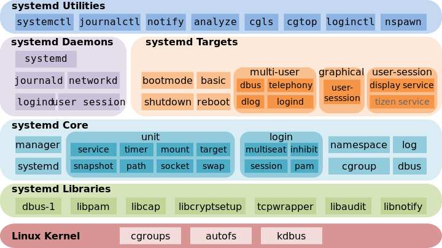

# Linux Basics

## Resources

- [Introduction to Linux Technology and Philosophy by Jeremy Hajek](../_assets/intro-to-linux-tech-philosophy.pdf)
  - [github source](https://github.com/jhajek/Linux-text-book-part-1)
- [The Linux Command Line by William Shotts](../_assets/linux-command-line.pdf)
- [Bite Size Linux by Julia Evans](../_assets/bite-size-linux.pdf)
- [DigitalOcean Linux Basics Tutorials](https://www.digitalocean.com/community/tutorials?q=%5BLinux%20Basics%5D)
  - [Introduction to Linux Basics](https://www.digitalocean.com/community/tutorials/an-introduction-to-linux-basics)
  - [Linux Command Line Primer](https://www.digitalocean.com/community/tutorials/a-linux-command-line-primer)
  - [How To Use ps, kill, and nice to Manage Linux Processes](https://www.digitalocean.com/community/tutorials/how-to-use-ps-kill-and-nice-to-manage-processes-in-linux)

### Manuals

- [ManKier](https://www.mankier.com/): concise pretty man pages with an API
- [explainshell](https://explainshell.com/): match command-line arguments to their help text
- [tldr pages](https://tldr.sh/): more concise man pages
- [manned](https://manned.org/): man page versions across a range of distributions
- [ubuntu](https://manpages.ubuntu.com/): ubuntu man pages and documentation

### Guides

- [The Art of the Command Line](./art-of-command-line): one-sheet condensed linux study guide
- [Ubuntu Community Documentation](https://help.ubuntu.com/community/CommunityHelpWiki): useful beginner series
- [Ultimate Linux Guide for Windows users](https://www.dedoimedo.com/computers/ultimate-linux-guide-for-windows-users.html)
- [Learning the Shell](https://linuxcommand.org/)

### Tools

- [Modern Linux Tools](linux-modern-tools.md)

## Filesystem

- `which`: display executable's location
- `type`: describe a command
- `rm`: delete directory
  ```bash
  rm -rf
  ```

- `find`: find file/directory recursively
  ```bash
  find . -iname _gsdata_ -exec rm {} +
  find . -type d -name _gsdata_ -print -exec rm -rfv {} +
  find . -type f \( -name .DS_Store -o -name Thumbs.db \) -print -exec rm {} +
  ```

- `tree`: show directory structure as tree
  ```bash
  tree -d [dir]   # list directories only
  tree -ah        # include hidden, human readable
  tree -fp -L <n> # include paths, permissions, limit up to N levels
  ```

- `df`: display free disk space
  ```bash
  df -lhT # show usage of all mounted filesystems
  ```

- `du`: disk usage/size of directory
  ```bash
  du -sh fooDir/
  ```

## Package Management

|Command|Description|
|-------|-----------|
|`apt list --installed`|list installed `pkgs`|
|`sudo apt policy`|list installed \`repositories'|
|`apt show <pkg>`|show dependencies of `pkgs`|
|`sudo apt install <pkg>`|install `<pkg>`|
|`sudo apt remove <pkg>`|uninstall `<pkg>`|
|`sudo apt autoremove`|uninstall unused dependencies e.g. `<pkg>` leftover deps that were auto installed but longer required|
|`sudo apt purge <pkg>`|uninstall `<pkg>` configuration files e.g. located under `/etc`|

## Console Management

- `env`: print the environment variables

- `tail`: displays the last part of a file
  
  ```bash
  tail -f [file]      # outputs last lines in realtime
  tail -n 100 [file]  # outputs last n lines
  ```

- `bind`: query keybinds
  
  ```bash
  bind -l      # List all bindable readline functions
  bind -v      # List variables and values
  bind -psX    # List keys bound to readline functions, macros, and shell executions
  bind -q <fn> # Query about which keys invoke the named function
  ```

- `bind`: change keybinds
  
  ```bash
  bind -u <fn>                 # Unbind all keys which are bound to the named function
  bind -r <keys>               # Remove the binding for <keys>
  bind -f <filename>           # Read key bindings from <filename>
  bind -x '"<keys>": "<cmds>"' # Execute <cmds> when <keys> is entered
  ```

## Networking

- list connections

```bash
netstat --all | head -n 15
sudo netstat --tcp --udp --listening --program --numeric --extend
```

- query interaces

```bash
ip a
netstat -ie
```

## Permissions

- `stat`: pretty print stats about file
  
  ```bash
  stat [file]
  ```

- `permission attributes`
  
  ```txt
  .rwxrwxrwx  path/to/file
  ││││││││││ 
  └│││││││││─ file type attribute
   │││││││││   -: file
   │││││││││   d: directory
   │││││││││   l: symbolic link
   │││││││││   c: character special file representing byte stream device e.g. /dev/null
   │││││││││   b: block special file representing block stream device e.g. hard drive
   │││││││││
   ├││││││││─ u: user owner
   └││││││││─  r: read
    └│││││││─  w: write
     └││││││─  x: execute
      ││││││
      ├│││││─ g: group owner
      └│││││─  r: read
       └││││─  w: write
        └│││─  x: execute
         │││
         ├││─ o: other
         └││─  r: read
          └│─  w: write
           └─  x: execute
  ```

- `id`:    display user identity

- `umask`: set the default file permissions

- `chmod`: change permissions to folders and files
  
  ```bash
  find . -type d -exec chmod 755 {} +
  find . -type f -exec chmod 644 {} +
  ```

- `chmod` recursively to 775/664
  
  ```bash
  chmod -R a=,a+rX,u+w,g+w /some/path/here
            ^  ^    ^   ^ adds write to group
            |  |    | adds write to user
            |  | adds read to all and execute to all folders (which controls access)
            | sets all to `000`
  ```

- `chown`: change ownership to user/group recursively
  
  ```bash
  chown -R user:group /some/path/here
  ```

## Process Management

- `id`: find UID/GID for user
  ```bash
  id [username]
  ```

- `ps`: list running processes
  ```bash
  ps aux
  pstree
  ```

- `pkill`: kill process by name
  ```bash
  pkill chrome
  ```

## Services

- `systemd`: initialization system and service manager
  
  
  - [systemd quickstart guide](https://www.linode.com/docs/guides/what-is-systemd/)
- `systemctl`: manage services/daemons
  
  - [systemctl quickstart guide](https://www.linode.com/docs/guides/introduction-to-systemctl/)
    
    - `systemctl start [name.service]`
    - `systemctl stop [name.service]`
    - `systemctl restart [name.service]`
    - `systemctl reload [name.service]`
    - `systemctl status [name.service]`
    - `systemctl is-active [name.service]`
    - `systemctl list-units --type service --all`
  - unit types
    
    ```bash
    $systemctl list-unit --type=help
    service   # service
    target    # group of units
    mount     # filesystem mountpoint
    automount # filesystem auto-mountpoint
    device    # kernel device names, which you can see in sysfs and udev
    path      # file or directory
    scope     # external processes not started by systemd
    slice     # a management unit of processes
    snapshot  # systemd saved state
    socket    # IPC (inter-process communication) socket
    swap      # swap file
    timer     # systemd timer
    ```
  
  - list services
    
    ```bash
    systemctl | grep running                                       # Loaded+Active
    systemctl --no-pager | grep running | column -t                # For more readable output
    systemctl list-units --no-pager --all                          # Loaded services: Active+Pending+Failed+Inactive+Dependents
    systemctl list-units --no-pager --all --state=inactive         # Loaded services: Inactive
    systemctl list-units --no-pager --type=service                 # Loaded services: Active+Pending+Failed
    systemctl list-units --no-pager --type=service --state=running # Loaded services: Running
    systemctl list-unit-files --no-pager --type=service            # Installed services: Loaded+Unloaded
    ```
  
  - start/stop/restart the specified service
    
    ```bash
    systemctl start [service]
    systemctl stop [service]
    systemctl restart [service]
    ```
  
  - enable/disable service to auto start at boot time
    
    ```bash
    systemctl enable [service]
    systemctl disable [service]
    ```
  
  - show/check service current status/runtime information
    
    ```bash
    systemctl status [service]
    systemctl is-active [service]
    systemctl is-enabled [service]
    systemctl is-failed [service]
    systemctl list-dependencies [service]
    ```
