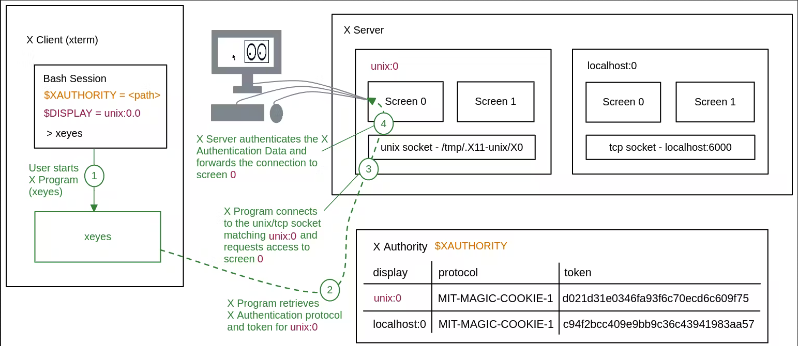

# WSL

## Resources

### Overview

- [awesome-wsl](https://github.com/sirredbeard/Awesome-WSL)
- [D3D12 GPU Video acceleration](https://devblogs.microsoft.com/commandline/d3d12-gpu-video-acceleration-in-the-windows-subsystem-for-linux-now-available/)

### Linux Desktop

- [X410 Guides](https://x410.dev/cookbook/)
  
  - [Enable systemd in WSL2 and have the best Ubuntu GUI desktop experience!](https://x410.dev/cookbook/wsl/enable-systemd-in-wsl2-and-have-the-best-ubuntu-gui-desktop-experience/)
  - [Using X410 with WSL2](https://x410.dev/cookbook/wsl/using-x410-with-wsl2/)
- [You can start Mate desktop in WSL 2 like this](https://old.reddit.com/r/bashonubuntuonwindows/comments/15jeuyu/you_can_start_mate_desktop_in_wsl_2_like_this/)
  
  - [xWSL.cmd (Version 1.5 / 20220718)](https://github.com/DesktopECHO/xWSL)
- [Ubuntu 20.04 Desktop GUI on WSL 2 on Surface Pro](https://www.most-useful.com/ubuntu-20-04-desktop-gui-on-wsl-2-on-surface-pro-4.html)
  
  - [KDE Plasma On WSL On Ubuntu 20.04 On Surface Pro 3](https://www.most-useful.com/kde-plasma-on-wsl.html)
  - [Fully Working KDE on Bash on Ubuntu 20.04](https://old.reddit.com/r/bashonubuntuonwindows/comments/j2i5ix/fully_working_kde_on_bash_on_ubuntu_2004/)
  - [WSL2 GUI Using VcXsrv: Complete Guide For Beginners](https://old.reddit.com/r/linux/comments/ii79t0/wsl2_gui_using_vcxsrv_complete_guide_for_beginners/)
- [wsl-install.sh | Windows 10 WSL Setup Guide](https://github.com/davecwright3/wsl-linux-de)

- [Install Desktop GUI for WSL | WSL Enable Desktop Guide](https://hub.tcno.co/windows/wsl/desktop-gui/)

- [What's the easiest way to run GUI apps on Windows Subsystem for Linux?](https://askubuntu.com/questions/993225/whats-the-easiest-way-to-run-gui-apps-on-windows-subsystem-for-linux)

- LXQt
  
  - [LXQt on WSLg](https://unix.stackexchange.com/questions/686691/lxqt-on-wslg-doesnt-fit-the-full-screen)
  - [Launch xfce4 or other desktop in Windows 11 WSLg Ubuntu distro](https://askubuntu.com/questions/1385703/launch-xfce4-or-other-desktop-in-windows-11-wslg-ubuntu-distro/1385747#1385747)

### Nvidia/CUDA

- <https://ubuntu.com/tutorials/enabling-gpu-acceleration-on-ubuntu-on-wsl2-with-the-nvidia-cuda-platform#3-install-nvidia-cuda-on-ubuntu>
- <https://developer.nvidia.com/cuda-downloads?target_os=Linux&target_arch=x86_64&Distribution=WSL-Ubuntu&target_version=2.0&target_type=deb_local>

## Commands

|||
|--|--|
|`wsl --list --online`|list available Linux distributions|
|`wsl --list --verbose`|list installed Linux distributions|
|`wsl --unregister [distro]`|unregister and uninstall wsl distro|
|\`wsl --set-default-version \[1|2\]\`|
|`wsl --update`|update WSL|
|`wsl --status`|check WSL status|
|`wsl --system`|launch system distro|
|`wsl -d [distro] --exec '...'`|run command without using the default Linux shell|
|\`wsl -d \[distro\] --shell-type \[standard|login|
|`wsl --debug-shell`|launch debug shell for diagnostics purposes|
|`wsl hostname --all-ip-addresses`|get all Host IP address|
|\`grep -m1 nameserver /etc/resolv.conf|awk '{print $2}'\`|
|\`ip route|grep default|
|\`ifconfig eth0|grep inet\`|

## Config

### wsl.conf

- `/etc/wsl.conf`: _**per-distribution**_ settings for WSL
  ```bash
  [boot]
  systemd=true
  command=service docker start                                     # Set a command to run when a new WSL instance launches. This example starts the Docker container service
  
  [automount]                                                      # Automatically mount Windows drive when the distribution is launched
  enabled=true                                                     # Set to true will automount fixed drives (C:/ or D:/) with DrvFs under the root directory set above. Set to false means drives won't be mounted automatically, but need to be mounted manually or with fstab.
  root=/                                                           # Sets the directory where fixed drives will be automatically mounted. This example changes the mount location, so your C-drive would be /c, rather than the default /mnt/c. 
  options="metadata,uid=1003,gid=1003,umask=077,fmask=11,case=off" # DrvFs-specific options can be specified.  
  mountFsTab=true                                                  # Sets the `/etc/fstab` file to be processed when a WSL distribution is launched.
  
  [network]                                                        # Network host settings configure the DNS server used by WSL2
  hostname=DemoHost                                                # change hostname
  generateHosts=false                                              # prevent WSL from the default behavior of auto-generating /etc/hosts
  generateResolvConf=false                                         # prevent WSL from auto-generating /etc/resolv.conf so that you can create your own ie. nameserver 1.1.1.1
  
  [interop]
  enabled=false                                                    # Set whether WSL supports interop process like launching Windows apps and adding path variables. Setting these to false will block the launch of Windows processes and block adding $PATH environment variables.
  appendWindowsPath=false
  
  [user]
  default=DemoUser                                                 # Set the user when launching a distribution with WSL
  ```

### .wslconfig

- `%USERPROFILE%/.wslconfig`: _**global**_ settings for WSL2
  
  |`[wsl2]` section setting|default|notes|
  |------------------------|-------|-----|
  |`kernel`|Microsoft built kernel provided inbox|absolute Windows path to a custom Linux kernel|
  |`memory`|50% Windows total memory capped at 8GB|WSL2 VM memory allocation|
  |`processors`|Windows logical processors count|WSL2 VM logical processors count|
  |`localhostForwarding`|`true`|allow Host access (via `localhost:port`) to WSL2 VM `wildcard`/`localhost` ports|
  |`kernelCommandLine`|blank|additional kernel command line arguments|
  |`safeMode`|`false`|disables many features, intended for distro recover recovery|
  |`swap`|25% Windows memory size|WSL2 VM swap space size, 0 for no swap file|
  |`swapFile`|`%USERPROFILE%\AppData\Local\Temp\swap.vhdx`|absolute Windows path to the swap virtual hard disk|
  |`pageReporting`|`true`|enables Windows to reclaim unused allocated memory frin WSL2 VM|
  |`guiApplications`\*|`true`|enable `WSLg`/GUI applications support|
  |`debugConsole`\*|`false`|enable output console displaying `dmesg` contents of WSL2 VM|
  |`nestedVirtualization`\*|`true`|enable other nested VMs to run inside WSL2|
  |`vmIdleTimeout`\*|`60000`|WSL2 VM idle milliseconds before it is shut down|
  
  - `path` values must be escaped Windows paths  e.g: `C:\\Temp\\myCustomKernel`
  - `size` values must be a size followed by a unit e.g. `8GB` or `512MB`
  - `*` only for Windows 11

### .wslgconfig

- `%USERPROFILE%/.wslgconfig`: _**global**_ settings for WSLg
  - [WSLg Configuration/Debug Options](https://github.com/microsoft/wslg/wiki/WSLg-Configuration-Options-for-Debugging)

## X11

### Overview

- `X11`: client-server system for managing GUI using `X protocol` [(reference)](https://goteleport.com/blog/x11-forwarding/)
  
  
   > 
   > \[!warning\] `X Server` runs on _**physical/local user machine**_; `X Client` runs on _**server/remote machine**_
  
  - `X Server`: mediates access to displays/input devices e.g. monitors, mice, keyboards
  - `X Client`: client program handles graphical data
  - `X Display`: made up of at least one screen, keyboard, and pointer device
  - `X11 Forwarding`: use `X11` over `SSH` because `X protocol` is plaintext
- `$DISPLAY`: variable denoting `X Display` connection for `X Client`
  
  - `X Client` derives `unix`/`tcp socket` connection to display through the `X Server`
  - `X Server` accepts/rejects connection and then forwards the connection to the requested screen
  - `hostname:display_number.screen_number`: format
    - `display_number`:           must always be explicitly set
    - `hostname`,`screen_number`: defaults to `device_name/unix` and `0`
    - `:0`:                       shorthand for  `device_name/unix:0.0`
    - `unix:0`:                   shorthand for `device_name/unix:0`
  - `unix`/`tcp socket` associated to display:
    - `hostname:n`      -> `localhost:6000+n`
    - `hostname/unix:n` -> `/tmp/.X11-unix/Xn`

### X11 Startup files

[Bash Init Scripts and Loading/Execution Order](https://www.sitepoint.com/understanding-nix-login-scripts/)
[Linux Login Scripts](https://schaazzz.github.io/linux-evironment-files-scripts/)

- `~/.xinitrc`: executed in text console mode login
  
  - executed after logging in by `xinit` usually invoked via `startx`
    - first you log in on a text console
    - then you start the GUI with startx
  - **purpose:**\_ start the GUI part of the session
    - sets GUI-related settings e.g. key bindings (with `xmodmap`,`xkbcomp`), X resources (with `xrdb`), etc
    - launches session/window manager (possibly as part of a desktop environment)
- `/etc/X11/Xsession`: analog to `/etc/profile` used by login shells
  
  - executed when `X Window System session` is started (regardless of using a display manager or startx from a virtual terminal)
  - `/etc/X11/Xsession.d/*`: ordered scripts that get sourced (analog to `/etc/profile.d`)
- `~/.xsession`: executed in graphical mode login
  
  - _**purpose:**_ starting the GUI session manager and possibly set login-time parameters (e.g. env vars)
  - on termination => the `X session` will log out and returned to your display manager login screen
  - Example:
    ```bash
    #!/bin/sh
    # typical .xsession
    . ~/.profile
    . ~/.xinitrc
    # Start our session manager of choice
    exec x-session-manager
    ```

- `~/.xsessionrc`: place to set `X session` specific settings
  
  - set env vars or run once-off utilities at launch (e.g `xrandr`/`xmodmap`)
  - can also use this to source `/etc/profile` and `~/.profile`
  - does not exist by default so you must create it

## Debugging

### Enable Debug Messages

- `.wslconfig`: enable WSL2 instance's debug console displaying `dmesg` output
  
  ```ini
  [wsl2]
  debugConsole=true
  ```

- `wsl.exe dmesg`: manually dump `dmesg` output

### Strace Failing Command

- Run the failing command under [strace](http://manpages.ubuntu.com/manpages/wily/man1/strace.1.html).  Normal command structure is:
  
  ```bash
  strace -ff <command>
  ```
  
   > 
   > \[!note\] `strace` can produce lengthy output. If the generated trace is more than about 20 lines please paste this into a [Gist](https://gist.github.com/) or another paste service and link in the bug.

- Example
  
  ```bash
  $ strace traceroute www.microsoft.com
  execve("/usr/bin/traceroute", ["traceroute", "www.microsoft.com"], [/* 22 vars */]) = 0
  brk(0)                                  = 0x7fffdd3bc000
  access("/etc/ld.so.nohwcap", F_OK)      = -1 ENOENT (No such file or directory)
  mmap(NULL, 8192, PROT_READ|PROT_WRITE, MAP_PRIVATE|MAP_ANONYMOUS, -1, 0) = 0x7f1f4e820000
  access("/etc/ld.so.preload", R_OK)      = -1 ENOENT (No such file or directory)
  ...
  ...
  ...
  ```

### Networking Issues

- Run [networking.bat](https://github.com/Microsoft/WSL/blob/master/diagnostics/networking.bat) in an administrative command prompt:
  
  ```batch
  git clone https://github.com/microsoft/WSL --depth=1 %tmp%\WSL
  cd %tmp%\WSL\diagnostics
  networking.bat
  ```

- Once the script execution is completed, include **both** its output and the generated log file, `wsl.etl` on the issue.

### Collect WSL Logs

- To collect WSL logs, download and execute [collect-wsl-logs.ps1](https://github.com/Microsoft/WSL/blob/master/diagnostics/collect-wsl-logs.ps1) in an administrative powershell prompt:
  ```powershell
  Invoke-WebRequest -UseBasicParsing "https://raw.githubusercontent.com/microsoft/WSL/master/diagnostics/collect-wsl-logs.ps1" -OutFile collect-wsl-logs.ps1
  Set-ExecutionPolicy Bypass -Scope Process -Force
  .\collect-wsl-logs.ps1
  ```

- The script will output the path of the log file once done

### Collect WSL Crashdump

Easiest way to introspect WSL process crash is by [collecting a user-mode crash dump](https://learn.microsoft.com/en-us/windows/win32/wer/collecting-user-mode-dumps).

- To enable automatic crash dumps, run the following commands in an elevated command prompt:
  
  ```batch
  md C:\crashes
  reg.exe add "HKEY_LOCAL_MACHINE\SOFTWARE\Microsoft\Windows\Windows Error Reporting\LocalDumps" /f
  reg.exe add "HKEY_LOCAL_MACHINE\SOFTWARE\Microsoft\Windows\Windows Error Reporting\LocalDumps" /v DumpFolder /t REG_EXPAND_SZ /d C:\crashes /f
  reg.exe add "HKEY_LOCAL_MACHINE\SOFTWARE\Microsoft\Windows\Windows Error Reporting\LocalDumps" /v DumpType /t REG_DWORD /d 2 /f
  ```

- Crash dumps will then automatically be written to C:\crashes.

- Once you're done, crash dump collection can be disabled by running the following command in an elevated command prompt:
  
  ```batch
  reg.exe delete "HKEY_LOCAL_MACHINE\SOFTWARE\Microsoft\Windows\Windows Error Reporting\LocalDumps" /f
  ```

### Collect wslservice Time Travel Trace

To collect time travel debugging traces:

- [Install Windbg preview](https://apps.microsoft.com/store/detail/windbg-preview/9PGJGD53TN86?hl=en-us&gl=us&rtc=1)
- Open windbg preview as administrator by running `windbgx` in an elevated command prompt
- Navigate to `file` -> `Attach to process`
- Check `Record with Time Travel Debugging` (at the bottom right)
- Check `Show processes from all users` (at the bottom)
- Select `wslservice.exe`. Note, if wslservice.exe is not running, you make it start it with: `wsl.exe -l`
- Click `Configure and Record` (write down the folder you chose for the traces)
- Reproduce the issue
- Go back to windbg and click `Stop and Debug`
- Once the trace is done collecting, click `Stop Debugging` and close Windbg
- Go to the folder where the trace was colleced, and locate the .run file. It should look like: `wslservice*.run`
- Share that file on the issue
