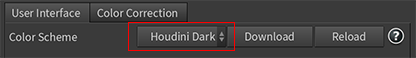
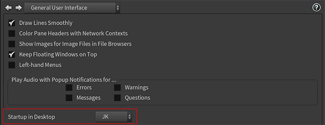
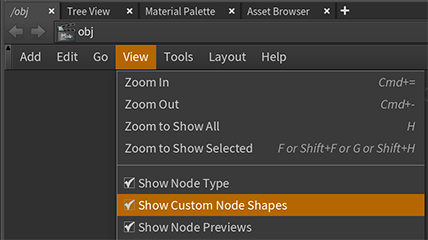
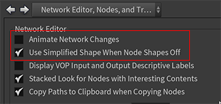
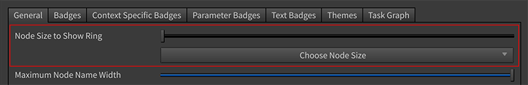
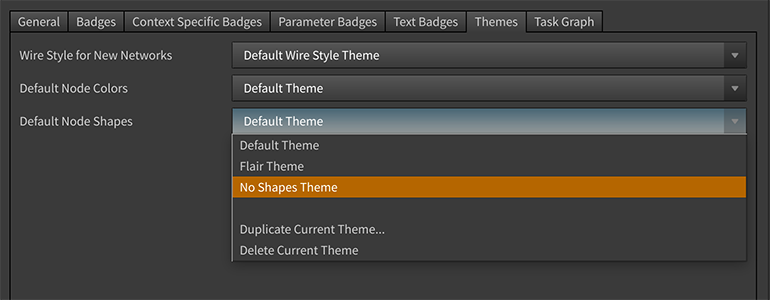

# Houdini Setup

## Common
- Install license server on each machine
- Install HQueue Client [(Reference)](http://kunani.com/how-to-setup-hqueue-for-sidefx-houdini-indie-on-your-windows-10-local-network/)
  - Directory in D:\knl\hou\HQClient
  - Server: ${env:EDEV_HOU_SERVER}:5000 (ex: ikrima-ryzen:5000)
  - Logon Account: ${env:EDEV_HOU_SERVERACCOUNT} (ex: sa_server_account)
  - Make sure firewall is accessible
- Update `MachineSetup-Config.ps1:${env:EDEV_HOU_ROOT}` to point to new path and rerun
- Make sure `HOUDINI_USER_PREF_DIR` is set (e.g. `HOUDINI_USER_PREF_DIR=${env:EDEV_HOU_HOUDEV}/prefs/houdini__HVER__`)
- Change symlink of C:\Program Files\Side Effects Software\Latest to point to new directory

### Optional
- Update git repos in tp directory
- Update binary plugins (Redshift, optix)

## For Major Updates
For major-minor version updates (i.e. from 17.0 to 17.5)
- Copy previous version prefs folder to new one (eg: `${env:EDEV_HOU_HOUDEV}\prefs\houdini17.5`)
- Update the new houdini.env Version envars. Ex:
  - HOU_MAJOR_VER = 17
  - HOU_MINOR_VER = 5
  - REDSHIFT_VER = 17.5.173
- Create a new version specific dso folder (eg: `${env:EDEV_HOU_HOUDEV}\personal\dso-17.5`)
- Compile dso's with new HDK (ex: SOP_ComputeTangents)
  - ~~mikktspace-for-houdini: Update the visual studio HDK props file to point to new HDK location~~
  - Not needed anymore as PolyFrame node has builtin support for mikktspace
- Follow instructions for nightly build updates

## For Nightly Updates
- Run `${env:EDEV_DEVOPS_DIR}/MachineConfig/Houdini-Setup.ps1:Update-HythonVenv`
- Change nvidia graphics custom 3d settings for new hindie.exe

## Houdini.env
Use `$HSITE` and `$HFS` to point site specific configuration & houdini install directory
The problem is that no one seems to understand the fully correct syntax, while some slightly bad variations happen to work depending on the platform/method.

Let me try to lay out some of the rules: [(Reference)](https://www.sidefx.com/forum/topic/26537/?page=1#post-122495)
- Houdini only expands environment variables in the hscript syntax. ie. $HOME, not the DOS syntax like %HOME%.
- The path separators should be semi-colon (;) instead of colon (:). This works on all platforms. Linux/OSX happen to also accept colon (:) as well.
- When you override a variable, you should have "&" in there somewhere so that the default path is still used. Depending on your shell, this is sometimes a special character, in which case you need to ensure that you set it with the correct escaping.
- On Windows especially, make sure you launch Houdini from the shell you set the environment variable. You cannot set it into a shell and then expect the Start Menu > Houdini to see it.
- You must set your environment variable _BEFORE_ Houdini is loaded.
- If you're using houdini.env (as an alternative), then you must use double quotes if your variable value contains spaces.
- [List of environment variables](http://www.sidefx.com/docs/houdini/ref/env.html)

## UI Customization

- [Original Source](https://wiki.johnkunz.com/index.php?title=Customizing_the_Houdini_Interface)
  - <iframe width="560" height="315" src="https://www.youtube.com/embed/VdiEd84Kjsw" title="YouTube video player" frameborder="0" allow="accelerometer; autoplay; clipboard-write; encrypted-media; gyroscope; picture-in-picture" allowfullscreen></iframe>
  - [Houdini Interface Customization Docs](https://www.sidefx.com/docs/houdini/basics/config.html)

- [Slate Theme from Odforce](https://forums.odforce.net/topic/18089-houdini-theme/): flat user interface
  - unzip the [files](../_assets/custom-ui/Slate_Theme_Houdini.zip) and put them in your `$HOME/houdiniX.x/config/ directory` and relaunch Houdini
  - select theme in [Edit ► Color Settings Window](https://www.sidefx.com/docs/houdini/ref/windows/color.html)
    

- Changing the [Desktop Layout](../_assets/custom-ui/JK.desk) file and place it in your local preferences desktop directory `$HOME/houdiniX.x/desktop/`
  - You can switch between desktops using the [menu at the top of the main window](https://www.sidefx.com/docs/houdini/basics/panes.html#layouts)
    
  - By default Houdini starts up in the Build desktop, but you can change that in the [Edit ► Preferences ► General User Interface](https://www.sidefx.com/docs/houdini/ref/windows/mainprefs.html#ui)
    

- Simplifying Node Shapes
  - In the network editor pane, click the [View](https://www.sidefx.com/docs/houdini/network/menus.html#view_menu) dropdown menu:
    
    - Show Custom Node Shapes ► Disable, so all nodes are rectangular

  - In the network editor pane, click the [Tools](https://www.sidefx.com/docs/houdini/network/menus.html#tools_menu) dropdown menu:
    
    - Make Room for New Nodes ► Disable

  - In the main Houdini prefs, [Edit ► Preferences ► Network Editor, Nodes and Trees](https://www.sidefx.com/docs/houdini/ref/windows/mainprefs.html#net):
    
    - Animate network changes ► Disable
    - Use simplified shape when node shapes off ► Enable, this uses a simple rectangle instead of a rounded rectangle

  - Press the "d" key with your mouse over the network pane to raise the [Network View Display Options](https://www.sidefx.com/docs/houdini/network/options.html#display):
    - General Tab ► Node size to show ring ► never show the ring
      
    - Themes Tab ► Default node shapes ► no shapes theme
      

- Changing the Splash Screen by [Setting Houdini Environment Variables](https://www.sidefx.com/docs/houdini/basics/config_env.html).
  - Modify `$HOME/houdiniX.x/houdini.env`
    ```bash
    HOUDINI_SPLASH_FILE = ~/Pictures/splashscreen_001.png
    HOUDINI_SPLASH_MESSAGE = "Welcome//n${USER} @ ${HOSTNAME}//n${HOUDINI_VERSION}//nGood Luck!"
    HOUDINI_NO_START_PAGE_SPLASH = 1
    ```
