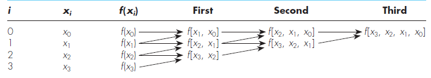

# Cliff Notes

Condensed Cheatsheet/mnemonics of stuff I forget

## Overview: Map of Mathematics
- Algebra: abstraction of numbers
- Group Theory: abstraction of symmetry
- Ring Theory: abstraction of arithmetic
- Graph Theory: abstraction of relationships
- Category Theory: abstraction of composition

## Linear Algebra
- [The Matrix Cookbook](_assets/matrix-cookbook.pdf)
- [Matrix Forensics](_assets/matrix-forensics.pdf)

## Differential Geometry
  
- **Inner Product**:  Angle
- **Norm**:           Length
- **Metric**:         Distance
- **Measure**:        Volume/Size
- **$L_p$ norm**:     `max()` Vector Component
- **$L_0$ norm**:     Counting Norm

- **Gradient**:       Derivative of scalar field
- **Divergence**:     Sink vs Source aka volume density of outward flux
- **Curl**:           Rotation Rate around point
- **Laplacian**:      Difference average of neighborhood at a point - value at point
- **Jacobian**:       Gradient of vector field
  - describes skew/rotation/distortion of differential patch around $f(\vec p)$
  - analogue of 1st order Taylor polynomial i.e. best linear approximation rate of change
    $f(\vec{p} + \varepsilon \vec{h})\approx f(\vec{p} )+\mathbf{J}_{f} (\vec{p})\cdot \varepsilon \vec{h}$

- **Laplace Equation**: Maximal smoothness/mean curvature is zero
  - intuitive as equilibrium steady-state state e.g. diffuse heat flow
  - intuitive as surface has no bumps or local minimas
  - intuition from [CMU Discrete Differential Geometry Course: Lecture 18](https://www.youtube.com/watch?v=oEq9ROl9Umk)
    
- **Poisson Equation**: Generalization of Laplace Equation
  - intuitive as soap film (_pde solution_) covering a wire (_boundary condition_)

- **Manifold**:            fancy name of a curved space
- **Reimannian manifold**: manifold with geodesic metric (Reimannian metric)
- **Functionals**:         Functions that take functions as inputs (derivative/integral operators)

- **Spaces**:              `Banach Space` ⊇ `Hilbert Space` ⊇ `Sobolev Space`
- **Banach Space**:        norm+completeness
- **Hilbert Space**:       inner-product norm
- **Sobolev Space**:       _nice_ derivatives up to order S

- **Group**:               closed under multiplication, commutative, identity function, inverse
- **Lie Group**:           curved space with a group structure i.e. a group that is a manifold where multiplication is smooth/infinitely differentiable
- **Lie Algebra**:         tangent space of Lie group
- **Tangent space**:       linear approximation of a curved space
- **Non-abelian group**:   non-commutative group i.e. $a*b \neq b*a$ (e.g. SO(3) rotation group)
- **Dual number**:         convenient for computation of Lie algebra

### Equations
$$
\begin{align*}
del :=  &  & \nabla  & = \left(\frac{\partial}{\partial x_1}, \dotsc, \frac{\partial}{\partial x_n}\right)\\
 &  &  & \\
Gradient :=  &  & \nabla f(\boldsymbol{\vec{x}}) & = \left(\frac{\partial f(\boldsymbol{\vec{x}})}{\partial x_1} ,\dotsc ,\frac{\partial f (\boldsymbol{\vec{x}})}{\partial x_n}\right)\\
 &  &  & = \begin{bmatrix}
\frac{\partial f}{\partial x_1} (\boldsymbol{\vec{x}})\\
\vdots \\
\frac{\partial f}{\partial x_n} (\boldsymbol{\vec{x}})
\end{bmatrix}\\
 &  &  & \\
Divergence :=  &  & \operatorname{div}\mathbf{F} & = \nabla \cdot \mathbf{F}\\
 &  &  & = \left(\frac{\partial}{\partial x}, \frac{\partial}{\partial y}, \frac{\partial}{\partial z}\right) \cdot (F_x ,F_y ,F_z)\\
 &  &  & = \frac{\partial F_x}{\partial x} + \frac{\partial F_y}{\partial y} + \frac{\partial F_z}{\partial z}\\
 &  &  & \\
Curl :=  &  & \nabla \times \mathbf{F} & = \begin{vmatrix}
\hat{\imath} & \hat{\jmath} & \boldsymbol{\hat{k}}\\
\dfrac{\partial}{\partial x} & \dfrac{\partial}{\partial y} & \dfrac{\partial}{\partial z}\\
F_x & F_y & F_z
\end{vmatrix}\\
 &  &  & =
 \left(\frac{\partial F_z}{\partial y} -\frac{\partial F_y}{\partial z}\right)\boldsymbol{\hat{\imath}} +
 \left(\frac{\partial F_x}{\partial z} -\frac{\partial F_z}{\partial x}\right)\boldsymbol{\hat{\jmath}} +
 \left(\frac{\partial F_y}{\partial x} -\frac{\partial F_x}{\partial y}\right)\boldsymbol{\hat{k}}\\
 &  &  & = \begin{bmatrix}
\frac{\partial F_z}{\partial y} -\frac{\partial F_y}{\partial z}\\
\frac{\partial F_x}{\partial z} -\frac{\partial F_z}{\partial x}\\
\frac{\partial F_y}{\partial x} -\frac{\partial F_x}{\partial y}
\end{bmatrix}\\
 &  &  & \\
Jacobian :=  &  & \mathbf{f} & :\mathbb{R}^{n}\to \mathbb{R}^{m}\\
 &  & \mathbf{J}_f & = \begin{bmatrix}
\dfrac{\partial f(\boldsymbol{\vec{x}})}{\partial x_1} & \cdots  & \dfrac{\partial \mathbf{f} (\boldsymbol{\vec{x}})}{\partial x_n}
\end{bmatrix}\\
 &  &  & = \begin{bmatrix}
\nabla f_1 (\boldsymbol{\vec{x}})\\
\vdots \\
\nabla f_m (\boldsymbol{\vec{x}})
\end{bmatrix}\\
 &  &  & = \begin{bmatrix}
\dfrac{\partial f_1 (\boldsymbol{\vec{x}})}{\partial x_1} & \cdots  & \dfrac{\partial f_1 (\boldsymbol{\vec{x}})}{\partial x_n}\\
\vdots  & \ddots  & \vdots \\
\dfrac{\partial f_m (\boldsymbol{\vec{x}})}{\partial x_1} & \cdots  & \dfrac{\partial f_m (\boldsymbol{\vec{x}})}{\partial x_n}
\end{bmatrix}\\
 &  &  & \\
Laplacian :=  &  & \Delta f & = \nabla^2 f = \nabla \cdot \nabla f = \sum_{i=1}^n \frac{\partial^2 f}{\partial x_i^2}\\
 &  &  & \\
Laplace Equation :=  &  & \Delta f & = 0\\
Poisson Equation :=  &  & \Delta f & = h
\end{align*}
$$

## Spectral Theory

### Legendre polynomial

The nth Legendre polynomial, $\boldsymbol{L}_{n}$, is orthogonal to every polynomial with degrees less than n i.e.

- $\boldsymbol{L}_{n} \perp \boldsymbol{P}_{i}, \ \forall i\in [0..n-1]$
- ex: $\boldsymbol{L}_{n} \perp x^{3}$

$\boldsymbol{L}_{n}$ has n real roots and they are all $\in [-1,1]$

Harmonic functions => $\Delta u(x) = 0$

Homogenous function => $f : \mathbb{R}^{n} \to \mathbb{R}^{n}, \ f(\lambda \mathbf{v})=\lambda^{k} f(\mathbf{v})$ where $k,\lambda \in \mathbb{R}$

General form of Newton's divided-difference polynomial interpolation:

$$
\begin{aligned} f_{n}(x)=& f\left(x_{0}\right)+\left(x-x_{0}\right) f\left[x_{1}, x_{0}\right]+\left(x-x_{0}\right)\left(x-x_{1}\right) f\left[x_{2}, x_{1}, x_{0}\right] \\ &+\cdots+\left(x-x_{0}\right)\left(x-x_{1}\right) \cdots\left(x-x_{n-1}\right) f\left[x_{n}, x_{n-1}, \ldots, x_{0}\right] \end{aligned}
$$

Lagrange interpolating polynomial scheme is just a reformulation of Newton scheme that avoids computation of divided differences

$$
f_{n}(x)=\sum_{i=0}^{n} L_{i}(x) f\left(x_{i}\right)\newline
L_{i}(x)=\prod_{j=0 \atop j \neq i}^{n} \frac{x-x_{j}}{x_{i}-x_{j}}
$$

### Gaussian quadrature

- allows for accurately approximating functions where $f(x) \in P_{2n-1}$ with only n coefficients

### Approximation Schemes

- **Regression Schemes:** (Linear or nonlinear)
  - Curves do not necessarily go through sample points so error at said points might be large
  - Round-off error becomes pronounced for higher order versions and ill-conditioned matrices are a problem
  - Orthogonal polynomials do not necessarily suffer from this
- **Interpolation Schemes:** (splines, lagrangian/newtonian, etc)
  - Curves must go through sample points so error at said points is small
  - Not ill conditioned

#### Thin plate splines

- construction is based on choosing a function that minimizes an integral that represents the bending energy of a surface
- the idea of thin-plate splines is to choose a function f(x) that exactly interpolates the datapoints (xi,yi), say,yi=f(xi), and that minimizes the bending energy
  $E[f]=\int_{\mathbf{R}^{n}}\left|D^{2} f\right|^{2} d X$
- Can also choose function that doesn't exactly interpolate all control points by using smoothing parameter for regularization
  $E[f]=\sum_{i=1}^{m}\left|f\left(\mathbf{x}_{i}\right)-y_{i}\right|^{2}+\lambda \int_{\mathbb{R}^{n}}\left|D^{2} f\right|^{2} d X$

#### Spherical Basis Splines

- Gross reduction summary: b-splines with slerp instead of lerp between control points

#### RBF

- [Integration By RBF Over The Sphere](https://www.math.unipd.it/~marcov/pdf/AMR05_17.pdf)
- [RBF for Scientific computing](https://math.boisestate.edu/~wright/montestigliano/RBFsForScientificComputingPartOne.pdf)
- [Interpolation and Best Approximation for Spherical Radial Basis Function Networks](https://www.hindawi.com/journals/aaa/2013/206265)
- Spherical Radial Basis Functions, Theory and Applications (Springer Briefs in Mathematics)
- [Transport schemes on a sphere using radial basis functions](https://www.math.utah.edu/~wright/misc/msFinal_Grady.pdf)
- [On choosing a radial basis function and a shape parameter when solving a convective PDE on a sphere](https://amath.colorado.edu/faculty/fornberg/Docs/Fornberg_Piret_2.pdf)
- [A Fast Algorithm For Spherical Basis approximation](https://www.math.uni-luebeck.de/mitarbeiter/prestin/ps/sharma.pdf)

#### Spherical Splines

- [Spline Representations of Functions on a Sphere for Geopotential Modeling](https://kb.osu.edu/bitstream/handle/1811/78653/1/SES_GeodeticScience_Report_475.pdf)
- [Fitting scattered data on sphere-like surfaces using spherical splines](https://math.vanderbilt.edu/schumake/ans4.pdf)
- [Bernstein-Bézier polynomials on spheres and sphere-like surfaces](https://math.vanderbilt.edu/neamtum/papers/ans2.pdf)
- [Survey on Spherical Spline Approximation](https://pdfs.semanticscholar.org/63eb/efb9cbdc248371e2fe4f09fa7e70b89c5008.pdf)
- scattered data fitting on the sphere: scattered data fitting on the sphere
